<!-- README.md is generated from README.Rmd. Please edit that file -->

# EMISSÃO DE CO<sub>2</sub> DO SOLO EM ÁREAS AGRÍCOLAS: ABORDAGEM EM APRENDIZADO DE MÁQUINA ESTATÍSTICO

## Autor: Prof. Dr. [Alan Rodrigo Panosso](https://www.fcav.unesp.br/#!/alan)

##### E-mail: <alan.panosso@unesp.br>

##### Departamento de Engenharia e Ciências Exatas

##### UNESP - Câmpus de Jaboticabal

## Objetivo

O objetivo do repositório `tese-fco2-ml-2023` é promover a
transparência, a reprodutibilidade e a colaboração em pesquisa. Você é
incentivado a explorar o código-fonte, utilizar os dados e contribuir
com melhorias, se desejar. Sinta-se à vontade para entrar em contato
caso tenha alguma dúvida ou precise de mais informações sobre minha
pesquisa.

## Contribuições

Contribuições são bem-vindas! Se você deseja colaborar com melhorias nos
códigos, correções de erros ou qualquer outro aprimoramento, sinta-se à
vontade para abrir uma solicitação de `pull request`.

## Licença

Este projeto é licenciado sob `MIT License`. Consulte o arquivo
[LICENSE](https://github.com/arpanosso/tese-fco2-ml-2023/blob/master/LICENSE.md)
para obter mais detalhes.

## Base de dados

Apresentação do pacote `fco2r` construído para divulgação e análise dos
resultados obtidos ao longo de mais de $21$ anos de ensaios em campo.
Este pacote, permite a visualização dos dados, a execução de análises
estatísticas avançadas e a geração de gráficos interativos para tornar
os resultados mais acessíveis e compreensíveis para a comunidade
científica.

### Instalação

Você pode instalar uma versão de desenvolvimento do pacote `fco2r` a
partir do [GitHub](https://github.com/) com os seguintes comandos:

``` r
# install.packages("devtools")
# devtools::install_github("arpanosso/fco2r")
```

### Problemas na instalação:

Possíveis problemas na instalação do pacote podem ser sanados com os
seguintes comandos:

``` r
# Sys.getenv("GITHUB_PAT")
# Sys.unsetenv("GITHUB_PAT")
# Sys.getenv("GITHUB_PAT")
```

# Variabilidade temporal de FCO<sub>2</sub>

### Carregando os pacotes

``` r
library(fco2r)
library(tidyverse)
```

    ## ── Attaching core tidyverse packages ──────────────────────── tidyverse 2.0.0 ──
    ## ✔ dplyr     1.1.4     ✔ readr     2.1.4
    ## ✔ forcats   1.0.0     ✔ stringr   1.5.1
    ## ✔ ggplot2   3.4.4     ✔ tibble    3.2.1
    ## ✔ lubridate 1.9.3     ✔ tidyr     1.3.0
    ## ✔ purrr     1.0.2     
    ## ── Conflicts ────────────────────────────────────────── tidyverse_conflicts() ──
    ## ✖ dplyr::filter() masks stats::filter()
    ## ✖ dplyr::lag()    masks stats::lag()
    ## ℹ Use the conflicted package (<http://conflicted.r-lib.org/>) to force all conflicts to become errors

``` r
library(patchwork)
library(ggspatial)
library(readxl)
library(skimr)
library(tidymodels)
```

    ## ── Attaching packages ────────────────────────────────────── tidymodels 1.1.1 ──
    ## ✔ broom        1.0.5     ✔ rsample      1.2.0
    ## ✔ dials        1.2.0     ✔ tune         1.1.2
    ## ✔ infer        1.0.5     ✔ workflows    1.1.3
    ## ✔ modeldata    1.2.0     ✔ workflowsets 1.0.1
    ## ✔ parsnip      1.1.1     ✔ yardstick    1.2.0
    ## ✔ recipes      1.0.8     
    ## ── Conflicts ───────────────────────────────────────── tidymodels_conflicts() ──
    ## ✖ scales::discard() masks purrr::discard()
    ## ✖ dplyr::filter()   masks stats::filter()
    ## ✖ recipes::fixed()  masks stringr::fixed()
    ## ✖ dplyr::lag()      masks stats::lag()
    ## ✖ yardstick::spec() masks readr::spec()
    ## ✖ recipes::step()   masks stats::step()
    ## • Use tidymodels_prefer() to resolve common conflicts.

``` r
library(ISLR)
library(modeldata)
library(vip)
```

    ## 
    ## Attaching package: 'vip'
    ## 
    ## The following object is masked from 'package:utils':
    ## 
    ##     vi

``` r
library(ggpubr)
source("../R/graficos.R")
theme_set(theme_bw())
```

### Conhecendo a base de dados de emissão de CO<sub>2</sub> do solo

Base proveniente de ensaios de campo.

``` r
data_fco2 %>% 
  janitor::clean_names() -> data_fco2
glimpse(data_fco2)
```

    ## Rows: 15,397
    ## Columns: 39
    ## $ experimento       <chr> "Espacial", "Espacial", "Espacial", "Espacial", "Esp…
    ## $ data              <date> 2001-07-10, 2001-07-10, 2001-07-10, 2001-07-10, 200…
    ## $ manejo            <chr> "convencional", "convencional", "convencional", "con…
    ## $ tratamento        <chr> "AD_GN", "AD_GN", "AD_GN", "AD_GN", "AD_GN", "AD_GN"…
    ## $ revolvimento_solo <lgl> FALSE, FALSE, FALSE, FALSE, FALSE, FALSE, FALSE, FAL…
    ## $ data_preparo      <date> 2001-07-01, 2001-07-01, 2001-07-01, 2001-07-01, 200…
    ## $ conversao         <date> 1970-01-01, 1970-01-01, 1970-01-01, 1970-01-01, 197…
    ## $ cobertura         <lgl> TRUE, TRUE, TRUE, TRUE, TRUE, TRUE, TRUE, TRUE, TRUE…
    ## $ cultura           <chr> "milho_soja", "milho_soja", "milho_soja", "milho_soj…
    ## $ x                 <dbl> 0, 40, 80, 10, 25, 40, 55, 70, 20, 40, 60, 10, 70, 3…
    ## $ y                 <dbl> 0, 0, 0, 10, 10, 10, 10, 10, 20, 20, 20, 25, 25, 30,…
    ## $ longitude_muni    <dbl> 782062.7, 782062.7, 782062.7, 782062.7, 782062.7, 78…
    ## $ latitude_muni     <dbl> 7647674, 7647674, 7647674, 7647674, 7647674, 7647674…
    ## $ estado            <chr> "SP", "SP", "SP", "SP", "SP", "SP", "SP", "SP", "SP"…
    ## $ municipio         <chr> "Jaboticabal", "Jaboticabal", "Jaboticabal", "Jaboti…
    ## $ id                <int> 1, 2, 3, 4, 5, 6, 7, 8, 9, 10, 11, 12, 13, 14, 15, 1…
    ## $ prof              <chr> "0-0.1", "0-0.1", "0-0.1", "0-0.1", "0-0.1", "0-0.1"…
    ## $ fco2              <dbl> 1.080, 0.825, 1.950, 0.534, 0.893, 0.840, 1.110, 1.8…
    ## $ ts                <dbl> 18.73, 18.40, 19.20, 18.28, 18.35, 18.47, 19.10, 18.…
    ## $ us                <dbl> NA, NA, NA, NA, NA, NA, NA, NA, NA, NA, NA, NA, NA, …
    ## $ p_h               <dbl> 5.1, 5.1, 5.8, 5.3, 5.5, 5.7, 5.6, 6.4, 5.3, 5.8, 5.…
    ## $ mo                <dbl> 20, 24, 25, 23, 23, 21, 26, 23, 25, 24, 26, 20, 25, …
    ## $ p                 <dbl> 46, 26, 46, 78, 60, 46, 55, 92, 55, 60, 48, 71, 125,…
    ## $ k                 <dbl> 2.4, 2.2, 5.3, 3.6, 3.4, 2.9, 4.0, 2.3, 3.3, 3.6, 4.…
    ## $ ca                <dbl> 25, 30, 41, 27, 33, 38, 35, 94, 29, 36, 37, 29, 50, …
    ## $ mg                <dbl> 11, 11, 25, 11, 15, 20, 16, 65, 11, 17, 15, 11, 30, …
    ## $ h_al              <dbl> 31, 31, 22, 28, 27, 22, 22, 12, 31, 28, 28, 31, 18, …
    ## $ sb                <dbl> 38.4, 43.2, 71.3, 41.6, 50.6, 60.9, 55.0, 161.3, 43.…
    ## $ ctc               <dbl> 69.4, 74.2, 93.3, 69.6, 77.9, 82.9, 77.0, 173.3, 74.…
    ## $ v                 <dbl> 55, 58, 76, 60, 65, 73, 71, 93, 58, 67, 67, 58, 82, …
    ## $ ds                <dbl> NA, NA, NA, NA, NA, NA, NA, NA, NA, NA, NA, NA, NA, …
    ## $ macro             <dbl> NA, NA, NA, NA, NA, NA, NA, NA, NA, NA, NA, NA, NA, …
    ## $ micro             <dbl> NA, NA, NA, NA, NA, NA, NA, NA, NA, NA, NA, NA, NA, …
    ## $ vtp               <dbl> NA, NA, NA, NA, NA, NA, NA, NA, NA, NA, NA, NA, NA, …
    ## $ pla               <dbl> NA, NA, NA, NA, NA, NA, NA, NA, NA, NA, NA, NA, NA, …
    ## $ at                <dbl> NA, NA, NA, NA, NA, NA, NA, NA, NA, NA, NA, NA, NA, …
    ## $ silte             <dbl> NA, NA, NA, NA, NA, NA, NA, NA, NA, NA, NA, NA, NA, …
    ## $ arg               <dbl> NA, NA, NA, NA, NA, NA, NA, NA, NA, NA, NA, NA, NA, …
    ## $ hlifs             <dbl> NA, NA, NA, NA, NA, NA, NA, NA, NA, NA, NA, NA, NA, …

Vamos conhecer, um pouco mais a nossa base de dados.

``` r
skimr::skim(data_fco2)
```

|                                                  |           |
|:-------------------------------------------------|:----------|
| Name                                             | data_fco2 |
| Number of rows                                   | 15397     |
| Number of columns                                | 39        |
| \_\_\_\_\_\_\_\_\_\_\_\_\_\_\_\_\_\_\_\_\_\_\_   |           |
| Column type frequency:                           |           |
| character                                        | 7         |
| Date                                             | 3         |
| logical                                          | 2         |
| numeric                                          | 27        |
| \_\_\_\_\_\_\_\_\_\_\_\_\_\_\_\_\_\_\_\_\_\_\_\_ |           |
| Group variables                                  | None      |

Data summary

**Variable type: character**

| skim_variable | n_missing | complete_rate | min | max | empty | n_unique | whitespace |
|:--------------|----------:|--------------:|----:|----:|------:|---------:|-----------:|
| experimento   |         0 |             1 |   8 |   8 |     0 |        2 |          0 |
| manejo        |         0 |             1 |   6 |  15 |     0 |       10 |          0 |
| tratamento    |         0 |             1 |   2 |  10 |     0 |       21 |          0 |
| cultura       |         0 |             1 |   4 |  14 |     0 |       11 |          0 |
| estado        |         0 |             1 |   2 |   2 |     0 |        2 |          0 |
| municipio     |         0 |             1 |   7 |  20 |     0 |        6 |          0 |
| prof          |         0 |             1 |   5 |   7 |     0 |        2 |          0 |

**Variable type: Date**

| skim_variable | n_missing | complete_rate | min        | max        | median     | n_unique |
|:--------------|----------:|--------------:|:-----------|:-----------|:-----------|---------:|
| data          |         0 |             1 | 2001-07-10 | 2019-12-01 | 2014-07-12 |      205 |
| data_preparo  |         0 |             1 | 1986-03-01 | 2019-04-01 | 2002-01-01 |       14 |
| conversao     |         0 |             1 | 1970-01-01 | 2009-07-03 | 1986-03-01 |       11 |

**Variable type: logical**

| skim_variable     | n_missing | complete_rate | mean | count      |
|:------------------|----------:|--------------:|-----:|:-----------|
| revolvimento_solo |         0 |             1 |    0 | FAL: 15397 |
| cobertura         |         0 |             1 |    1 | TRU: 15397 |

**Variable type: numeric**

| skim_variable  | n_missing | complete_rate |       mean |         sd |        p0 |        p25 |        p50 |        p75 |       p100 | hist  |
|:---------------|----------:|--------------:|-----------:|-----------:|----------:|-----------:|-----------:|-----------:|-----------:|:------|
| x              |         0 |          1.00 | 1392083.56 | 2923710.70 |      0.00 |       0.00 |      30.00 |     100.00 | 7749472.16 | ▇▁▁▁▂ |
| y              |         0 |          1.00 |  495854.97 | 1722529.75 |      0.00 |       0.00 |      27.00 |      80.00 | 7630525.47 | ▇▁▁▁▁ |
| longitude_muni |         0 |          1.00 | 1067926.05 | 1796771.47 | 456798.63 |  458447.46 |  458447.46 |  792043.56 | 7638196.06 | ▇▁▁▁▁ |
| latitude_muni  |         0 |          1.00 | 7231328.21 | 1754220.76 | 795907.06 | 7635356.70 | 7749398.84 | 7749821.85 | 7758831.37 | ▁▁▁▁▇ |
| id             |         0 |          1.00 |      40.52 |      31.52 |      1.00 |      13.00 |      35.00 |      60.00 |     141.00 | ▇▅▃▁▁ |
| fco2           |       110 |          0.99 |       2.78 |       2.08 |     -3.42 |       1.30 |       2.16 |       3.75 |      46.93 | ▇▁▁▁▁ |
| ts             |       317 |          0.98 |      21.84 |       6.76 |      1.00 |      19.33 |      22.50 |      26.15 |     195.63 | ▇▁▁▁▁ |
| us             |      1754 |          0.89 |      16.31 |       8.93 |      0.00 |      10.00 |      14.06 |      22.00 |      89.00 | ▇▅▁▁▁ |
| p_h            |      2802 |          0.82 |       4.64 |       1.13 |      3.50 |       4.00 |       4.50 |       5.15 |      52.00 | ▇▁▁▁▁ |
| mo             |      1355 |          0.91 |      21.59 |      12.60 |      1.35 |      12.00 |      23.00 |      29.00 |      61.26 | ▆▇▇▂▁ |
| p              |      1355 |          0.91 |      20.95 |      24.74 |      1.00 |       6.00 |      15.48 |      27.36 |     253.00 | ▇▁▁▁▁ |
| k              |      1348 |          0.91 |       2.40 |       2.21 |      0.03 |       0.90 |       1.70 |       3.40 |      34.00 | ▇▁▁▁▁ |
| ca             |      1376 |          0.91 |      17.20 |      14.57 |      1.10 |       6.00 |      11.00 |      26.00 |      94.00 | ▇▃▁▁▁ |
| mg             |      1376 |          0.91 |      10.13 |       5.65 |      0.32 |       7.00 |      10.00 |      13.00 |      65.00 | ▇▂▁▁▁ |
| h_al           |      1362 |          0.91 |      46.89 |      29.38 |      0.00 |      26.00 |      42.29 |      72.00 |     121.00 | ▅▇▆▂▂ |
| sb             |      1376 |          0.91 |      29.69 |      20.10 |      1.54 |      15.60 |      23.80 |      42.00 |     161.30 | ▇▃▁▁▁ |
| ctc            |      1369 |          0.91 |      77.10 |      32.99 |      4.62 |      59.23 |      83.40 |     103.20 |     173.30 | ▂▃▇▃▁ |
| v              |      1383 |          0.91 |      41.68 |      20.05 |      4.96 |      22.00 |      43.00 |      58.00 |     100.00 | ▆▆▇▅▁ |
| ds             |      3284 |          0.79 |       1.38 |       0.17 |      0.88 |       1.24 |       1.38 |       1.52 |       1.86 | ▁▆▇▇▁ |
| macro          |      3277 |          0.79 |       8.55 |       7.85 |    -45.30 |       0.15 |       8.13 |      13.64 |      49.77 | ▁▁▇▃▁ |
| micro          |      3298 |          0.79 |      25.30 |      17.13 |      0.07 |       0.37 |      33.86 |      38.30 |      52.42 | ▅▁▂▇▁ |
| vtp            |      3298 |          0.79 |      42.34 |      15.65 |     -4.68 |      40.81 |      46.25 |      51.32 |      87.80 | ▂▁▇▃▁ |
| pla            |      3438 |          0.78 |      29.57 |      11.80 |    -47.30 |      21.27 |      32.41 |      38.15 |      79.80 | ▁▁▅▇▁ |
| at             |      8083 |          0.48 |    1013.33 |    1358.81 |     11.72 |     236.00 |     593.62 |     816.00 |    4542.73 | ▇▁▁▁▂ |
| silte          |      8048 |          0.48 |     229.26 |     336.37 |      1.26 |      50.87 |      73.65 |     188.00 |    1395.00 | ▇▁▁▁▁ |
| arg            |      8055 |          0.48 |     995.41 |    1560.32 |     27.19 |     173.27 |     403.69 |     609.50 |    5244.76 | ▇▁▁▁▂ |
| hlifs          |     10872 |          0.29 |   14590.11 |   17253.55 |    158.39 |    1110.15 |    2409.80 |   29707.78 |   84692.90 | ▇▃▁▁▁ |

### Alguns gráficos a respeito de nossa variável alvo, emissão de CO<sub>2</sub> do solo (FCO<sub>2</sub>).

``` r
composition(fco2,data_fco2)
```

    ## Warning: The dot-dot notation (`..density..`) was deprecated in ggplot2 3.4.0.
    ## ℹ Please use `after_stat(density)` instead.
    ## This warning is displayed once every 8 hours.
    ## Call `lifecycle::last_lifecycle_warnings()` to see where this warning was
    ## generated.

    ## `stat_bin()` using `bins = 30`. Pick better value with `binwidth`.

<!-- -->

### Aplicando a transformação logarítmica nos dados de FCO<sub>2</sub>

``` r
composition(log10(fco2) ,data_fco2)
```

    ## Warning: Removed 1 rows containing non-finite values (`stat_qq()`).

    ## Warning: Removed 1 rows containing non-finite values (`stat_qq_line()`).

    ## `stat_bin()` using `bins = 30`. Pick better value with `binwidth`.

    ## Warning: Removed 1 rows containing non-finite values (`stat_bin()`).

    ## Warning: Removed 1 rows containing non-finite values (`stat_density()`).

    ## Warning: Removed 1 rows containing non-finite values (`stat_boxplot()`).

<!-- --> \###
Carregando os dados do pacote `{geobr}`

#### Shape dos estados do Brasil

A fonte dos shapes abaixo utiizados é o pacote `{geobr}`, para maiores
inofrmações acesse o link no
, por comodidade, deixamos
armazenados no repositório os arquivos que aqui serão utilizados.

``` r
# library(geobr)
# brasil_geobr <- geobr::read_country()
# estados <- read_state(code_state = "all")
# write_rds(estados,"data/estados.rds")
# write_rds(brasil_geobr,"data/brasil_geobr.rds")
estados <- read_rds("../data/estados.rds")
```

#### Shape dos municípios

``` r
# muni <- read_municipality()
# write_rds(muni,"data/municipios.rds")
muni <- read_rds("../data/municipios.rds")
sp_ms <- muni %>% 
  filter(abbrev_state == "SP" | abbrev_state == "MS")

fsp_ms<-if_else(sp_ms$name_muni == "Jaboticabal" | 
             sp_ms$name_muni == "Guariba" |
             sp_ms$name_muni == "Padrópolis" |
             sp_ms$name_muni == "Rincão"|
             sp_ms$name_muni == "Mococa"|
             sp_ms$name_muni == "Ilha Solteira" |
             sp_ms$name_muni == "Aparecida Do Taboado" | 
             sp_ms$name_muni == "Selvíria"|
             sp_ms$name_muni == "Dourados"   
             ,"red","lightyellow")

sp_ms_ <- estados %>% 
      filter(abbrev_state == "SP" | abbrev_state == "MS")

ggplot(sp_ms) + 
  geom_sf(fill="lightyellow") +
  theme_minimal() + 
  annotation_scale(location="bl") +
  geom_sf(data = sp_ms, fill=fsp_ms,col=fsp_ms) +
  # geom_sf(data = sp_ms, fill=fms,col=fms) +
  geom_sf(data = sp_ms_,fill="transparent") +
  tema_mapa()
```

<!-- -->

### Conhecendo a base de dados de concentração de CO<sub>2</sub> atmosférico, oriundo do sensor orbital NASA-OCO2.

O satélite OCO-2 foi lançado em órbita em julho de 2014 pela NASA, e
oferece um grande potencial nas estimativas dos fluxos de dióxido de
carbono (CO<sub>2</sub>). O satélite mede a concentração de
CO<sub>2</sub> atmosférico indiretamente por meio da intensidade da
radiação solar refletida em função da presença de dióxido de carbono em
uma coluna de ar. Desta forma, faz-se a leitura em três faixas de
comprimento de onda: a do O2, na faixa de $0,757$ a $0,775$ μm, e as do
CO<sub>2</sub>, que são subdividas em banda fraca
$(1,594 – 1,627 \text{ μm})$ e banda forte $(2,043 – 2,087 \text{ μm})$.

Ele foi o primeiro satélite da NASA direcionado para o monitoramento dos
fluxos de CO<sub>2</sub> atmosférico, sendo um dos mais recentes, e vem
apresentando usos bem diversificados, mostrando-se capaz de monitorar as
emissões de combustíveis fósseis, fotossíntese, e produção de biomassa.

``` r
oco2_br %>% 
  janitor::clean_names() -> oco2_br
glimpse(oco2_br)
```

    ## Rows: 37,387
    ## Columns: 18
    ## $ longitude                                                     <dbl> -70.5, -…
    ## $ longitude_bnds                                                <chr> "-71.0:-…
    ## $ latitude                                                      <dbl> -5.5, -4…
    ## $ latitude_bnds                                                 <chr> "-6.0:-5…
    ## $ time_yyyymmddhhmmss                                           <dbl> 2.014091…
    ## $ time_bnds_yyyymmddhhmmss                                      <chr> "2014090…
    ## $ altitude_km                                                   <dbl> 3307.8, …
    ## $ alt_bnds_km                                                   <chr> "0.0:661…
    ## $ fluorescence_radiance_757nm_uncert_idp_ph_sec_1_m_2_sr_1_um_1 <dbl> 7.272876…
    ## $ fluorescence_radiance_757nm_idp_ph_sec_1_m_2_sr_1_um_1        <dbl> 2.537127…
    ## $ xco2_moles_mole_1                                             <dbl> 0.000394…
    ## $ aerosol_total_aod                                             <dbl> 0.148579…
    ## $ fluorescence_offset_relative_771nm_idp                        <dbl> 0.016753…
    ## $ fluorescence_at_reference_ph_sec_1_m_2_sr_1_um_1              <dbl> 2.615319…
    ## $ fluorescence_radiance_771nm_idp_ph_sec_1_m_2_sr_1_um_1        <dbl> 3.088582…
    ## $ fluorescence_offset_relative_757nm_idp                        <dbl> 0.013969…
    ## $ fluorescence_radiance_771nm_uncert_idp_ph_sec_1_m_2_sr_1_um_1 <dbl> 5.577878…
    ## $ xco2                                                          <dbl> 387.2781…

### Breve resumo do banco de dados de X<sub>CO2</sub>

``` r
skimr::skim(oco2_br)
```

|                                                  |         |
|:-------------------------------------------------|:--------|
| Name                                             | oco2_br |
| Number of rows                                   | 37387   |
| Number of columns                                | 18      |
| \_\_\_\_\_\_\_\_\_\_\_\_\_\_\_\_\_\_\_\_\_\_\_   |         |
| Column type frequency:                           |         |
| character                                        | 4       |
| numeric                                          | 14      |
| \_\_\_\_\_\_\_\_\_\_\_\_\_\_\_\_\_\_\_\_\_\_\_\_ |         |
| Group variables                                  | None    |

Data summary

**Variable type: character**

| skim_variable            | n_missing | complete_rate | min | max | empty | n_unique | whitespace |
|:-------------------------|----------:|--------------:|----:|----:|------:|---------:|-----------:|
| longitude_bnds           |         0 |             1 |  11 |  11 |     0 |       39 |          0 |
| latitude_bnds            |         0 |             1 |   7 |  11 |     0 |       38 |          0 |
| time_bnds_yyyymmddhhmmss |         0 |             1 |  29 |  29 |     0 |     1765 |          0 |
| alt_bnds_km              |         0 |             1 |  11 |  20 |     0 |       64 |          0 |

**Variable type: numeric**

| skim_variable                                                 | n_missing | complete_rate |          mean |           sd |            p0 |           p25 |           p50 |           p75 |          p100 | hist  |
|:--------------------------------------------------------------|----------:|--------------:|--------------:|-------------:|--------------:|--------------:|--------------:|--------------:|--------------:|:------|
| longitude                                                     |         0 |             1 | -5.120000e+01 | 8.280000e+00 | -7.350000e+01 | -5.650000e+01 | -5.050000e+01 | -4.450000e+01 | -3.550000e+01 | ▂▃▇▇▅ |
| latitude                                                      |         0 |             1 | -1.179000e+01 | 7.850000e+00 | -3.250000e+01 | -1.750000e+01 | -1.050000e+01 | -5.500000e+00 |  4.500000e+00 | ▂▃▇▇▃ |
| time_yyyymmddhhmmss                                           |         0 |             1 |  2.016952e+13 | 1.564571e+10 |  2.014091e+13 |  2.016020e+13 |  2.017052e+13 |  2.018092e+13 |  2.020012e+13 | ▇▇▅▆▇ |
| altitude_km                                                   |         0 |             1 |  3.123200e+03 | 1.108800e+02 |  2.555700e+03 |  3.056350e+03 |  3.126310e+03 |  3.196250e+03 |  3.307800e+03 | ▁▁▂▇▇ |
| fluorescence_radiance_757nm_uncert_idp_ph_sec_1_m_2_sr_1_um_1 |         0 |             1 |  8.520719e+17 | 5.599367e+18 | -9.999990e+05 |  6.323256e+17 |  6.951592e+17 |  7.671609e+17 |  9.365539e+20 | ▇▁▁▁▁ |
| fluorescence_radiance_757nm_idp_ph_sec_1_m_2_sr_1_um_1        |         0 |             1 | -1.358150e+18 | 1.946775e+20 | -3.400736e+22 |  7.735159e+17 |  1.676353e+18 |  2.566089e+18 |  2.316112e+20 | ▁▁▁▁▇ |
| xco2_moles_mole_1                                             |         0 |             1 |  0.000000e+00 | 0.000000e+00 |  0.000000e+00 |  0.000000e+00 |  0.000000e+00 |  0.000000e+00 |  0.000000e+00 | ▁▁▇▁▁ |
| aerosol_total_aod                                             |         0 |             1 |  4.828100e+02 | 7.848572e+04 |  2.000000e-02 |  1.100000e-01 |  1.700000e-01 |  2.600000e-01 |  1.487623e+07 | ▇▁▁▁▁ |
| fluorescence_offset_relative_771nm_idp                        |         0 |             1 | -4.814400e+02 | 2.193698e+04 | -9.999990e+05 |  1.000000e-02 |  1.000000e-02 |  2.000000e-02 |  1.230000e+00 | ▁▁▁▁▇ |
| fluorescence_at_reference_ph_sec_1_m_2_sr_1_um_1              |         0 |             1 |  1.296932e+18 | 2.245185e+18 | -8.394901e+19 |  2.014560e+17 |  1.268715e+18 |  2.395217e+18 |  8.610756e+19 | ▁▁▇▁▁ |
| fluorescence_radiance_771nm_idp_ph_sec_1_m_2_sr_1_um_1        |         0 |             1 |  1.904438e+18 | 2.236381e+18 | -8.453983e+19 |  9.694709e+17 |  1.987682e+18 |  2.918792e+18 |  4.338306e+19 | ▁▁▁▇▁ |
| fluorescence_offset_relative_757nm_idp                        |         0 |             1 | -3.744400e+02 | 1.934763e+04 | -9.999990e+05 |  1.000000e-02 |  1.000000e-02 |  2.000000e-02 |  2.086000e+01 | ▁▁▁▁▇ |
| fluorescence_radiance_771nm_uncert_idp_ph_sec_1_m_2_sr_1_um_1 |         0 |             1 |  5.235574e+17 | 7.580471e+16 | -9.999990e+05 |  4.695467e+17 |  5.216793e+17 |  5.736367e+17 |  1.143215e+18 | ▁▂▇▁▁ |
| xco2                                                          |         0 |             1 |  3.858900e+02 | 3.120000e+00 |  3.383400e+02 |  3.844100e+02 |  3.862900e+02 |  3.878000e+02 |  4.301400e+02 | ▁▁▇▁▁ |

### Manipulando a base `oco2_br` para criação das variáveis temporais e ajuste de unidade de xco2.

Inicialmente devemos transformar os dados de concentração de
CO<sub>2</sub>, variável xco2_moles_mole_1 para ppm em seguida devemos
criar as variáveis de data a partir da variável time_yyyymmddhhmmss.
Além disso, é necessário ajustar os valores de SIF, para compor a
variável a partir dos dois sinais fornecidos pelo produto (“YU, L.; WEN,
J.; CHANG, C. Y.; FRANKENBERG, C.; SUN, Y. High-Resolution Global
Contiguous SIF of OCO-2. **Geophysical Research Letters**, v. 46, n. 3,
p. 1449-1458, 2019.”).

``` r
oco2_br <- oco2_br  %>% 
        mutate(
           xco2 = xco2_moles_mole_1*1e06,
           data = ymd_hms(time_yyyymmddhhmmss),
           ano = year(data),
           mes = month(data),
           dia = day(data),
           dia_semana = wday(data),
           sif = (fluorescence_radiance_757nm_idp_ph_sec_1_m_2_sr_1_um_1*2.6250912*10^(-19)  + 1.5*fluorescence_radiance_771nm_idp_ph_sec_1_m_2_sr_1_um_1* 2.57743*10^(-19))/2
           )
```

Mapa das leituras do satélite OCO2-NASA

``` r
brasil_geobr <- read_rds("../data/brasil_geobr.rds")
brasil_geobr %>% 
  ggplot() +
  geom_sf(fill="white", color="black",
          size=.15, show.legend = FALSE) +
  tema_mapa() +
  geom_point(data=oco2_br %>%  
                        sample_n(20000) ,
             aes(x=longitude,y=latitude),
             shape=1,
             col="red",
             alpha=01)+
  labs(x="Longitude",y="Latitude")
```

    ## Scale on map varies by more than 10%, scale bar may be inaccurate

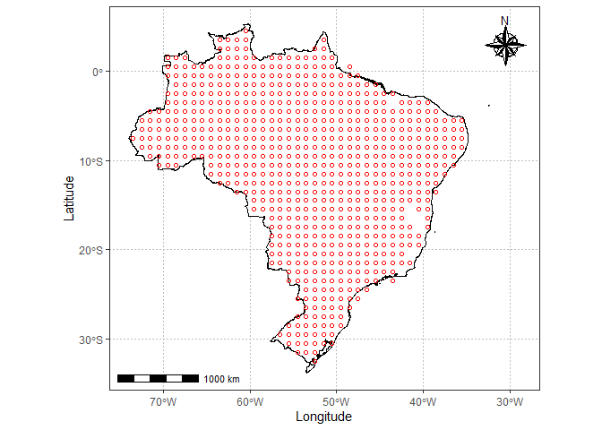<!-- -->

``` r
composition(xco2,oco2_br)
```

    ## `stat_bin()` using `bins = 30`. Pick better value with `binwidth`.

<!-- -->

``` r
composition(sif,oco2_br)
```

    ## `stat_bin()` using `bins = 30`. Pick better value with `binwidth`.

<!-- -->

Necessário tratamento dos dados de SIF

``` r
oco2_br %>% 
  filter (sif > 0) %>%  
  pull(sif) %>% median() -> sif_median

oco2_br <- oco2_br %>% 
  mutate(sif = ifelse(sif > 0, sif, sif_median))
```

Existe uma tendência de aumento monotônica mundial da concentração de
CO<sub>2</sub> na atmosfera, assim, ela deve ser retirada para podermos
observar as tendências regionais. Observe que o sinal na variável `XCO2`
não apresenta a tendência descrita.

``` r
oco2_br  %>%  
  ggplot(aes(x=data,y=xco2_moles_mole_1)) +
  geom_point(shape=21,color="black",fill="gray") +
  geom_smooth(method = "lm") +
  stat_regline_equation(ggplot2::aes(
  label =  paste(..eq.label.., ..rr.label.., sep = "*plain(\",\")~~")))
```

    ## `geom_smooth()` using formula = 'y ~ x'

<!-- -->

Compare com os dados da variáveis `xco2` que apresenta a tendência de
crescimento monotônica.

``` r
oco2_br  %>%  
  ggplot(aes(x=data,y=xco2)) +
  geom_point(shape=21,color="black",fill="gray") +
  geom_smooth(method = "lm") +
  stat_regline_equation(ggplot2::aes(
  label =  paste(..eq.label.., ..rr.label.., sep = "*plain(\",\")~~")))
```

    ## `geom_smooth()` using formula = 'y ~ x'

<!-- -->

Agora, deve-se vizualizar os dados perdidos nas bases

``` r
visdat::vis_miss(data_fco2)
```

<!-- -->

## Listando as datas dos arquivos

``` r
lista_data_fco2 <- unique(data_fco2$data)
lista_data_oco2 <- unique(oco2_br$data)
datas_fco2 <- paste0(lubridate::year(lista_data_fco2),"-",lubridate::month(lista_data_fco2)) %>% 
  unique()

datas_oco2 <- paste0(lubridate::year(lista_data_oco2),"-",lubridate::month(lista_data_oco2)) %>% unique()
datas <- datas_fco2[datas_fco2 %in% datas_oco2]
```

Chaves para mesclagem

``` r
fco2 <- data_fco2 %>% 
  mutate(ano_mes = paste0(lubridate::year(data),"-",lubridate::month(data))) %>% 
  dplyr::filter(ano_mes %in% datas)

xco2 <- oco2_br %>%   
  mutate(ano_mes=paste0(ano,"-",mes)) %>% 
  dplyr::filter(ano_mes %in% datas)
```

Coordenadas das cidades

``` r
unique(xco2$ano_mes)[unique(xco2$ano_mes) %>% order()] == 
unique(fco2$ano_mes)[unique(fco2$ano_mes) %>% order()]
```

    ##  [1] TRUE TRUE TRUE TRUE TRUE TRUE TRUE TRUE TRUE TRUE TRUE TRUE TRUE TRUE TRUE
    ## [16] TRUE TRUE TRUE TRUE TRUE TRUE TRUE TRUE TRUE TRUE TRUE TRUE TRUE TRUE

``` r
data_set <- left_join(fco2 %>% 
            mutate(ano = lubridate::year(data),
                   mes = lubridate::month(data)
                   ), 
          xco2 %>% 
            select(data,mes,dia,longitude,latitude,xco2,sif,fluorescence_radiance_757nm_idp_ph_sec_1_m_2_sr_1_um_1,fluorescence_radiance_771nm_idp_ph_sec_1_m_2_sr_1_um_1, ano_mes), by = "ano_mes") %>% 
  mutate(dist = sqrt((longitude-(-51.423519))^2+(latitude-(-20.362911))^2),
         # SIF = (fluorescence_radiance_757nm_idp_ph_sec_1_m_2_sr_1_um_1*2.6250912*10^(-19)  + 1.5*fluorescence_radiance_771nm_idp_ph_sec_1_m_2_sr_1_um_1* 2.57743*10^(-19))/2
         )
```

    ## Warning in left_join(fco2 %>% mutate(ano = lubridate::year(data), mes = lubridate::month(data)), : Detected an unexpected many-to-many relationship between `x` and `y`.
    ## ℹ Row 1 of `x` matches multiple rows in `y`.
    ## ℹ Row 1 of `y` matches multiple rows in `x`.
    ## ℹ If a many-to-many relationship is expected, set `relationship =
    ##   "many-to-many"` to silence this warning.

``` r
data_set<-data_set %>%
  select(-fluorescence_radiance_757nm_idp_ph_sec_1_m_2_sr_1_um_1, -fluorescence_radiance_771nm_idp_ph_sec_1_m_2_sr_1_um_1 )  %>% 
  filter(dist <= .16, fco2 <= 30 ) 
```

``` r
composition(sif,data_set)
```

    ## `stat_bin()` using `bins = 30`. Pick better value with `binwidth`.

<!-- -->

``` r
# Definindo o plano de multisession
future::plan("multisession")
```

``` r
visdat::vis_miss(data_set)
```

<!-- -->

``` r
tab_medias <- data_set %>% 
  # mutate(SIF = ifelse(SIF <=0, mean(data_set$SIF, na.rm=TRUE),SIF)) %>% 
  group_by(ano_mes, cultura) %>% 
  summarise(fco2 = mean(fco2, na.rm=TRUE),
            xco2 = mean(xco2, na.rm=TRUE),
            sif = mean(sif, na.rm=TRUE))
```

    ## `summarise()` has grouped output by 'ano_mes'. You can override using the
    ## `.groups` argument.

``` r
tab_medias %>% filter(sif > 0) %>% 
  ggplot(aes(y=xco2, x=sif)) +
  geom_point(size=3, shape=21, fill="gray")+
  geom_smooth(method = "lm", se=FALSE,
              ldw=2,color="red")+
  stat_regline_equation(aes(
    label =  paste(..eq.label.., ..rr.label.., sep = "*plain(\",\")~~")),size=5, label.x.npc = .4)
```

    ## Warning in geom_smooth(method = "lm", se = FALSE, ldw = 2, color = "red"):
    ## Ignoring unknown parameters: `ldw`

    ## `geom_smooth()` using formula = 'y ~ x'

<!-- -->

``` r
lm(xco2 ~ sif,
           data = tab_medias %>% filter(sif > 0) ) %>% 
  summary.lm()
```

    ## 
    ## Call:
    ## lm(formula = xco2 ~ sif, data = tab_medias %>% filter(sif > 0))
    ## 
    ## Residuals:
    ##     Min      1Q  Median      3Q     Max 
    ## -6.2221 -3.1933 -0.5836  3.3626  8.3877 
    ## 
    ## Coefficients:
    ##             Estimate Std. Error t value Pr(>|t|)    
    ## (Intercept)  405.068      1.093 370.746  < 2e-16 ***
    ## sif           -5.199      1.438  -3.616 0.000667 ***
    ## ---
    ## Signif. codes:  0 '***' 0.001 '**' 0.01 '*' 0.05 '.' 0.1 ' ' 1
    ## 
    ## Residual standard error: 4.151 on 53 degrees of freedom
    ## Multiple R-squared:  0.1979, Adjusted R-squared:  0.1828 
    ## F-statistic: 13.08 on 1 and 53 DF,  p-value: 0.0006668

``` r
lm(xco2 ~ sif + sif2,
           data = tab_medias %>% filter(sif > 0) %>% mutate(sif2 = sif^2))  %>% 
  summary.lm()
```

    ## 
    ## Call:
    ## lm(formula = xco2 ~ sif + sif2, data = tab_medias %>% filter(sif > 
    ##     0) %>% mutate(sif2 = sif^2))
    ## 
    ## Residuals:
    ##     Min      1Q  Median      3Q     Max 
    ## -5.6980 -3.2502 -0.6342  3.0163  9.0301 
    ## 
    ## Coefficients:
    ##             Estimate Std. Error t value Pr(>|t|)    
    ## (Intercept)  406.845      2.122 191.765   <2e-16 ***
    ## sif          -11.053      6.161  -1.794   0.0786 .  
    ## sif2           3.539      3.622   0.977   0.3330    
    ## ---
    ## Signif. codes:  0 '***' 0.001 '**' 0.01 '*' 0.05 '.' 0.1 ' ' 1
    ## 
    ## Residual standard error: 4.152 on 52 degrees of freedom
    ## Multiple R-squared:  0.2124, Adjusted R-squared:  0.1821 
    ## F-statistic:  7.01 on 2 and 52 DF,  p-value: 0.002017

``` r
lm(xco2 ~ sif + sif2 + sif3,
           data = tab_medias %>% filter(sif > 0) %>% mutate(sif2 = sif^2,
                                                            sif3 = sif^3))  %>% 
  summary.lm()
```

    ## 
    ## Call:
    ## lm(formula = xco2 ~ sif + sif2 + sif3, data = tab_medias %>% 
    ##     filter(sif > 0) %>% mutate(sif2 = sif^2, sif3 = sif^3))
    ## 
    ## Residuals:
    ##     Min      1Q  Median      3Q     Max 
    ## -5.9277 -3.1707 -0.1811  3.0402  8.7560 
    ## 
    ## Coefficients:
    ##             Estimate Std. Error t value Pr(>|t|)    
    ## (Intercept)  411.221      3.878 106.043   <2e-16 ***
    ## sif          -34.070     18.188  -1.873   0.0668 .  
    ## sif2          35.649     24.166   1.475   0.1463    
    ## sif3         -12.584      9.365  -1.344   0.1850    
    ## ---
    ## Signif. codes:  0 '***' 0.001 '**' 0.01 '*' 0.05 '.' 0.1 ' ' 1
    ## 
    ## Residual standard error: 4.121 on 51 degrees of freedom
    ## Multiple R-squared:  0.2393, Adjusted R-squared:  0.1945 
    ## F-statistic: 5.347 on 3 and 51 DF,  p-value: 0.002797

``` r
formula <- y ~ poly(x, 3, raw = TRUE)
tab_medias %>% filter(sif > 0) %>%
  ggplot(aes(x=xco2, y=fco2)) +
  geom_point(size=3, shape=21, fill="gray")+
  geom_smooth(method = "lm", se=FALSE,
              ldw=2,color="red") +
  stat_regline_equation(aes(
    label =  paste(..eq.label.., ..rr.label.., sep = "*plain(\",\")~~")),size=5,label.x.npc = .4) +
  stat_smooth(method="lm", se=TRUE, fill=NA,
                formula=y ~ poly(x, 3, raw=TRUE),colour="blue") +
  stat_regline_equation(aes(
    label =  paste(..eq.label.., ..rr.label.., sep = "*plain(\",\")~~")), formula = y ~ poly(x, 3, raw = TRUE)
    ,size=5,label.x.npc = .2,label.y.npc = .85)
```

    ## Warning in geom_smooth(method = "lm", se = FALSE, ldw = 2, color = "red"):
    ## Ignoring unknown parameters: `ldw`

    ## `geom_smooth()` using formula = 'y ~ x'

<!-- -->

``` r
lm(xco2 ~ fco2,
           data = tab_medias %>% filter(sif > 0) ) %>% 
  summary.lm()
```

    ## 
    ## Call:
    ## lm(formula = xco2 ~ fco2, data = tab_medias %>% filter(sif > 
    ##     0))
    ## 
    ## Residuals:
    ##    Min     1Q Median     3Q    Max 
    ## -6.503 -2.598 -1.369  3.193  9.588 
    ## 
    ## Coefficients:
    ##             Estimate Std. Error t value Pr(>|t|)    
    ## (Intercept) 407.0694     1.1172 364.353  < 2e-16 ***
    ## fco2         -1.5381     0.2846  -5.404 1.58e-06 ***
    ## ---
    ## Signif. codes:  0 '***' 0.001 '**' 0.01 '*' 0.05 '.' 0.1 ' ' 1
    ## 
    ## Residual standard error: 3.721 on 53 degrees of freedom
    ## Multiple R-squared:  0.3553, Adjusted R-squared:  0.3431 
    ## F-statistic:  29.2 on 1 and 53 DF,  p-value: 1.577e-06

``` r
lm(xco2 ~ fco2 + fco22,
           data = tab_medias %>% filter(sif > 0) %>% mutate(fco22 = fco2^2))  %>% 
  summary.lm()
```

    ## 
    ## Call:
    ## lm(formula = xco2 ~ fco2 + fco22, data = tab_medias %>% filter(sif > 
    ##     0) %>% mutate(fco22 = fco2^2))
    ## 
    ## Residuals:
    ##    Min     1Q Median     3Q    Max 
    ## -5.884 -2.555 -1.224  3.046  7.158 
    ## 
    ## Coefficients:
    ##             Estimate Std. Error t value Pr(>|t|)    
    ## (Intercept) 409.5820     2.2623 181.045   <2e-16 ***
    ## fco2         -3.1541     1.2988  -2.428   0.0187 *  
    ## fco22         0.2048     0.1606   1.275   0.2080    
    ## ---
    ## Signif. codes:  0 '***' 0.001 '**' 0.01 '*' 0.05 '.' 0.1 ' ' 1
    ## 
    ## Residual standard error: 3.7 on 52 degrees of freedom
    ## Multiple R-squared:  0.3748, Adjusted R-squared:  0.3508 
    ## F-statistic: 15.59 on 2 and 52 DF,  p-value: 4.971e-06

``` r
lm(xco2 ~ fco2 + fco22 + fco23,
           data = tab_medias %>% filter(sif > 0) %>% mutate(fco22 = fco2^2,
                                                            fco23 = fco2^3))  %>% 
  summary.lm()
```

    ## 
    ## Call:
    ## lm(formula = xco2 ~ fco2 + fco22 + fco23, data = tab_medias %>% 
    ##     filter(sif > 0) %>% mutate(fco22 = fco2^2, fco23 = fco2^3))
    ## 
    ## Residuals:
    ##     Min      1Q  Median      3Q     Max 
    ## -7.0760 -2.4081 -0.6747  1.8383  8.4071 
    ## 
    ## Coefficients:
    ##              Estimate Std. Error t value Pr(>|t|)    
    ## (Intercept) 396.24732    4.00770  98.872  < 2e-16 ***
    ## fco2         10.00441    3.61034   2.771 0.007778 ** 
    ## fco22        -3.37002    0.94022  -3.584 0.000755 ***
    ## fco23         0.28341    0.07368   3.847 0.000334 ***
    ## ---
    ## Signif. codes:  0 '***' 0.001 '**' 0.01 '*' 0.05 '.' 0.1 ' ' 1
    ## 
    ## Residual standard error: 3.289 on 51 degrees of freedom
    ## Multiple R-squared:  0.5154, Adjusted R-squared:  0.4869 
    ## F-statistic: 18.08 on 3 and 51 DF,  p-value: 4.007e-08

``` r
lm(xco2 ~ fco2 + fco22 + fco23+ fco24,
           data = tab_medias %>% filter(sif > 0) %>% mutate(fco22 = fco2^2,
                                                            fco23 = fco2^3,
                                                            fco24 = fco2^4))  %>% 
  summary.lm()
```

    ## 
    ## Call:
    ## lm(formula = xco2 ~ fco2 + fco22 + fco23 + fco24, data = tab_medias %>% 
    ##     filter(sif > 0) %>% mutate(fco22 = fco2^2, fco23 = fco2^3, 
    ##     fco24 = fco2^4))
    ## 
    ## Residuals:
    ##     Min      1Q  Median      3Q     Max 
    ## -7.0815 -2.4024 -0.6729  1.8395  8.4153 
    ## 
    ## Coefficients:
    ##               Estimate Std. Error t value Pr(>|t|)    
    ## (Intercept)  3.964e+02  7.379e+00  53.718   <2e-16 ***
    ## fco2         9.831e+00  9.226e+00   1.066    0.292    
    ## fco22       -3.293e+00  3.861e+00  -0.853    0.398    
    ## fco23        2.702e-01  6.513e-01   0.415    0.680    
    ## fco24        7.769e-04  3.795e-02   0.020    0.984    
    ## ---
    ## Signif. codes:  0 '***' 0.001 '**' 0.01 '*' 0.05 '.' 0.1 ' ' 1
    ## 
    ## Residual standard error: 3.322 on 50 degrees of freedom
    ## Multiple R-squared:  0.5154, Adjusted R-squared:  0.4766 
    ## F-statistic: 13.29 on 4 and 50 DF,  p-value: 1.892e-07

``` r
tab_medias %>% filter(sif > 0) %>%
  ggplot(aes(y=fco2, x=sif)) +
  geom_point(size=3, shape=21, fill="gray")+
  geom_smooth(method = "lm", se=FALSE,
              ldw=2,color="red")+
  stat_regline_equation(aes(
    label =  paste(..eq.label.., ..rr.label.., sep = "*plain(\",\")~~")),size=5,label.x.npc = .4,label.y.npc = .1)
```

    ## Warning in geom_smooth(method = "lm", se = FALSE, ldw = 2, color = "red"):
    ## Ignoring unknown parameters: `ldw`

    ## `geom_smooth()` using formula = 'y ~ x'

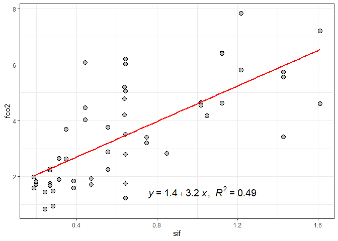<!-- -->

``` r
lm(fco2 ~ sif,
           data = tab_medias %>% filter(sif > 0) ) %>% 
  summary.lm()
```

    ## 
    ## Call:
    ## lm(formula = fco2 ~ sif, data = tab_medias %>% filter(sif > 0))
    ## 
    ## Residuals:
    ##     Min      1Q  Median      3Q     Max 
    ## -2.5468 -0.7814 -0.2975  0.7166  3.2571 
    ## 
    ## Coefficients:
    ##             Estimate Std. Error t value Pr(>|t|)    
    ## (Intercept)   1.4350     0.3371   4.257 8.50e-05 ***
    ## sif           3.1750     0.4436   7.158 2.51e-09 ***
    ## ---
    ## Signif. codes:  0 '***' 0.001 '**' 0.01 '*' 0.05 '.' 0.1 ' ' 1
    ## 
    ## Residual standard error: 1.281 on 53 degrees of freedom
    ## Multiple R-squared:  0.4915, Adjusted R-squared:  0.4819 
    ## F-statistic: 51.23 on 1 and 53 DF,  p-value: 2.514e-09

``` r
lm(fco2 ~ sif + sif2,
           data = tab_medias %>% filter(sif > 0) %>% mutate(sif2 = sif^2))  %>% 
  summary.lm()
```

    ## 
    ## Call:
    ## lm(formula = fco2 ~ sif + sif2, data = tab_medias %>% filter(sif > 
    ##     0) %>% mutate(sif2 = sif^2))
    ## 
    ## Residuals:
    ##     Min      1Q  Median      3Q     Max 
    ## -2.5244 -0.8894 -0.2424  0.7600  3.1917 
    ## 
    ## Coefficients:
    ##             Estimate Std. Error t value Pr(>|t|)   
    ## (Intercept)   0.4461     0.6409   0.696   0.4895   
    ## sif           6.4331     1.8613   3.456   0.0011 **
    ## sif2         -1.9699     1.0942  -1.800   0.0776 . 
    ## ---
    ## Signif. codes:  0 '***' 0.001 '**' 0.01 '*' 0.05 '.' 0.1 ' ' 1
    ## 
    ## Residual standard error: 1.254 on 52 degrees of freedom
    ## Multiple R-squared:  0.5214, Adjusted R-squared:  0.5029 
    ## F-statistic: 28.32 on 2 and 52 DF,  p-value: 4.791e-09

``` r
lm(fco2 ~ sif + sif2 + sif3,
           data = tab_medias %>% filter(sif > 0) %>% mutate(sif2 = sif^2,
                                                            sif3 = sif^3))  %>% 
  summary.lm()
```

    ## 
    ## Call:
    ## lm(formula = fco2 ~ sif + sif2 + sif3, data = tab_medias %>% 
    ##     filter(sif > 0) %>% mutate(sif2 = sif^2, sif3 = sif^3))
    ## 
    ## Residuals:
    ##     Min      1Q  Median      3Q     Max 
    ## -2.5431 -0.8731 -0.2585  0.7704  3.1687 
    ## 
    ## Coefficients:
    ##             Estimate Std. Error t value Pr(>|t|)
    ## (Intercept)   0.2809     1.1917   0.236    0.815
    ## sif           7.3019     5.5894   1.306    0.197
    ## sif2         -3.1818     7.4263  -0.428    0.670
    ## sif3          0.4750     2.8779   0.165    0.870
    ## 
    ## Residual standard error: 1.266 on 51 degrees of freedom
    ## Multiple R-squared:  0.5216, Adjusted R-squared:  0.4935 
    ## F-statistic: 18.54 on 3 and 51 DF,  p-value: 2.901e-08

``` r
data_set_temporal <- data_set %>% 
  filter(experimento == "Temporal")

data_set_espacial <- data_set %>% 
  filter(experimento == "Espacial")
```

# Carregando dados Meteorológicos de Ilha Solteira

``` r
dados_estacao <- read_excel("../data-raw/xlsx/estacao_meteorologia_ilha_solteira.xlsx", na = "NA") %>% 
  janitor::clean_names()
glimpse(dados_estacao)
```

    ## Rows: 1,826
    ## Columns: 16
    ## $ data    <dttm> 2015-01-01, 2015-01-02, 2015-01-03, 2015-01-04, 2015-01-05, 2…
    ## $ tmed    <dbl> 30.5, 30.0, 26.8, 27.1, 27.0, 27.6, 30.2, 28.2, 28.5, 29.9, 30…
    ## $ tmax    <dbl> 36.5, 36.7, 35.7, 34.3, 33.2, 36.4, 37.2, 32.4, 37.1, 38.1, 38…
    ## $ tmin    <dbl> 24.6, 24.5, 22.9, 22.7, 22.3, 22.8, 22.7, 24.0, 23.0, 23.3, 24…
    ## $ umed    <dbl> 66.6, 70.4, 82.7, 76.8, 81.6, 75.5, 65.8, 70.0, 72.9, 67.6, 66…
    ## $ umax    <dbl> 89.6, 93.6, 99.7, 95.0, 98.3, 96.1, 99.2, 83.4, 90.7, 97.4, 90…
    ## $ umin    <dbl> 42.0, 44.2, 52.9, 43.8, 57.1, 47.5, 34.1, 57.4, 42.7, 38.3, 37…
    ## $ pk_pa   <dbl> 97.2, 97.3, 97.4, 97.5, 97.4, 97.5, 97.4, 97.4, 97.4, 97.4, 97…
    ## $ rad     <dbl> 23.6, 24.6, 20.2, 21.4, 17.8, 19.2, 27.0, 15.2, 21.6, 24.3, 24…
    ## $ par     <dbl> 496.6, 513.3, 430.5, 454.0, 378.2, 405.4, 565.7, 317.2, 467.5,…
    ## $ eto     <dbl> 5.7, 5.8, 4.9, 5.1, 4.1, 4.8, 6.2, 4.1, 5.5, 5.7, 5.9, 6.1, 6.…
    ## $ velmax  <dbl> 6.1, 4.8, 12.1, 6.2, 5.1, 4.5, 4.6, 5.7, 5.8, 5.2, 5.2, 4.7, 6…
    ## $ velmin  <dbl> 1.0, 1.0, 1.2, 1.0, 0.8, 0.9, 0.9, 1.5, 1.2, 0.8, 0.8, 1.2, 1.…
    ## $ dir_vel <dbl> 17.4, 261.9, 222.0, 25.0, 56.9, 74.9, 53.4, 89.0, 144.8, 303.9…
    ## $ chuva   <dbl> 0.0, 0.0, 3.3, 0.0, 0.0, 0.0, 0.0, 0.0, 0.0, 0.0, 0.0, 0.0, 0.…
    ## $ inso    <dbl> 7.9, 8.7, 5.2, 6.2, 3.4, 4.5, 10.5, 1.3, 6.3, 8.4, 8.6, 7.9, 1…

``` r
dados_estacao <- dados_estacao %>% 
                   drop_na()
visdat::vis_miss(dados_estacao)
```

<!-- -->

``` r
data_set_est_isa <- left_join(data_set %>% 
                         rename(data=data.x), dados_estacao, by = "data") %>%                           mutate(range_t = tmax-tmin) 
```

``` r
data_set_temporal <- data_set_est_isa %>% 
  filter(experimento == "Temporal")

data_set_espacial <- data_set_est_isa %>% 
  filter(experimento == "Espacial")
```

# Quarta Aproximação

- Alvo: FCO2 - temporal
- restrição dados após 2014
- Features: Atributos do Solo + Xco2 e SIF + Dados da Estação de ISA
- Modelo mais simples e geral
- Teste de três métodos baseados em árvores de decisão

### Visualização do banco de dados

``` r
visdat::vis_miss(data_set_temporal)
```

<!-- -->

### Definindo a Base de treino e teste

``` r
# data_set_ml <- data_set_espacial  # <-------
data_set_ml <- data_set_temporal %>% #<-------
  drop_na()
fco2_initial_split <- initial_split(data_set_ml, prop = 0.75)
```

``` r
fco2_train <- training(fco2_initial_split)
# fco2_test <- testing(fco2_initial_split)
# visdat::vis_miss(fco2_test)
fco2_train  %>% 
  ggplot(aes(x=fco2, y=..density..))+
  geom_histogram(bins = 30, color="black",  fill="lightgray")+
  geom_density(alpha=.05,fill="red")+
  theme_bw() +
  labs(x="fco2 - treino", y = "Densidade")
```

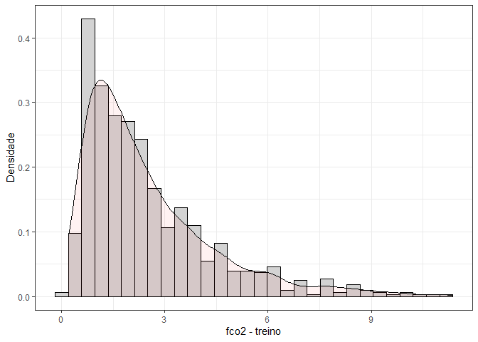<!-- -->

``` r
fco2_testing <- testing(fco2_initial_split)
fco2_testing  %>% 
  ggplot(aes(x=fco2, y=..density..))+
  geom_histogram(bins = 30, color="black",  fill="lightgray")+
  geom_density(alpha=.05,fill="blue")+
  theme_bw() +
  labs(x="fco2 - teste", y = "Densidade")
```

<!-- -->

``` r
fco2_train   %>%    select(fco2:hlifs,xco2,sif,tmed:inso) %>% 
  mutate(range_t = tmax-tmin) %>% 
  select(-c(tmax,tmin,umax,umin,dir_vel)) %>%   
  select(where(is.numeric)) %>%
  drop_na() %>% 
  cor()  %>%  
  corrplot::corrplot()
```

<!-- -->

### data prep

``` r
fco2_recipe <- recipe(fco2 ~ ., 
                      data = fco2_train %>% 
            select(fco2:hlifs,xco2,sif,tmed:inso) 
) %>%  
  # step_normalize(all_numeric_predictors())  %>% 
  step_naomit() %>%  
  step_novel(all_nominal_predictors()) %>% 
  step_zv(all_predictors()) %>%
  step_naomit(c(ts, us)) %>% 
  step_impute_median(where(is.numeric)) %>% # inputação da mediana nos numéricos
  # step_poly(c(Us,Ts), degree = 2)  %>%  
  step_dummy(all_nominal_predictors())
bake(prep(fco2_recipe), new_data = NULL)
```

    ## # A tibble: 852 × 39
    ##       ts    us   p_h    mo     p     k    ca    mg  h_al    sb   ctc     v    ds
    ##    <dbl> <dbl> <dbl> <dbl> <dbl> <dbl> <dbl> <dbl> <dbl> <dbl> <dbl> <dbl> <dbl>
    ##  1   3   21.8    4.1     4    19   0.4     6     7    88  13.4 101.   13    1.62
    ##  2  22.1  4.4    6.5    23    16   1.2    45    22     0  68.2  79.2  86.1  1.4 
    ##  3  12.6  8.8    6.5    23    16   1.2    45    22     0  68.2  79.2  86.1  1.4 
    ##  4  22.3  4.06   4.8    15    15   0.6     7     9    20  16.6  36.6  45    1.68
    ##  5   4   20.3    3.9     4    17   0.2     4     2    64   6.2  70.2   9    1.6 
    ##  6  21.7  4.14   5.7    18     3   0.8    18    18    12  36.8  48.8  75    1.6 
    ##  7  28.8  9.5    4.9    10     2   0.4     7     4     0  11.4  26.4  43.2  1.53
    ##  8  11.7 10.3    5.4    12     4   0.4    12     5     0  17.4  30.4  57.2  1.71
    ##  9  22.1  3.3    5.2    10     2   0.3    11     5     0  16.3  28.3  57.6  1.56
    ## 10  17.4  2.3    5.3    13     3   0.3     9     5     0  14.3  29.3  48.8  1.63
    ## # ℹ 842 more rows
    ## # ℹ 26 more variables: macro <dbl>, micro <dbl>, vtp <dbl>, pla <dbl>,
    ## #   at <dbl>, silte <dbl>, arg <dbl>, hlifs <dbl>, xco2 <dbl>, sif <dbl>,
    ## #   tmed <dbl>, tmax <dbl>, tmin <dbl>, umed <dbl>, umax <dbl>, umin <dbl>,
    ## #   pk_pa <dbl>, rad <dbl>, par <dbl>, eto <dbl>, velmax <dbl>, velmin <dbl>,
    ## #   dir_vel <dbl>, chuva <dbl>, inso <dbl>, fco2 <dbl>

``` r
visdat::vis_miss(bake(prep(fco2_recipe), new_data = NULL))
```

<!-- -->

### Reamostragem definida e será padrão para todos os modelos

``` r
fco2_resamples <- vfold_cv(fco2_train, v = 5) 
```

## Rede Neural Artificial

#### ϵ-insensitive loss regression (Flavor).

<https://www.r-bloggers.com/2020/03/machine-learning-with-tidymodels/>

### Definição do modelo

Esquema da rede neural contendo 4 neurônios e algumas variáveis para
exemplificação apenas.

``` r
fco2_nn_model <- mlp(
  hidden_units = 4) %>% # margin sempre para regressão
  set_mode("regression") %>%
  set_engine("nnet") %>% 
  fit(fco2 ~ ., data = fco2_train %>% 
            select(fco2:mo, hlifs,xco2,sif,tmed))
NeuralNetTools::plotnet(fco2_nn_model$fit)
```

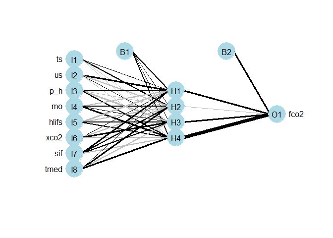<!-- -->

``` r
fco2_nn_model <- mlp(
  hidden_units = tune(), 
  penalty = tune(),
  epochs = tune()
  ) %>% # margin sempre para regressão
  set_mode("regression") %>%
  set_engine("nnet") 
```

### Workflow

``` r
fco2_nn_wf <- workflow()   %>%  
  add_model(fco2_nn_model) %>% 
  add_recipe(fco2_recipe)
```

### Criando a matriz (grid) com os valores de hiperparâmetros a serem testados

``` r
grid_nn <- expand.grid(
  hidden_units = c(1,2,3,4,5,6,7),
  penalty = c(1,5,10,15),
  epochs = c(100, 1000, 5000)
)
glimpse(grid_nn)
```

    ## Rows: 84
    ## Columns: 3
    ## $ hidden_units <dbl> 1, 2, 3, 4, 5, 6, 7, 1, 2, 3, 4, 5, 6, 7, 1, 2, 3, 4, 5, …
    ## $ penalty      <dbl> 1, 1, 1, 1, 1, 1, 1, 5, 5, 5, 5, 5, 5, 5, 10, 10, 10, 10,…
    ## $ epochs       <dbl> 100, 100, 100, 100, 100, 100, 100, 100, 100, 100, 100, 10…

### Tuning de hiperparâmetros

``` r
fco2_nn_tune_grid <- tune_grid(
  fco2_nn_wf,
  resamples = fco2_resamples,
  grid = grid_nn,
  metrics = metric_set(rmse)
)
```

``` r
autoplot(fco2_nn_tune_grid)
```

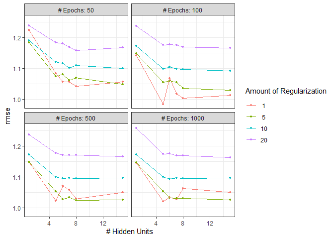<!-- -->

``` r
collect_metrics(fco2_nn_tune_grid)
```

    ## # A tibble: 84 × 9
    ##    hidden_units penalty epochs .metric .estimator  mean     n std_err .config   
    ##           <dbl>   <dbl>  <dbl> <chr>   <chr>      <dbl> <int>   <dbl> <chr>     
    ##  1            1       1    100 rmse    standard    1.54     5  0.123  Preproces…
    ##  2            2       1    100 rmse    standard    1.38     5  0.0894 Preproces…
    ##  3            3       1    100 rmse    standard    1.49     5  0.0734 Preproces…
    ##  4            4       1    100 rmse    standard    1.49     5  0.0488 Preproces…
    ##  5            5       1    100 rmse    standard    1.48     5  0.0782 Preproces…
    ##  6            6       1    100 rmse    standard    1.44     5  0.0594 Preproces…
    ##  7            7       1    100 rmse    standard    1.44     5  0.0618 Preproces…
    ##  8            1       5    100 rmse    standard    1.57     5  0.156  Preproces…
    ##  9            2       5    100 rmse    standard    1.42     5  0.0572 Preproces…
    ## 10            3       5    100 rmse    standard    1.44     5  0.0830 Preproces…
    ## # ℹ 74 more rows

``` r
fco2_nn_tune_grid %>%   
  show_best(metric = "rmse", n = 5)
```

    ## # A tibble: 5 × 9
    ##   hidden_units penalty epochs .metric .estimator  mean     n std_err .config    
    ##          <dbl>   <dbl>  <dbl> <chr>   <chr>      <dbl> <int>   <dbl> <chr>      
    ## 1            6       5   5000 rmse    standard    1.04     5  0.0491 Preprocess…
    ## 2            7       5   1000 rmse    standard    1.05     5  0.0500 Preprocess…
    ## 3            7      15   5000 rmse    standard    1.05     5  0.0362 Preprocess…
    ## 4            6      10   1000 rmse    standard    1.07     5  0.0326 Preprocess…
    ## 5            7       5   5000 rmse    standard    1.07     5  0.0228 Preprocess…

### Desempenho dos modelos finais

``` r
fco2_nn_best_params <- select_best(fco2_nn_tune_grid, "rmse")
fco2_nn_wf <- fco2_nn_wf %>% 
  finalize_workflow(fco2_nn_best_params)
fco2_nn_last_fit <- last_fit(fco2_nn_wf, fco2_initial_split)
```

### Criando os preditos

``` r
fco2_test_preds <- bind_rows(
  collect_predictions(fco2_nn_last_fit)  %>%  
    mutate(modelo = "nn")
)

fco2_test <- testing(fco2_initial_split)
visdat::vis_miss(fco2_test)
```

<!-- -->

``` r
fco2_test_preds %>% 
  ggplot(aes(x=.pred, y=fco2)) +
  geom_point()+
  theme_bw() +
  geom_smooth(method = "lm") +
  stat_regline_equation(ggplot2::aes(
  label =  paste(..eq.label.., ..rr.label.., sep = "*plain(\",\")~~"))) +
  geom_abline (slope=1, linetype = "dashed", color="Red")
```

    ## `geom_smooth()` using formula = 'y ~ x'

<!-- -->

# Importância

To compute the variable importance scores we just call vip() with method
= “permute” and pass our previously defined predictions wrapper to the
pred_wrapper argument. `estimate` should be a numeric vector, not a
numeric matrix.

``` r
fco2_nn_last_fit_model <-fco2_nn_last_fit$.workflow[[1]]$fit$fit
vip(fco2_nn_last_fit_model,
    aesthetics = list(color = "black", fill = "orange")) +
    theme(axis.text.y=element_text(size=rel(1.5)),
          axis.text.x=element_text(size=rel(1.5)),
          axis.title.x=element_text(size=rel(1.5))
          )
```

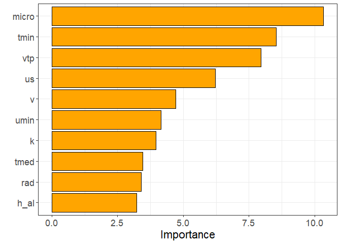<!-- -->

## Métricas

``` r
da <- fco2_test_preds %>% 
  filter(fco2 > 0, .pred>0 )

my_r <- cor(da$fco2,da$.pred)
my_r2 <- my_r*my_r
my_mse <- Metrics::mse(da$fco2,da$.pred)
my_rmse <- Metrics::rmse(da$fco2,
                         da$.pred)
my_mae <- Metrics::mae(da$fco2,da$.pred)
my_mape <- Metrics::mape(da$fco2,da$.pred)*100

vector_of_metrics <- c(r=my_r, R2=my_r2, MSE=my_mse, RMSE=my_rmse, MAE=my_mae, MAPE=my_mape)
print(data.frame(vector_of_metrics))
```

    ##      vector_of_metrics
    ## r            0.8239823
    ## R2           0.6789468
    ## MSE          1.1037050
    ## RMSE         1.0505737
    ## MAE          0.6821857
    ## MAPE        32.9579187

## Support Vector Machine - RDF

#### ϵ-insensitive loss regression (Flavor).

<https://bradleyboehmke.github.io/HOML/svm.html>
<https://stackoverflow.com/questions/77735850/variable-importance-plot-for-support-vector-machine-with-tidymodel-framework-is>

### Definição do modelo

``` r
fco2_svm_model <- svm_rbf(
  cost = tune(), 
  rbf_sigma = tune(),
  margin = tune()) %>% # margin sempre para regressão
  set_mode("regression") %>%
  set_engine("kernlab") #%>% 
  #translate()


# fco2_svm_model <- svm_linear(
#   cost = tune(),
#   margin = tune()
# ) %>%  
#   set_engine("LiblineaR") %>% 
#   set_mode("regression")
```

### Workflow

``` r
fco2_svm_wf <- workflow()   %>%  
  add_model(fco2_svm_model) %>% 
  add_recipe(fco2_recipe)
```

### Criando a matriz (grid) com os valores de hiperparâmetros a serem testados

``` r
grid_svm <- expand.grid(
  cost = c(0.01, 0.0625, 0.1, 0.5, 1, 10, 20, 50),
  rbf_sigma = c(0.001, 0.01, 0.095, 0.5),
  margin = c( .001, 0.025,.05, 0.175)
)
glimpse(grid_svm)
```

    ## Rows: 128
    ## Columns: 3
    ## $ cost      <dbl> 0.0100, 0.0625, 0.1000, 0.5000, 1.0000, 10.0000, 20.0000, 50…
    ## $ rbf_sigma <dbl> 0.001, 0.001, 0.001, 0.001, 0.001, 0.001, 0.001, 0.001, 0.01…
    ## $ margin    <dbl> 0.001, 0.001, 0.001, 0.001, 0.001, 0.001, 0.001, 0.001, 0.00…

### Tuning de hiperparâmetros

``` r
fco2_svm_tune_grid <- tune_grid(
  fco2_svm_wf,
  resamples = fco2_resamples,
  grid = grid_svm,
  metrics = metric_set(rmse)
)
```

``` r
autoplot(fco2_svm_tune_grid)
```

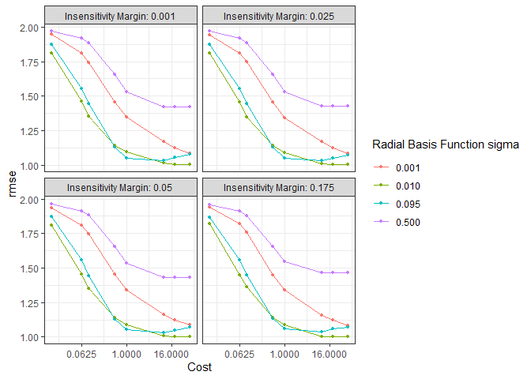<!-- -->

``` r
collect_metrics(fco2_svm_tune_grid)
```

    ## # A tibble: 128 × 9
    ##       cost rbf_sigma margin .metric .estimator  mean     n std_err .config      
    ##      <dbl>     <dbl>  <dbl> <chr>   <chr>      <dbl> <int>   <dbl> <chr>        
    ##  1  0.01       0.001  0.001 rmse    standard    1.92     5  0.0751 Preprocessor…
    ##  2  0.0625     0.001  0.001 rmse    standard    1.80     5  0.0780 Preprocessor…
    ##  3  0.1        0.001  0.001 rmse    standard    1.74     5  0.0778 Preprocessor…
    ##  4  0.5        0.001  0.001 rmse    standard    1.48     5  0.0686 Preprocessor…
    ##  5  1          0.001  0.001 rmse    standard    1.39     5  0.0641 Preprocessor…
    ##  6 10          0.001  0.001 rmse    standard    1.22     5  0.0568 Preprocessor…
    ##  7 20          0.001  0.001 rmse    standard    1.18     5  0.0504 Preprocessor…
    ##  8 50          0.001  0.001 rmse    standard    1.14     5  0.0470 Preprocessor…
    ##  9  0.01       0.01   0.001 rmse    standard    1.79     5  0.0775 Preprocessor…
    ## 10  0.0625     0.01   0.001 rmse    standard    1.48     5  0.0687 Preprocessor…
    ## # ℹ 118 more rows

``` r
fco2_svm_tune_grid %>%   
  show_best(metric = "rmse", n = 5)
```

    ## # A tibble: 5 × 9
    ##    cost rbf_sigma margin .metric .estimator  mean     n std_err .config         
    ##   <dbl>     <dbl>  <dbl> <chr>   <chr>      <dbl> <int>   <dbl> <chr>           
    ## 1    50      0.01  0.025 rmse    standard   0.987     5  0.0301 Preprocessor1_M…
    ## 2    50      0.01  0.001 rmse    standard   0.987     5  0.0281 Preprocessor1_M…
    ## 3    50      0.01  0.05  rmse    standard   0.987     5  0.0304 Preprocessor1_M…
    ## 4    50      0.01  0.175 rmse    standard   1.00      5  0.0342 Preprocessor1_M…
    ## 5    20      0.01  0.175 rmse    standard   1.01      5  0.0394 Preprocessor1_M…

### Desempenho dos modelos finais

``` r
fco2_svm_best_params <- select_best(fco2_svm_tune_grid, "rmse")
fco2_svm_wf <- fco2_svm_wf %>% 
  finalize_workflow(fco2_svm_best_params)
fco2_svm_last_fit <- last_fit(fco2_svm_wf, fco2_initial_split)
```

### Criando os preditos

``` r
fco2_test_preds <- bind_rows(
  collect_predictions(fco2_svm_last_fit)  %>%  
    mutate(modelo = "svm")
)

fco2_test <- testing(fco2_initial_split)
visdat::vis_miss(fco2_test)
```

<!-- -->

``` r
fco2_test_preds %>% 
  ggplot(aes(x=.pred, y=fco2)) +
  geom_point()+
  theme_bw() +
  geom_smooth(method = "lm") +
  stat_regline_equation(ggplot2::aes(
  label =  paste(..eq.label.., ..rr.label.., sep = "*plain(\",\")~~"))) +
  geom_abline (slope=1, linetype = "dashed", color="Red")
```

    ## `geom_smooth()` using formula = 'y ~ x'

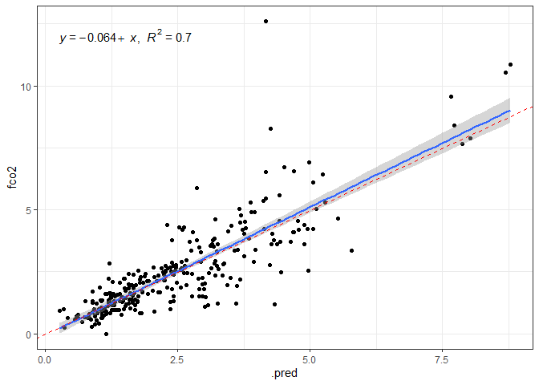<!-- -->

# Importância

To compute the variable importance scores we just call vip() with method
= “permute” and pass our previously defined predictions wrapper to the
pred_wrapper argument. `estimate` should be a numeric vector, not a
numeric matrix.

``` r
fco2_svm_last_fit_model <- fco2_svm_last_fit$.workflow[[1]]$fit$fit
fco2_svm_last_fit %>%
  extract_fit_parsnip() %>%
  vip(
    method = "permute", 
    target = "fco2", 
    metric = "rmse",
    nsim = 5,
    pred_wrapper = function(object, newdata)
      as.vector(kernlab::predict(object, newdata)),
    train = fco2_train %>% 
            select(fco2:hlifs,xco2,sif,tmed:inso),
     aesthetics = list(color = "black", fill = "orange")) +
    theme(axis.text.y=element_text(size=rel(1.5)),
          axis.text.x=element_text(size=rel(1.5)),
          axis.title.x=element_text(size=rel(1.5))
          )
```

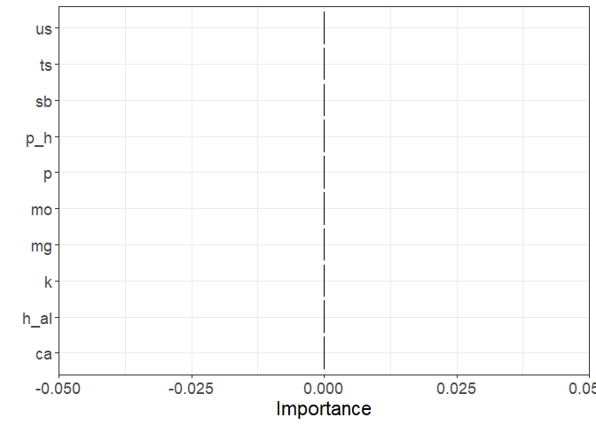<!-- -->

## Métricas

``` r
da <- fco2_test_preds %>% 
  filter(fco2 > 0, .pred>0 )

my_r <- cor(da$fco2,da$.pred)
my_r2 <- my_r*my_r
my_mse <- Metrics::mse(da$fco2,da$.pred)
my_rmse <- Metrics::rmse(da$fco2,
                         da$.pred)
my_mae <- Metrics::mae(da$fco2,da$.pred)
my_mape <- Metrics::mape(da$fco2,da$.pred)*100

vector_of_metrics <- c(r=my_r, R2=my_r2, MSE=my_mse, RMSE=my_rmse, MAE=my_mae, MAPE=my_mape)
print(data.frame(vector_of_metrics))
```

    ##      vector_of_metrics
    ## r            0.8528598
    ## R2           0.7273699
    ## MSE          0.9301085
    ## RMSE         0.9644213
    ## MAE          0.5156672
    ## MAPE        23.5450683

## Support Vector Machine - Linear

#### ϵ-insensitive loss regression (Flavor).

<https://bradleyboehmke.github.io/HOML/svm.html>
<https://stackoverflow.com/questions/77735850/variable-importance-plot-for-support-vector-machine-with-tidymodel-framework-is>

### Definição do modelo

``` r
fco2_svml_model <- svm_linear(
  cost = tune(), 
  margin = tune()) %>% # margin sempre para regressão
  set_mode("regression") %>%
  set_engine("kernlab") #%>% 
  #translate()


# fco2_svm_model <- svm_linear(
#   cost = tune(),
#   margin = tune()
# ) %>%  
#   set_engine("LiblineaR") %>% 
#   set_mode("regression")
```

### Workflow

``` r
fco2_svml_wf <- workflow()   %>%  
  add_model(fco2_svml_model) %>% 
  add_recipe(fco2_recipe)
```

### Criando a matriz (grid) com os valores de hiperparâmetros a serem testados

``` r
grid_svml <- expand.grid(
  cost = c(0.01, 0.0625, 0.1, 0.5, 1, 10, 20, 50),
  margin = c(0.175,0.5,0.55,0.6,0.75)
)
glimpse(grid_svml)
```

    ## Rows: 40
    ## Columns: 2
    ## $ cost   <dbl> 0.0100, 0.0625, 0.1000, 0.5000, 1.0000, 10.0000, 20.0000, 50.00…
    ## $ margin <dbl> 0.175, 0.175, 0.175, 0.175, 0.175, 0.175, 0.175, 0.175, 0.500, …

### Tuning de hiperparâmetros

``` r
fco2_svml_tune_grid <- tune_grid(
  fco2_svml_wf,
  resamples = fco2_resamples,
  grid = grid_svml,
  metrics = metric_set(rmse)
)
```

``` r
autoplot(fco2_svml_tune_grid)
```

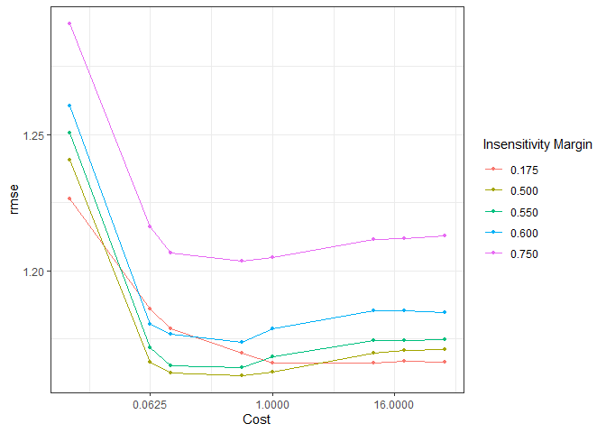<!-- -->

``` r
collect_metrics(fco2_svml_tune_grid)
```

    ## # A tibble: 40 × 8
    ##       cost margin .metric .estimator  mean     n std_err .config              
    ##      <dbl>  <dbl> <chr>   <chr>      <dbl> <int>   <dbl> <chr>                
    ##  1  0.01    0.175 rmse    standard    1.29     5  0.0594 Preprocessor1_Model01
    ##  2  0.0625  0.175 rmse    standard    1.25     5  0.0556 Preprocessor1_Model02
    ##  3  0.1     0.175 rmse    standard    1.24     5  0.0519 Preprocessor1_Model03
    ##  4  0.5     0.175 rmse    standard    1.23     5  0.0468 Preprocessor1_Model04
    ##  5  1       0.175 rmse    standard    1.23     5  0.0455 Preprocessor1_Model05
    ##  6 10       0.175 rmse    standard    1.23     5  0.0430 Preprocessor1_Model06
    ##  7 20       0.175 rmse    standard    1.23     5  0.0427 Preprocessor1_Model07
    ##  8 50       0.175 rmse    standard    1.23     5  0.0426 Preprocessor1_Model08
    ##  9  0.01    0.5   rmse    standard    1.29     5  0.0568 Preprocessor1_Model09
    ## 10  0.0625  0.5   rmse    standard    1.22     5  0.0489 Preprocessor1_Model10
    ## # ℹ 30 more rows

``` r
fco2_svml_tune_grid %>%   
  show_best(metric = "rmse", n = 5)
```

    ## # A tibble: 5 × 8
    ##    cost margin .metric .estimator  mean     n std_err .config              
    ##   <dbl>  <dbl> <chr>   <chr>      <dbl> <int>   <dbl> <chr>                
    ## 1   0.5   0.5  rmse    standard    1.21     5  0.0393 Preprocessor1_Model12
    ## 2   0.1   0.55 rmse    standard    1.21     5  0.0449 Preprocessor1_Model19
    ## 3   1     0.5  rmse    standard    1.21     5  0.0370 Preprocessor1_Model13
    ## 4  50     0.5  rmse    standard    1.22     5  0.0364 Preprocessor1_Model16
    ## 5  20     0.5  rmse    standard    1.22     5  0.0369 Preprocessor1_Model15

### Desempenho dos modelos finais

``` r
fco2_svml_best_params <- select_best(fco2_svml_tune_grid, "rmse")
fco2_svml_wf <- fco2_svml_wf %>% 
  finalize_workflow(fco2_svml_best_params)
fco2_svml_last_fit <- last_fit(fco2_svml_wf, fco2_initial_split)
```

### Criando os preditos

``` r
fco2_test_preds <- bind_rows(
  collect_predictions(fco2_svml_last_fit)  %>%  
    mutate(modelo = "svml")
)

fco2_test <- testing(fco2_initial_split)
visdat::vis_miss(fco2_test)
```

<!-- -->

``` r
fco2_test_preds %>% 
  ggplot(aes(x=.pred, y=fco2)) +
  geom_point()+
  theme_bw() +
  geom_smooth(method = "lm") +
  stat_regline_equation(ggplot2::aes(
  label =  paste(..eq.label.., ..rr.label.., sep = "*plain(\",\")~~"))) +
  geom_abline (slope=1, linetype = "dashed", color="Red")
```

    ## `geom_smooth()` using formula = 'y ~ x'

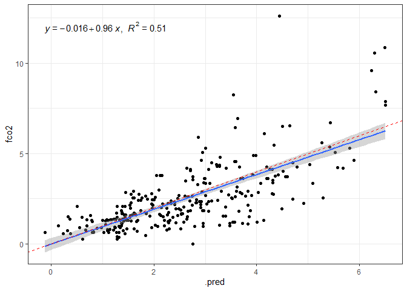<!-- -->

# Importância

To compute the variable importance scores we just call vip() with method
= “permute” and pass our previously defined predictions wrapper to the
pred_wrapper argument. `estimate` should be a numeric vector, not a
numeric matrix.

``` r
fco2_svml_last_fit_model <- fco2_svml_last_fit$.workflow[[1]]$fit$fit
fco2_svml_last_fit %>%
  extract_fit_parsnip() %>%
  vip(
    method = "permute", 
    target = "fco2", 
    metric = "rmse",
    nsim = 5,
    pred_wrapper = function(object, newdata)
      as.vector(kernlab::predict(object, newdata)),
    train = fco2_train %>% 
            select(fco2:hlifs,xco2,sif,tmed:inso),
     aesthetics = list(color = "black", fill = "orange")) +
    theme(axis.text.y=element_text(size=rel(1.5)),
          axis.text.x=element_text(size=rel(1.5)),
          axis.title.x=element_text(size=rel(1.5))
          )
```

<!-- -->

## Métricas

``` r
da <- fco2_test_preds %>% 
  filter(fco2 > 0, .pred>0 )

my_r <- cor(da$fco2,da$.pred)
my_r2 <- my_r*my_r
my_mse <- Metrics::mse(da$fco2,da$.pred)
my_rmse <- Metrics::rmse(da$fco2,
                         da$.pred)
my_mae <- Metrics::mae(da$fco2,da$.pred)
my_mape <- Metrics::mape(da$fco2,da$.pred)*100

vector_of_metrics <- c(r=my_r, R2=my_r2, MSE=my_mse, RMSE=my_rmse, MAE=my_mae, MAPE=my_mape)
print(data.frame(vector_of_metrics))
```

    ##      vector_of_metrics
    ## r            0.7803436
    ## R2           0.6089361
    ## MSE          1.3403224
    ## RMSE         1.1577229
    ## MAE          0.8000502
    ## MAPE        43.4099297

## Árvore de Decisão

### Definição do modelo

``` r
fco2_dt_model <- decision_tree(
  cost_complexity = tune(), # Quanto maior mais poda é realizada na árvore,
  tree_depth = tune(),  # Limitar evita criação de regras complexas
  min_n = tune() #número mín de obs em um nó para ser / em sub-nós.
)  %>%  
  set_mode("regression")  %>%  
  set_engine("rpart")
```

### Workflow

``` r
fco2_dt_wf <- workflow()   %>%  
  add_model(fco2_dt_model) %>% 
  add_recipe(fco2_recipe)
```

### Criando a matriz (grid) com os valores de hiperparâmetros a serem testados

``` r
# grid_dt <- grid_regular(
#   cost_complexity(c(1e-1, 1e-7)),
#   tree_depth(range = c(2, 30)),
#   min_n(range = c(2, 93)),
#   levels = 20 # <-----------------------------
# )

## melhor hiperparâmetros
grid_dt <- expand.grid(
  cost_complexity = c(1e-1, 1e-2, 1e-3, 1e-05, 1.e-06, 1e-7),
  tree_depth = c(2, 5, 15, 30),
  min_n  = c(2, 42, 93)
)
glimpse(grid_dt)
```

    ## Rows: 72
    ## Columns: 3
    ## $ cost_complexity <dbl> 1e-01, 1e-02, 1e-03, 1e-05, 1e-06, 1e-07, 1e-01, 1e-02…
    ## $ tree_depth      <dbl> 2, 2, 2, 2, 2, 2, 5, 5, 5, 5, 5, 5, 15, 15, 15, 15, 15…
    ## $ min_n           <dbl> 2, 2, 2, 2, 2, 2, 2, 2, 2, 2, 2, 2, 2, 2, 2, 2, 2, 2, …

### Tuning de hiperparâmetros

``` r
fco2_dt_tune_grid <- tune_grid(
  fco2_dt_wf,
  resamples = fco2_resamples,
  grid = grid_dt,
  metrics = metric_set(rmse)
)
```

``` r
autoplot(fco2_dt_tune_grid)
```

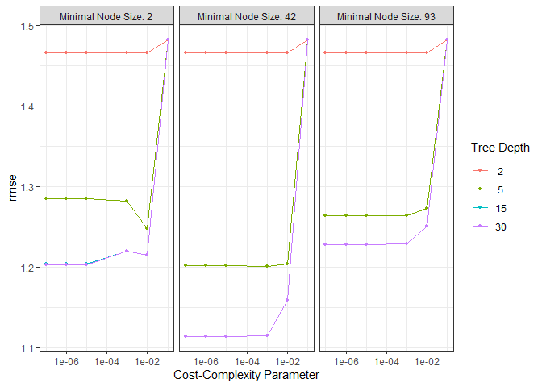<!-- -->

``` r
collect_metrics(fco2_dt_tune_grid)
```

    ## # A tibble: 72 × 9
    ##    cost_complexity tree_depth min_n .metric .estimator  mean     n std_err
    ##              <dbl>      <dbl> <dbl> <chr>   <chr>      <dbl> <int>   <dbl>
    ##  1       0.1                2     2 rmse    standard    1.59     5  0.0283
    ##  2       0.01               2     2 rmse    standard    1.47     5  0.0474
    ##  3       0.001              2     2 rmse    standard    1.47     5  0.0474
    ##  4       0.00001            2     2 rmse    standard    1.47     5  0.0474
    ##  5       0.000001           2     2 rmse    standard    1.47     5  0.0474
    ##  6       0.0000001          2     2 rmse    standard    1.47     5  0.0474
    ##  7       0.1                5     2 rmse    standard    1.41     5  0.0900
    ##  8       0.01               5     2 rmse    standard    1.15     5  0.0613
    ##  9       0.001              5     2 rmse    standard    1.11     5  0.0568
    ## 10       0.00001            5     2 rmse    standard    1.10     5  0.0591
    ## # ℹ 62 more rows
    ## # ℹ 1 more variable: .config <chr>

``` r
fco2_dt_tune_grid %>%   show_best(metric = "rmse", n = 6)
```

    ## # A tibble: 6 × 9
    ##   cost_complexity tree_depth min_n .metric .estimator  mean     n std_err
    ##             <dbl>      <dbl> <dbl> <chr>   <chr>      <dbl> <int>   <dbl>
    ## 1       0.00001           15    42 rmse    standard    1.08     5  0.0218
    ## 2       0.000001          15    42 rmse    standard    1.08     5  0.0218
    ## 3       0.0000001         15    42 rmse    standard    1.08     5  0.0218
    ## 4       0.00001           30    42 rmse    standard    1.08     5  0.0218
    ## 5       0.000001          30    42 rmse    standard    1.08     5  0.0218
    ## 6       0.0000001         30    42 rmse    standard    1.08     5  0.0218
    ## # ℹ 1 more variable: .config <chr>

### Desempenho dos modelos finais

``` r
fco2_dt_best_params <- select_best(fco2_dt_tune_grid, "rmse")
fco2_dt_wf <- fco2_dt_wf %>% finalize_workflow(fco2_dt_best_params)
fco2_dt_last_fit <- last_fit(fco2_dt_wf, fco2_initial_split)
```

### Criando os preditos

``` r
fco2_test_preds <- bind_rows(
  collect_predictions(fco2_dt_last_fit)  %>%   mutate(modelo = "dt")
)

fco2_test <- testing(fco2_initial_split)
visdat::vis_miss(fco2_test)
```

<!-- -->

``` r
fco2_test_preds %>% 
  ggplot(aes(x=.pred, y=fco2)) +
  geom_point()+
  theme_bw() +
  geom_smooth(method = "lm") +
  stat_regline_equation(ggplot2::aes(
  label =  paste(..eq.label.., ..rr.label.., sep = "*plain(\",\")~~"))) +
  geom_abline (slope=1, linetype = "dashed", color="Red")
```

    ## `geom_smooth()` using formula = 'y ~ x'

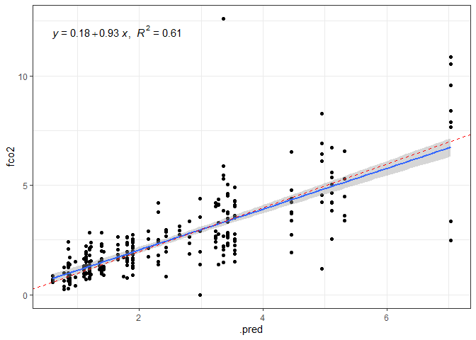<!-- -->

# Importância

``` r
fco2_dt_last_fit_model <-fco2_dt_last_fit$.workflow[[1]]$fit$fit
vip(fco2_dt_last_fit_model,
    aesthetics = list(color = "black", fill = "orange")) +
    theme(axis.text.y=element_text(size=rel(1.5)),
          axis.text.x=element_text(size=rel(1.5)),
          axis.title.x=element_text(size=rel(1.5))
          )
```

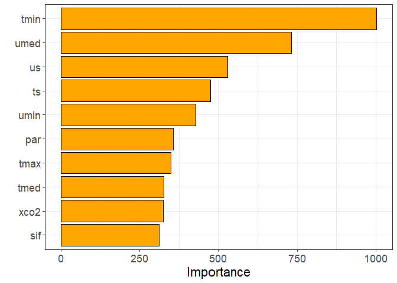<!-- -->

## Métricas

``` r
da <- fco2_test_preds %>% 
  filter(fco2 > 0, .pred>0 )

my_r <- cor(da$fco2,da$.pred)
my_r2 <- my_r*my_r
my_mse <- Metrics::mse(da$fco2,da$.pred)
my_rmse <- Metrics::rmse(da$fco2,
                         da$.pred)
my_mae <- Metrics::mae(da$fco2,da$.pred)
my_mape <- Metrics::mape(da$fco2,da$.pred)*100

vector_of_metrics <- c(r=my_r, R2=my_r2, MSE=my_mse, RMSE=my_rmse, MAE=my_mae, MAPE=my_mape)
print(data.frame(vector_of_metrics))
```

    ##      vector_of_metrics
    ## r            0.8078749
    ## R2           0.6526618
    ## MSE          1.2000949
    ## RMSE         1.0954884
    ## MAE          0.7044035
    ## MAPE        34.3924176

``` r
tree_fit_rpart <- extract_fit_engine(fco2_dt_last_fit)  
rpart.plot::rpart.plot(tree_fit_rpart,cex=.4)
```

    ## Warning: Cannot retrieve the data used to build the model (so cannot determine roundint and is.binary for the variables).
    ## To silence this warning:
    ##     Call rpart.plot with roundint=FALSE,
    ##     or rebuild the rpart model with model=TRUE.

<!-- -->

## Random Forest

### Definição do modelo

``` r
fco2_rf_model <- rand_forest(
  min_n = tune(),
  mtry = tune(),
  trees = tune()
)   %>%  
  set_mode("regression")  %>% 
  set_engine("randomForest")
```

### Workflow

``` r
fco2_rf_wf <- workflow()   %>%  
  add_model(fco2_rf_model) %>%  
  add_recipe(fco2_recipe)
```

### Tune

``` r
# grid_rf <- grid_regular(
#   min_n(range = c(20, 30)),
#   mtry(range = c(5,10)),
#   trees(range = c(100,500) ),
#   levels = 5 #<-----------------------
# )


grid_rf <- expand.grid(
  min_n = c(2, 5), #número mínimo de observações necessárias em um nó
  mtry = c(5,10, 20), #quantas variáveis  em cada divisão de árvore
  # usar a raiz quadrada do número total de variáveis em seus dados mtry REGRA
  trees = c(100, 500) #número de árvores MENOS CRITICO 500 o mais usado.
)
```

``` r
fco2_rf_tune_grid <- tune_grid(
 fco2_rf_wf,
  resamples = fco2_resamples,
  grid = grid_rf,
  metrics = metric_set(rmse)
)
```

``` r
autoplot(fco2_rf_tune_grid)
```

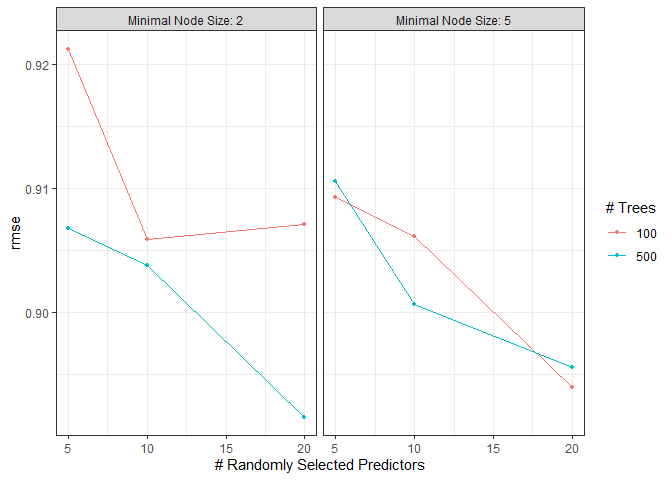<!-- -->

``` r
collect_metrics(fco2_rf_tune_grid)
```

    ## # A tibble: 12 × 9
    ##     mtry trees min_n .metric .estimator  mean     n std_err .config             
    ##    <dbl> <dbl> <dbl> <chr>   <chr>      <dbl> <int>   <dbl> <chr>               
    ##  1     5   100     2 rmse    standard   0.921     5  0.0252 Preprocessor1_Model…
    ##  2     5   100     5 rmse    standard   0.909     5  0.0243 Preprocessor1_Model…
    ##  3    10   100     2 rmse    standard   0.906     5  0.0225 Preprocessor1_Model…
    ##  4    10   100     5 rmse    standard   0.906     5  0.0199 Preprocessor1_Model…
    ##  5    20   100     2 rmse    standard   0.907     5  0.0238 Preprocessor1_Model…
    ##  6    20   100     5 rmse    standard   0.894     5  0.0254 Preprocessor1_Model…
    ##  7     5   500     2 rmse    standard   0.907     5  0.0181 Preprocessor1_Model…
    ##  8     5   500     5 rmse    standard   0.911     5  0.0197 Preprocessor1_Model…
    ##  9    10   500     2 rmse    standard   0.904     5  0.0219 Preprocessor1_Model…
    ## 10    10   500     5 rmse    standard   0.901     5  0.0217 Preprocessor1_Model…
    ## 11    20   500     2 rmse    standard   0.892     5  0.0239 Preprocessor1_Model…
    ## 12    20   500     5 rmse    standard   0.896     5  0.0231 Preprocessor1_Model…

``` r
fco2_rf_tune_grid %>%   
  show_best(metric = "rmse", n = 6)
```

    ## # A tibble: 6 × 9
    ##    mtry trees min_n .metric .estimator  mean     n std_err .config              
    ##   <dbl> <dbl> <dbl> <chr>   <chr>      <dbl> <int>   <dbl> <chr>                
    ## 1    20   500     2 rmse    standard   0.892     5  0.0239 Preprocessor1_Model11
    ## 2    20   100     5 rmse    standard   0.894     5  0.0254 Preprocessor1_Model06
    ## 3    20   500     5 rmse    standard   0.896     5  0.0231 Preprocessor1_Model12
    ## 4    10   500     5 rmse    standard   0.901     5  0.0217 Preprocessor1_Model10
    ## 5    10   500     2 rmse    standard   0.904     5  0.0219 Preprocessor1_Model09
    ## 6    10   100     2 rmse    standard   0.906     5  0.0225 Preprocessor1_Model03

### Desempenho modelo final

``` r
fco2_rf_best_params <- select_best(fco2_rf_tune_grid, "rmse")
fco2_rf_wf <- fco2_rf_wf %>%
  finalize_workflow(fco2_rf_best_params)
fco2_rf_last_fit <- last_fit(fco2_rf_wf, fco2_initial_split)
```

### Criando os preditos

``` r
fco2_test_preds <- bind_rows(
  collect_predictions(fco2_rf_last_fit)  %>%   
    mutate(modelo = "rf"))

fco2_test <- testing(fco2_initial_split)
visdat::vis_miss(fco2_test)
```

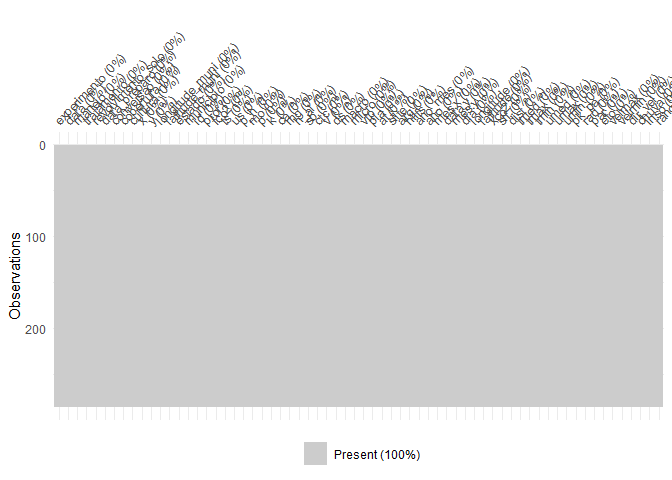<!-- -->

``` r
fco2_test_preds %>% 
  ggplot(aes(x=.pred, y=fco2)) +
  geom_point()+
  theme_bw() +
  geom_smooth(method = "lm") +
  stat_regline_equation(ggplot2::aes(
  label =  paste(..eq.label.., ..rr.label.., sep = "*plain(\",\")~~"))) +
  geom_abline (slope=1, linetype = "dashed", color="Red")
```

    ## `geom_smooth()` using formula = 'y ~ x'

<!-- -->

# Importância

``` r
fco2_rf_last_fit_model <-fco2_rf_last_fit$.workflow[[1]]$fit$fit
vip(fco2_rf_last_fit_model,
    aesthetics = list(color = "black", fill = "orange")) +
    theme(axis.text.y=element_text(size=rel(1.5)),
          axis.text.x=element_text(size=rel(1.5)),
          axis.title.x=element_text(size=rel(1.5))
          )
```

<!-- --> \##
Métricas

``` r
da <- fco2_test_preds %>% 
  filter(fco2 > 0, .pred>0 )

my_r <- cor(da$fco2,da$.pred)
my_r2 <- my_r*my_r
my_mse <- Metrics::mse(da$fco2,da$.pred)
my_rmse <- Metrics::rmse(da$fco2,
                         da$.pred)
my_mae <- Metrics::mae(da$fco2,da$.pred)
my_mape <- Metrics::mape(da$fco2,da$.pred)*100


vector_of_metrics <- c(r=my_r, R2=my_r2, MSE=my_mse, RMSE=my_rmse, MAE=my_mae, MAPE=my_mape)
print(data.frame(vector_of_metrics))
```

    ##      vector_of_metrics
    ## r            0.9031413
    ## R2           0.8156643
    ## MSE          0.6262449
    ## RMSE         0.7913563
    ## MAE          0.4468458
    ## MAPE        21.2551532

## Boosting gradient tree (xgb)

``` r
cores = 4
fco2_xgb_model <- boost_tree(
  mtry = 0.8, 
  trees = tune(), # <---------------
  min_n = 5, 
  tree_depth = 4,
  loss_reduction = 0, # lambda
  learn_rate = tune(), # epsilon
  sample_size = 0.8
)  %>%   
  set_mode("regression")  %>% 
  set_engine("xgboost", nthread = cores, counts = FALSE)
```

``` r
fco2_xgb_wf <- workflow()  %>%  
  add_model(fco2_xgb_model) %>%  
  add_recipe(fco2_recipe)
```

``` r
grid_xgb <- grid_regular(
  learn_rate(range =  c(0.005, 0.3)),
  trees(range = c(3, 100)),
  levels = 5
)
```

#### Passo 1

``` r
fco2_xgb_tune_grid <- tune_grid(
 fco2_xgb_wf,
  resamples = fco2_resamples,
  grid = grid_xgb,
  metrics = metric_set(rmse)
)
autoplot(fco2_xgb_tune_grid)
```

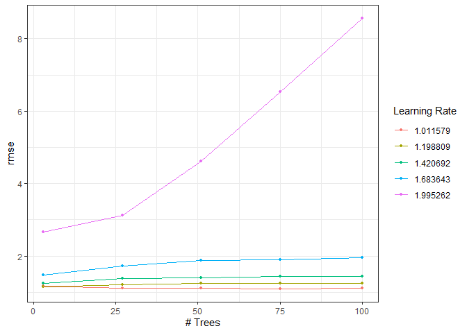<!-- -->

``` r
fco2_xgb_tune_grid   %>%   show_best(metric = "rmse", n = 5)
```

    ## # A tibble: 5 × 8
    ##   trees learn_rate .metric .estimator  mean     n std_err .config              
    ##   <int>      <dbl> <chr>   <chr>      <dbl> <int>   <dbl> <chr>                
    ## 1    75       1.01 rmse    standard    1.10     5  0.0639 Preprocessor1_Model04
    ## 2   100       1.01 rmse    standard    1.11     5  0.0592 Preprocessor1_Model05
    ## 3    51       1.01 rmse    standard    1.11     5  0.0677 Preprocessor1_Model03
    ## 4    27       1.01 rmse    standard    1.12     5  0.0660 Preprocessor1_Model02
    ## 5     3       1.20 rmse    standard    1.15     5  0.0387 Preprocessor1_Model06

``` r
fco2_xgb_select_best_passo1 <- fco2_xgb_tune_grid %>% 
  select_best(metric = "rmse")
fco2_xgb_select_best_passo1
```

    ## # A tibble: 1 × 3
    ##   trees learn_rate .config              
    ##   <int>      <dbl> <chr>                
    ## 1    75       1.01 Preprocessor1_Model04

#### Passo 2

``` r
fco2_xgb_model <- boost_tree(
  mtry = 0.8,
  trees = fco2_xgb_select_best_passo1$trees,
  min_n = tune(),
  tree_depth = tune(), 
  loss_reduction = 0, 
  learn_rate = fco2_xgb_select_best_passo1$learn_rate, 
  sample_size = 0.8
) %>% 
  set_mode("regression")  %>% 
  set_engine("xgboost", nthread = cores, counts = FALSE)

#### Workflow
fco2_xgb_wf <- workflow() %>%  
    add_model(fco2_xgb_model)   %>%   
    add_recipe(fco2_recipe)

#### Grid
fco2_xgb_grid <- grid_regular(
  tree_depth(range = c(1, 4)), 
  min_n(range = c(5, 60)),
  levels = 5
)

fco2_xgb_tune_grid <- fco2_xgb_wf   %>%   
  tune_grid(
    resamples =fco2_resamples,
    grid = fco2_xgb_grid,
    control = control_grid(save_pred = TRUE, verbose = FALSE, allow_par = TRUE),
    metrics = metric_set(rmse)
  )

#### Melhores hiperparâmetros
autoplot(fco2_xgb_tune_grid)
```

<!-- -->

``` r
fco2_xgb_tune_grid  %>%   
  show_best(metric = "rmse", n = 5)
```

    ## # A tibble: 5 × 8
    ##   min_n tree_depth .metric .estimator  mean     n std_err .config              
    ##   <int>      <int> <chr>   <chr>      <dbl> <int>   <dbl> <chr>                
    ## 1    46          1 rmse    standard   0.956     5  0.0121 Preprocessor1_Model13
    ## 2    32          1 rmse    standard   0.973     5  0.0207 Preprocessor1_Model09
    ## 3    18          1 rmse    standard   0.982     5  0.0266 Preprocessor1_Model05
    ## 4    18          2 rmse    standard   0.983     5  0.0280 Preprocessor1_Model06
    ## 5    60          1 rmse    standard   0.989     5  0.0241 Preprocessor1_Model17

``` r
fco2_xgb_select_best_passo2 <- fco2_xgb_tune_grid  %>% 
  select_best(metric = "rmse")
fco2_xgb_select_best_passo2
```

    ## # A tibble: 1 × 3
    ##   min_n tree_depth .config              
    ##   <int>      <int> <chr>                
    ## 1    46          1 Preprocessor1_Model13

## Passo 3

``` r
fco2_xgb_model <- boost_tree(
  mtry = 0.8,
  trees = fco2_xgb_select_best_passo1$trees,
  min_n = fco2_xgb_select_best_passo2$min_n,
  tree_depth = fco2_xgb_select_best_passo2$tree_depth, 
  loss_reduction =tune(), 
  learn_rate = fco2_xgb_select_best_passo1$learn_rate, 
  sample_size = 0.8
)  %>%  
  set_mode("regression")  %>%  
  set_engine("xgboost", nthread = cores, counts = FALSE)

#### Workflow
fco2_xgb_wf <- workflow()  %>%   
    add_model(fco2_xgb_model)  %>%   
    add_recipe(fco2_recipe)

#### Grid
fco2_xgb_grid <- grid_regular(
  loss_reduction(range = c(0.01, 8)),
  levels = 6
)

fco2_xgb_tune_grid <- fco2_xgb_wf   %>%   
  tune_grid(
    resamples = fco2_resamples,
    grid = fco2_xgb_grid,
    control = control_grid(save_pred = TRUE, 
                           verbose = FALSE, 
                           allow_par = TRUE),
    metrics = metric_set(rmse)
  )

#### Melhores hiperparâmetros
autoplot(fco2_xgb_tune_grid)
```

<!-- -->

``` r
fco2_xgb_tune_grid   %>%   show_best(metric = "rmse", n = 5)
```

    ## # A tibble: 5 × 7
    ##   loss_reduction .metric .estimator  mean     n std_err .config             
    ##            <dbl> <chr>   <chr>      <dbl> <int>   <dbl> <chr>               
    ## 1           1.02 rmse    standard   0.956     5  0.0199 Preprocessor1_Model1
    ## 2          40.6  rmse    standard   1.19      5  0.0228 Preprocessor1_Model2
    ## 3   100000000    rmse    standard   1.88      5  0.0743 Preprocessor1_Model6
    ## 4       63680.   rmse    standard   1.88      5  0.0733 Preprocessor1_Model4
    ## 5        1607.   rmse    standard   1.88      5  0.0741 Preprocessor1_Model3

``` r
fco2_xgb_select_best_passo3 <- fco2_xgb_tune_grid %>% select_best(metric = "rmse")
fco2_xgb_select_best_passo3
```

    ## # A tibble: 1 × 2
    ##   loss_reduction .config             
    ##            <dbl> <chr>               
    ## 1           1.02 Preprocessor1_Model1

### Passo 4

``` r
fco2_xgb_model <- boost_tree(
  mtry = tune(),
  trees = fco2_xgb_select_best_passo1$trees,
  min_n = fco2_xgb_select_best_passo2$min_n,
  tree_depth = fco2_xgb_select_best_passo2$tree_depth, 
  loss_reduction = fco2_xgb_select_best_passo3$loss_reduction, 
  learn_rate = fco2_xgb_select_best_passo1$learn_rate, 
  sample_size = tune()
)%>%  
  set_mode("regression")  |> 
  set_engine("xgboost", nthread = cores, counts = FALSE)

#### Workflow
fco2_xgb_wf <- workflow()  %>%   
    add_model(fco2_xgb_model)  %>%   
    add_recipe(fco2_recipe)

#### Grid
fco2_xgb_grid <- expand.grid(
    sample_size = seq(0.5, 1.0, length.out = 4), ## <---
    mtry = seq(0.1, 1.0, length.out = 4) ## <---
)

fco2_xgb_tune_grid <- fco2_xgb_wf   %>%   
  tune_grid(
    resamples = fco2_resamples,
    grid = fco2_xgb_grid,
    control = control_grid(save_pred = TRUE, 
                           verbose = FALSE, 
                           allow_par = TRUE),
    metrics = metric_set(rmse)
  )

autoplot(fco2_xgb_tune_grid)
```

<!-- -->

``` r
fco2_xgb_tune_grid  %>%  
  show_best(metric = "rmse", n = 5)
```

    ## # A tibble: 5 × 8
    ##    mtry sample_size .metric .estimator  mean     n std_err .config              
    ##   <dbl>       <dbl> <chr>   <chr>      <dbl> <int>   <dbl> <chr>                
    ## 1   0.7       1     rmse    standard   0.937     5 0.0139  Preprocessor1_Model12
    ## 2   1         0.833 rmse    standard   0.949     5 0.0102  Preprocessor1_Model15
    ## 3   1         1     rmse    standard   0.949     5 0.00995 Preprocessor1_Model16
    ## 4   0.7       0.833 rmse    standard   0.961     5 0.0158  Preprocessor1_Model11
    ## 5   0.4       1     rmse    standard   0.963     5 0.0127  Preprocessor1_Model08

``` r
fco2_xgb_select_best_passo4 <- fco2_xgb_tune_grid   %>%
  select_best(metric = "rmse")
fco2_xgb_select_best_passo4
```

    ## # A tibble: 1 × 3
    ##    mtry sample_size .config              
    ##   <dbl>       <dbl> <chr>                
    ## 1   0.7           1 Preprocessor1_Model12

### Passo 5

``` r
fco2_xgb_model <- boost_tree(
  mtry = fco2_xgb_select_best_passo4$mtry,
  trees = tune(),
  min_n = fco2_xgb_select_best_passo2$min_n,
  tree_depth = fco2_xgb_select_best_passo2$tree_depth, 
  loss_reduction = fco2_xgb_select_best_passo3$loss_reduction, 
  learn_rate = tune(), 
  sample_size = fco2_xgb_select_best_passo4$sample_size
) %>% 
  set_mode("regression")  %>%  
  set_engine("xgboost", nthread = cores, counts = FALSE)

#### Workflow
fco2_xgb_wf <- workflow() %>%   
    add_model(fco2_xgb_model)  %>%   
    add_recipe(fco2_recipe)

#### Grid
fco2_xgb_grid <- expand.grid(
    learn_rate = c(0.10, 0.15, 0.25, 0.50),
    trees = c(100, 250, 500)
)

fco2_xgb_tune_grid <- fco2_xgb_wf   %>%   
  tune_grid(
    resamples = fco2_resamples,
    grid = fco2_xgb_grid,
    control = control_grid(save_pred = TRUE, 
                           verbose = FALSE, 
                           allow_par = TRUE),
    metrics = metric_set(rmse)
  )

#### Melhores hiperparâmetros
autoplot(fco2_xgb_tune_grid)
```

<!-- -->

``` r
fco2_xgb_tune_grid  %>%   
  show_best(metric = "rmse", n = 5)
```

    ## # A tibble: 5 × 8
    ##   trees learn_rate .metric .estimator  mean     n std_err .config              
    ##   <dbl>      <dbl> <chr>   <chr>      <dbl> <int>   <dbl> <chr>                
    ## 1   250       0.5  rmse    standard   0.952     5  0.0139 Preprocessor1_Model11
    ## 2   500       0.5  rmse    standard   0.952     5  0.0139 Preprocessor1_Model12
    ## 3   500       0.25 rmse    standard   0.959     5  0.0159 Preprocessor1_Model09
    ## 4   250       0.25 rmse    standard   0.959     5  0.0159 Preprocessor1_Model08
    ## 5   100       0.5  rmse    standard   0.959     5  0.0154 Preprocessor1_Model10

``` r
fco2_xgb_select_best_passo5 <- fco2_xgb_tune_grid %>%
  select_best(metric = "rmse")
fco2_xgb_select_best_passo5
```

    ## # A tibble: 1 × 3
    ##   trees learn_rate .config              
    ##   <dbl>      <dbl> <chr>                
    ## 1   250        0.5 Preprocessor1_Model11

## Desempenho dos modelos finais

``` r
fco2_xgb_model <- boost_tree(
  mtry = fco2_xgb_select_best_passo4$mtry,
  trees = fco2_xgb_select_best_passo5$trees,
  min_n = fco2_xgb_select_best_passo2$min_n,
  tree_depth = fco2_xgb_select_best_passo2$tree_depth, 
  loss_reduction = fco2_xgb_select_best_passo3$loss_reduction, 
  learn_rate = fco2_xgb_select_best_passo5$learn_rate, 
  sample_size = fco2_xgb_select_best_passo4$sample_size
) %>%  
  set_mode("regression")  %>%  
  set_engine("xgboost", nthread = cores, counts = FALSE)
```

``` r
df <- data.frame(
  mtry = fco2_xgb_select_best_passo4$mtry,
  trees = fco2_xgb_select_best_passo5$trees,
  min_n = fco2_xgb_select_best_passo2$min_n,
  tree_depth = fco2_xgb_select_best_passo2$tree_depth, 
  loss_reduction = fco2_xgb_select_best_passo3$loss_reduction, 
  learn_rate = fco2_xgb_select_best_passo5$learn_rate, 
  sample_size = fco2_xgb_select_best_passo4$sample_size
)
fco2_xgb_wf <- fco2_xgb_wf %>% finalize_workflow(df) # <------
fco2_xgb_last_fit <- last_fit(fco2_xgb_wf, fco2_initial_split) # <--------
```

## Criar Preditos

``` r
fco2_test_preds <- bind_rows(
  collect_predictions(fco2_xgb_last_fit)  %>%   
    mutate(modelo = "xgb")
)
```

``` r
fco2_test_preds %>% 
  ggplot(aes(x=.pred, y = fco2)) +
  geom_point()+
  theme_bw() +
  geom_smooth(method = "lm") +
  stat_regline_equation(ggplot2::aes(
  label =  paste(..eq.label.., ..rr.label.., sep = "*plain(\",\")~~")))+
  geom_abline (slope=1, linetype = "dashed", color="Red")
```

    ## `geom_smooth()` using formula = 'y ~ x'

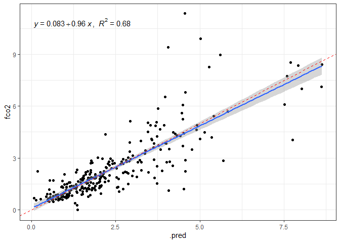<!-- -->

``` r
fco2_xgb_last_fit_model <-fco2_xgb_last_fit$.workflow[[1]]$fit$fit
vip(fco2_xgb_last_fit_model,
    aesthetics = list(color = "black", fill = "orange")) +
    theme(axis.text.y=element_text(size=rel(1.5)),
          axis.text.x=element_text(size=rel(1.5)),
          axis.title.x=element_text(size=rel(1.5))
          )
```

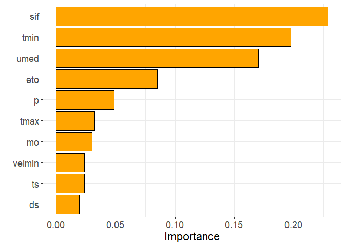<!-- -->

## Métricas

``` r
da <- fco2_test_preds %>% 
  filter(fco2 > 0, .pred>0 )

my_r <- cor(da$fco2,da$.pred)
my_r2 <- my_r*my_r
my_mse <- Metrics::mse(da$fco2,da$.pred)
my_rmse <- Metrics::rmse(da$fco2,
                         da$.pred)
my_mae <- Metrics::mae(da$fco2,da$.pred)
my_mape <- Metrics::mape(da$fco2,da$.pred)*100

vector_of_metrics <- c(r=my_r, R2=my_r2, MSE=my_mse, RMSE=my_rmse, MAE=my_mae, MAPE=my_mape)
print(data.frame(vector_of_metrics))
```

    ##      vector_of_metrics
    ## r            0.8239692
    ## R2           0.6789253
    ## MSE          1.0901307
    ## RMSE         1.0440932
    ## MAE          0.6277181
    ## MAPE        31.9303174
