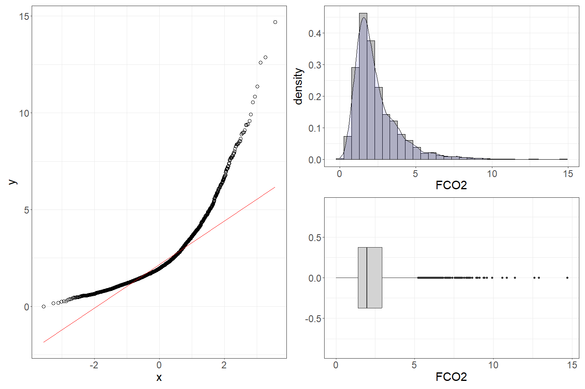

<!-- README.md is generated from README.Rmd. Please edit that file -->

# EMISSÃO DE CO<sub>2</sub> DO SOLO EM ÁREAS AGRÍCOLAS: ABORDAGEM EM APRENDIZADO DE MÁQUINA ESTATÍSTICO

## Autor: Prof. Dr. [Alan Rodrigo Panosso](https://www.fcav.unesp.br/#!/alan)

##### E-mail: <alan.panosso@unesp.br>

##### Departamento de Engenharia e Ciências Exatas

##### UNESP - Câmpus de Jaboticabal

## Objetivo

O objetivo do repositório `tese-fco2-ml-2023` é promover a
transparência, a reprodutibilidade e a colaboração em pesquisa. Você é
incentivado a explorar o código-fonte, utilizar os dados e contribuir
com melhorias, se desejar. Sinta-se à vontade para entrar em contato
caso tenha alguma dúvida ou precise de mais informações sobre minha
pesquisa.

## Contribuições

Contribuições são bem-vindas! Se você deseja colaborar com melhorias nos
códigos, correções de erros ou qualquer outro aprimoramento, sinta-se à
vontade para abrir uma solicitação de `pull request`.

## Licença

Este projeto é licenciado sob `MIT License`. Consulte o arquivo
[LICENSE](https://github.com/arpanosso/tese-fco2-ml-2023/blob/master/LICENSE.md)
para obter mais detalhes.

## Base de dados

Apresentação do pacote `fco2r` construído para facilitar a divulgação e
análise dos resultados obtidos ao longo de mais de 20 anos de ensaios em
campo. Este pacote, permite a visualização dos dados, a execução de
análises estatísticas avançadas e a geração de gráficos interativos para
tornar os resultados mais acessíveis e compreensíveis para a comunidade
científica.

### Intalação

Você pode instalar uma versão de desenvolvimento do pacote `fco2r` a
partir do [GitHub](https://github.com/) com os seguintes comandos:

``` r
# install.packages("devtools")
# devtools::install_github("arpanosso/fco2r")
```

### Problemas na instalação:

Possíveis problemas na instalação do pacote podem ser sanados com os
seguintes comandos:

``` r
# Sys.getenv("GITHUB_PAT")
# Sys.unsetenv("GITHUB_PAT")
# Sys.getenv("GITHUB_PAT")
```

### Carregando o pacote

``` r
library(fco2r)
```

### Conhecendo a base de dados de emissão de CO<sub>2</sub> do solo

Base proveniente de ensaios de campo

``` r
help(data_fco2)
dplyr::glimpse(data_fco2)
#> Rows: 15,397
#> Columns: 39
#> $ experimento       <chr> "Espacial", "Espacial", "Espacial", "Espacial", "Esp~
#> $ data              <date> 2001-07-10, 2001-07-10, 2001-07-10, 2001-07-10, 200~
#> $ manejo            <chr> "convencional", "convencional", "convencional", "con~
#> $ tratamento        <chr> "AD_GN", "AD_GN", "AD_GN", "AD_GN", "AD_GN", "AD_GN"~
#> $ revolvimento_solo <lgl> FALSE, FALSE, FALSE, FALSE, FALSE, FALSE, FALSE, FAL~
#> $ data_preparo      <date> 2001-07-01, 2001-07-01, 2001-07-01, 2001-07-01, 200~
#> $ conversao         <date> 1970-01-01, 1970-01-01, 1970-01-01, 1970-01-01, 197~
#> $ cobertura         <lgl> TRUE, TRUE, TRUE, TRUE, TRUE, TRUE, TRUE, TRUE, TRUE~
#> $ cultura           <chr> "milho_soja", "milho_soja", "milho_soja", "milho_soj~
#> $ x                 <dbl> 0, 40, 80, 10, 25, 40, 55, 70, 20, 40, 60, 10, 70, 3~
#> $ y                 <dbl> 0, 0, 0, 10, 10, 10, 10, 10, 20, 20, 20, 25, 25, 30,~
#> $ longitude_muni    <dbl> 782062.7, 782062.7, 782062.7, 782062.7, 782062.7, 78~
#> $ latitude_muni     <dbl> 7647674, 7647674, 7647674, 7647674, 7647674, 7647674~
#> $ estado            <chr> "SP", "SP", "SP", "SP", "SP", "SP", "SP", "SP", "SP"~
#> $ municipio         <chr> "Jaboticabal", "Jaboticabal", "Jaboticabal", "Jaboti~
#> $ ID                <int> 1, 2, 3, 4, 5, 6, 7, 8, 9, 10, 11, 12, 13, 14, 15, 1~
#> $ prof              <chr> "0-0.1", "0-0.1", "0-0.1", "0-0.1", "0-0.1", "0-0.1"~
#> $ FCO2              <dbl> 1.080, 0.825, 1.950, 0.534, 0.893, 0.840, 1.110, 1.8~
#> $ Ts                <dbl> 18.73, 18.40, 19.20, 18.28, 18.35, 18.47, 19.10, 18.~
#> $ Us                <dbl> NA, NA, NA, NA, NA, NA, NA, NA, NA, NA, NA, NA, NA, ~
#> $ pH                <dbl> 5.1, 5.1, 5.8, 5.3, 5.5, 5.7, 5.6, 6.4, 5.3, 5.8, 5.~
#> $ MO                <dbl> 20, 24, 25, 23, 23, 21, 26, 23, 25, 24, 26, 20, 25, ~
#> $ P                 <dbl> 46, 26, 46, 78, 60, 46, 55, 92, 55, 60, 48, 71, 125,~
#> $ K                 <dbl> 2.4, 2.2, 5.3, 3.6, 3.4, 2.9, 4.0, 2.3, 3.3, 3.6, 4.~
#> $ Ca                <dbl> 25, 30, 41, 27, 33, 38, 35, 94, 29, 36, 37, 29, 50, ~
#> $ Mg                <dbl> 11, 11, 25, 11, 15, 20, 16, 65, 11, 17, 15, 11, 30, ~
#> $ H_Al              <dbl> 31, 31, 22, 28, 27, 22, 22, 12, 31, 28, 28, 31, 18, ~
#> $ SB                <dbl> 38.4, 43.2, 71.3, 41.6, 50.6, 60.9, 55.0, 161.3, 43.~
#> $ CTC               <dbl> 69.4, 74.2, 93.3, 69.6, 77.9, 82.9, 77.0, 173.3, 74.~
#> $ V                 <dbl> 55, 58, 76, 60, 65, 73, 71, 93, 58, 67, 67, 58, 82, ~
#> $ Ds                <dbl> NA, NA, NA, NA, NA, NA, NA, NA, NA, NA, NA, NA, NA, ~
#> $ Macro             <dbl> NA, NA, NA, NA, NA, NA, NA, NA, NA, NA, NA, NA, NA, ~
#> $ Micro             <dbl> NA, NA, NA, NA, NA, NA, NA, NA, NA, NA, NA, NA, NA, ~
#> $ VTP               <dbl> NA, NA, NA, NA, NA, NA, NA, NA, NA, NA, NA, NA, NA, ~
#> $ PLA               <dbl> NA, NA, NA, NA, NA, NA, NA, NA, NA, NA, NA, NA, NA, ~
#> $ AT                <dbl> NA, NA, NA, NA, NA, NA, NA, NA, NA, NA, NA, NA, NA, ~
#> $ SILTE             <dbl> NA, NA, NA, NA, NA, NA, NA, NA, NA, NA, NA, NA, NA, ~
#> $ ARG               <dbl> NA, NA, NA, NA, NA, NA, NA, NA, NA, NA, NA, NA, NA, ~
#> $ HLIFS             <dbl> NA, NA, NA, NA, NA, NA, NA, NA, NA, NA, NA, NA, NA, ~
```

Vamos conhecer, um pouco mais a nossa base de dados.

``` r
skimr::skim(data_fco2)
```

|                                                  |           |
|:-------------------------------------------------|:----------|
| Name                                             | data_fco2 |
| Number of rows                                   | 15397     |
| Number of columns                                | 39        |
| \_\_\_\_\_\_\_\_\_\_\_\_\_\_\_\_\_\_\_\_\_\_\_   |           |
| Column type frequency:                           |           |
| character                                        | 7         |
| Date                                             | 3         |
| logical                                          | 2         |
| numeric                                          | 27        |
| \_\_\_\_\_\_\_\_\_\_\_\_\_\_\_\_\_\_\_\_\_\_\_\_ |           |
| Group variables                                  | None      |

Data summary

**Variable type: character**

| skim_variable | n_missing | complete_rate | min | max | empty | n_unique | whitespace |
|:--------------|----------:|--------------:|----:|----:|------:|---------:|-----------:|
| experimento   |         0 |             1 |   8 |   8 |     0 |        2 |          0 |
| manejo        |         0 |             1 |   6 |  15 |     0 |       10 |          0 |
| tratamento    |         0 |             1 |   2 |  10 |     0 |       21 |          0 |
| cultura       |         0 |             1 |   4 |  14 |     0 |       11 |          0 |
| estado        |         0 |             1 |   2 |   2 |     0 |        2 |          0 |
| municipio     |         0 |             1 |   7 |  20 |     0 |        6 |          0 |
| prof          |         0 |             1 |   5 |   7 |     0 |        2 |          0 |

**Variable type: Date**

| skim_variable | n_missing | complete_rate | min        | max        | median     | n_unique |
|:--------------|----------:|--------------:|:-----------|:-----------|:-----------|---------:|
| data          |         0 |             1 | 2001-07-10 | 2019-12-01 | 2014-07-12 |      205 |
| data_preparo  |         0 |             1 | 1986-03-01 | 2019-04-01 | 2002-01-01 |       14 |
| conversao     |         0 |             1 | 1970-01-01 | 2009-07-03 | 1986-03-01 |       11 |

**Variable type: logical**

| skim_variable     | n_missing | complete_rate | mean | count      |
|:------------------|----------:|--------------:|-----:|:-----------|
| revolvimento_solo |         0 |             1 |    0 | FAL: 15397 |
| cobertura         |         0 |             1 |    1 | TRU: 15397 |

**Variable type: numeric**

| skim_variable  | n_missing | complete_rate |       mean |         sd |        p0 |        p25 |        p50 |        p75 |       p100 | hist  |
|:---------------|----------:|--------------:|-----------:|-----------:|----------:|-----------:|-----------:|-----------:|-----------:|:------|
| x              |         0 |          1.00 | 1392083.56 | 2923710.70 |      0.00 |       0.00 |      30.00 |     100.00 | 7749472.16 | ▇▁▁▁▂ |
| y              |         0 |          1.00 |  495854.97 | 1722529.75 |      0.00 |       0.00 |      27.00 |      80.00 | 7630525.47 | ▇▁▁▁▁ |
| longitude_muni |         0 |          1.00 | 1067926.05 | 1796771.47 | 456798.63 |  458447.46 |  458447.46 |  792043.56 | 7638196.06 | ▇▁▁▁▁ |
| latitude_muni  |         0 |          1.00 | 7231328.21 | 1754220.76 | 795907.06 | 7635356.70 | 7749398.84 | 7749821.85 | 7758831.37 | ▁▁▁▁▇ |
| ID             |         0 |          1.00 |      40.52 |      31.52 |      1.00 |      13.00 |      35.00 |      60.00 |     141.00 | ▇▅▃▁▁ |
| FCO2           |       110 |          0.99 |       2.78 |       2.08 |     -3.42 |       1.30 |       2.16 |       3.75 |      46.93 | ▇▁▁▁▁ |
| Ts             |       317 |          0.98 |      21.84 |       6.76 |      1.00 |      19.33 |      22.50 |      26.15 |     195.63 | ▇▁▁▁▁ |
| Us             |      1754 |          0.89 |      16.31 |       8.93 |      0.00 |      10.00 |      14.06 |      22.00 |      89.00 | ▇▅▁▁▁ |
| pH             |      2802 |          0.82 |       4.64 |       1.13 |      3.50 |       4.00 |       4.50 |       5.15 |      52.00 | ▇▁▁▁▁ |
| MO             |      1355 |          0.91 |      21.59 |      12.60 |      1.35 |      12.00 |      23.00 |      29.00 |      61.26 | ▆▇▇▂▁ |
| P              |      1355 |          0.91 |      20.95 |      24.74 |      1.00 |       6.00 |      15.48 |      27.36 |     253.00 | ▇▁▁▁▁ |
| K              |      1348 |          0.91 |       2.40 |       2.21 |      0.03 |       0.90 |       1.70 |       3.40 |      34.00 | ▇▁▁▁▁ |
| Ca             |      1376 |          0.91 |      17.20 |      14.57 |      1.10 |       6.00 |      11.00 |      26.00 |      94.00 | ▇▃▁▁▁ |
| Mg             |      1376 |          0.91 |      10.13 |       5.65 |      0.32 |       7.00 |      10.00 |      13.00 |      65.00 | ▇▂▁▁▁ |
| H_Al           |      1362 |          0.91 |      46.89 |      29.38 |      0.00 |      26.00 |      42.29 |      72.00 |     121.00 | ▅▇▆▂▂ |
| SB             |      1376 |          0.91 |      29.69 |      20.10 |      1.54 |      15.60 |      23.80 |      42.00 |     161.30 | ▇▃▁▁▁ |
| CTC            |      1369 |          0.91 |      77.10 |      32.99 |      4.62 |      59.23 |      83.40 |     103.20 |     173.30 | ▂▃▇▃▁ |
| V              |      1383 |          0.91 |      41.68 |      20.05 |      4.96 |      22.00 |      43.00 |      58.00 |     100.00 | ▆▆▇▅▁ |
| Ds             |      3284 |          0.79 |       1.38 |       0.17 |      0.88 |       1.24 |       1.38 |       1.52 |       1.86 | ▁▆▇▇▁ |
| Macro          |      3277 |          0.79 |       8.55 |       7.85 |    -45.30 |       0.15 |       8.13 |      13.64 |      49.77 | ▁▁▇▃▁ |
| Micro          |      3298 |          0.79 |      25.30 |      17.13 |      0.07 |       0.37 |      33.86 |      38.30 |      52.42 | ▅▁▂▇▁ |
| VTP            |      3298 |          0.79 |      42.34 |      15.65 |     -4.68 |      40.81 |      46.25 |      51.32 |      87.80 | ▂▁▇▃▁ |
| PLA            |      3438 |          0.78 |      29.57 |      11.80 |    -47.30 |      21.27 |      32.41 |      38.15 |      79.80 | ▁▁▅▇▁ |
| AT             |      8083 |          0.48 |    1013.33 |    1358.81 |     11.72 |     236.00 |     593.62 |     816.00 |    4542.73 | ▇▁▁▁▂ |
| SILTE          |      8048 |          0.48 |     229.26 |     336.37 |      1.26 |      50.87 |      73.65 |     188.00 |    1395.00 | ▇▁▁▁▁ |
| ARG            |      8055 |          0.48 |     995.41 |    1560.32 |     27.19 |     173.27 |     403.69 |     609.50 |    5244.76 | ▇▁▁▁▂ |
| HLIFS          |     10872 |          0.29 |   14590.11 |   17253.55 |    158.39 |    1110.15 |    2409.80 |   29707.78 |   84692.90 | ▇▃▁▁▁ |

### Alguns gráficos a respeito de nossa variável alvo, emissão de CO<sub>2</sub> do solo (FCO<sub>2</sub>).

``` r
library(magrittr)
library(patchwork)
ggplot2::theme_set(ggplot2::theme_bw())
fco2_histograma <- data_fco2 %>% 
  tidyr::drop_na() %>% 
  ggplot2::ggplot(ggplot2::aes(x=FCO2, y=..density..)) +
  ggplot2::geom_histogram(col="black",fill="gray") +
  ggplot2::geom_density(fill="blue",alpha=.08)

fco2_boxplot <- data_fco2 %>% 
  tidyr::drop_na() %>% 
  ggplot2::ggplot(ggplot2::aes(x=FCO2)) +
  ggplot2::geom_boxplot(fill="lightgray") + 
  ggplot2::coord_cartesian(ylim=c(-.9,.9))

fco2_qqplot <- data_fco2 %>% 
  tidyr::drop_na() %>% 
  ggplot2::ggplot(ggplot2::aes(sample=FCO2)) +
  ggplot2::stat_qq(shape=1,size=1,color="black")+
  ggplot2::stat_qq_line(col="red")

fco2_qqplot | (fco2_histograma)/(fco2_boxplot)
```

<!-- -->

### Conhecendo a base de dados de concentração de CO<sub>2</sub> atmosférico, oriundo do sensor NASA-OCO2.

``` r
help(oco2_br)
dplyr::glimpse(oco2_br)
#> Rows: 37,387
#> Columns: 32
#> $ longitude                                                     <dbl> -70.5, -~
#> $ longitude_bnds                                                <chr> "-71.0:-~
#> $ latitude                                                      <dbl> -5.5, -4~
#> $ latitude_bnds                                                 <chr> "-6.0:-5~
#> $ time_yyyymmddhhmmss                                           <dbl> 2.014091~
#> $ time_bnds_yyyymmddhhmmss                                      <chr> "2014090~
#> $ altitude_km                                                   <dbl> 3307.8, ~
#> $ alt_bnds_km                                                   <chr> "0.0:661~
#> $ fluorescence_radiance_757nm_uncert_idp_ph_sec_1_m_2_sr_1_um_1 <dbl> 7.272876~
#> $ fluorescence_radiance_757nm_idp_ph_sec_1_m_2_sr_1_um_1        <dbl> 2.537127~
#> $ xco2_moles_mole_1                                             <dbl> 0.000394~
#> $ aerosol_total_aod                                             <dbl> 0.148579~
#> $ fluorescence_offset_relative_771nm_idp                        <dbl> 0.016753~
#> $ fluorescence_at_reference_ph_sec_1_m_2_sr_1_um_1              <dbl> 2.615319~
#> $ fluorescence_radiance_771nm_idp_ph_sec_1_m_2_sr_1_um_1        <dbl> 3.088582~
#> $ fluorescence_offset_relative_757nm_idp                        <dbl> 0.013969~
#> $ fluorescence_radiance_771nm_uncert_idp_ph_sec_1_m_2_sr_1_um_1 <dbl> 5.577878~
#> $ xco2                                                          <dbl> 394.3686~
#> $ data                                                          <dttm> 2014-09~
#> $ ano                                                           <dbl> 2014, 20~
#> $ mes                                                           <dbl> 9, 9, 9,~
#> $ dia                                                           <int> 6, 6, 6,~
#> $ dia_semana                                                    <dbl> 7, 7, 7,~
#> $ x                                                             <int> 7, 8, 11~
#> $ xco2_est                                                      <dbl> 392.7080~
#> $ delta                                                         <dbl> -1.66062~
#> $ XCO2                                                          <dbl> 387.2781~
#> $ flag_norte                                                    <lgl> TRUE, TR~
#> $ flag_nordeste                                                 <lgl> FALSE, F~
#> $ flag_sul                                                      <lgl> FALSE, F~
#> $ flag_sudeste                                                  <lgl> FALSE, F~
#> $ flag_centroeste                                               <lgl> FALSE, F~
```
