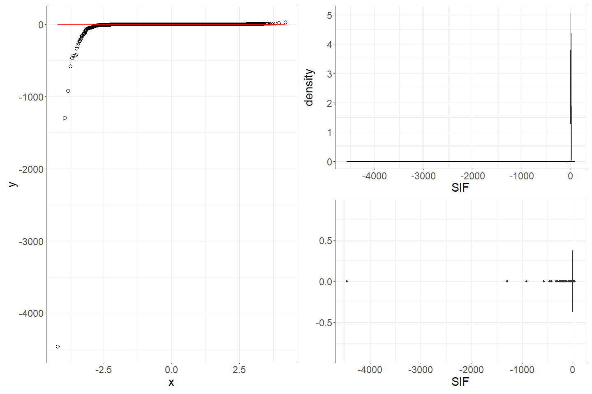
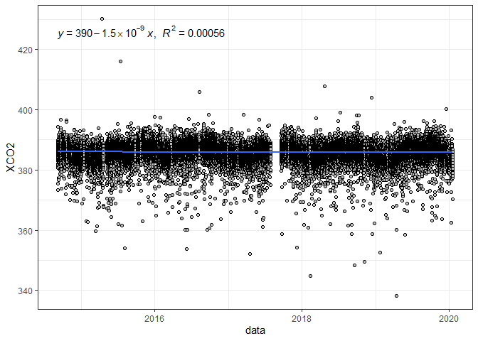
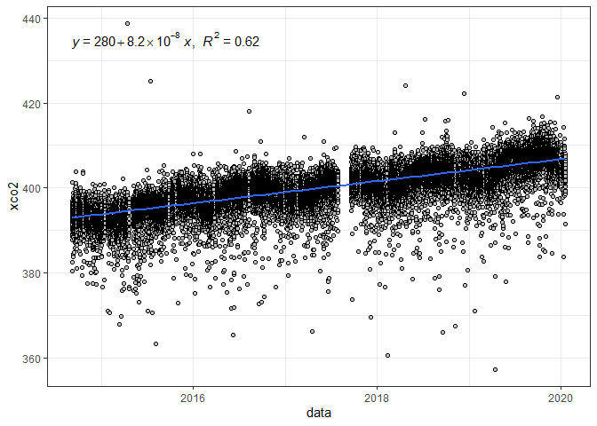
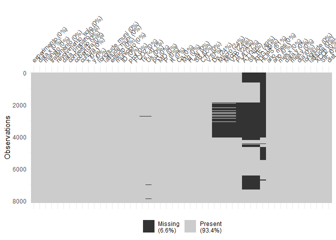
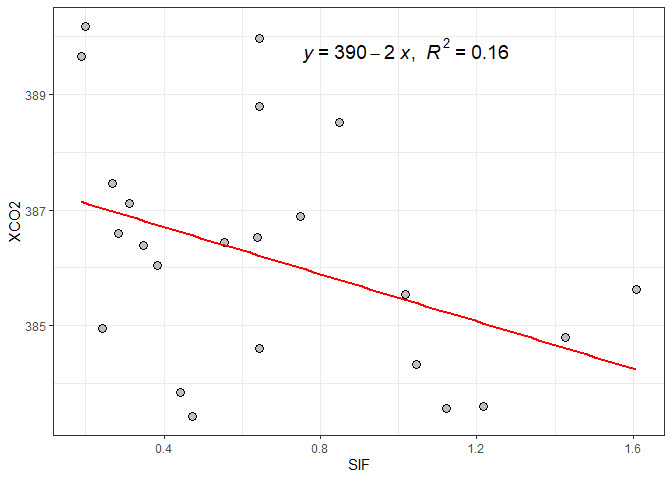
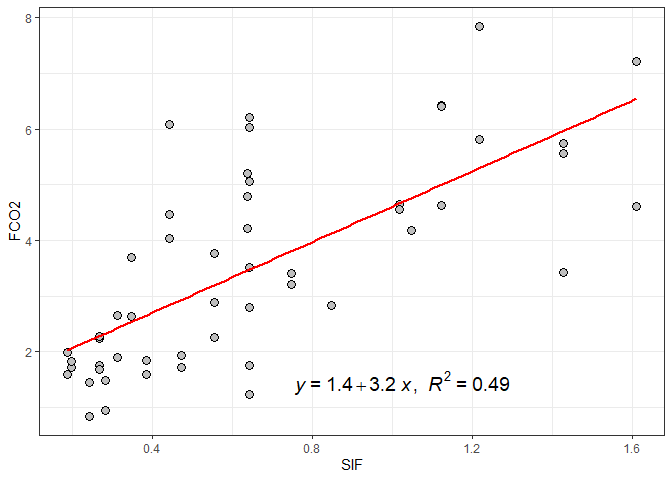
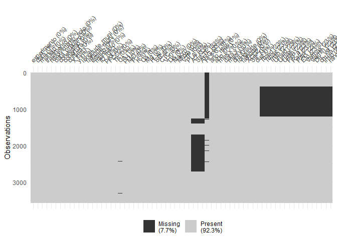
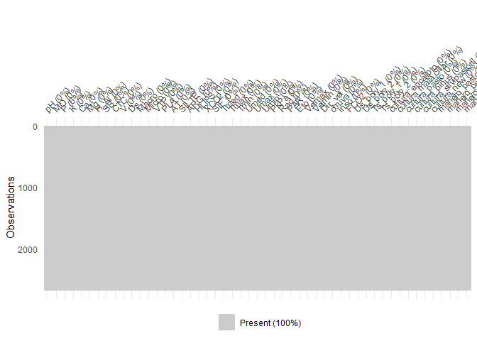

<!-- README.md is generated from README.Rmd. Please edit that file -->

# EMISSÃO DE CO<sub>2</sub> DO SOLO EM ÁREAS AGRÍCOLAS: ABORDAGEM EM APRENDIZADO DE MÁQUINA ESTATÍSTICO

## Autor: Prof. Dr. [Alan Rodrigo Panosso](https://www.fcav.unesp.br/#!/alan)

##### E-mail: <alan.panosso@unesp.br>

##### Departamento de Engenharia e Ciências Exatas

##### UNESP - Câmpus de Jaboticabal

## Objetivo

O objetivo do repositório `tese-fco2-ml-2023` é promover a
transparência, a reprodutibilidade e a colaboração em pesquisa. Você é
incentivado a explorar o código-fonte, utilizar os dados e contribuir
com melhorias, se desejar. Sinta-se à vontade para entrar em contato
caso tenha alguma dúvida ou precise de mais informações sobre minha
pesquisa.

## Contribuições

Contribuições são bem-vindas! Se você deseja colaborar com melhorias nos
códigos, correções de erros ou qualquer outro aprimoramento, sinta-se à
vontade para abrir uma solicitação de `pull request`.

## Licença

Este projeto é licenciado sob `MIT License`. Consulte o arquivo
[LICENSE](https://github.com/arpanosso/tese-fco2-ml-2023/blob/master/LICENSE.md)
para obter mais detalhes.

## Base de dados

Apresentação do pacote `fco2r` construído para divulgação e análise dos
resultados obtidos ao longo de mais de

anos de ensaios em campo. Este pacote, permite a visualização dos dados,
a execução de análises estatísticas avançadas e a geração de gráficos
interativos para tornar os resultados mais acessíveis e compreensíveis
para a comunidade científica.

### Instalação

Você pode instalar uma versão de desenvolvimento do pacote `fco2r` a
partir do [GitHub](https://github.com/) com os seguintes comandos:

``` r
# install.packages("devtools")
# devtools::install_github("arpanosso/fco2r")
```

### Problemas na instalação:

Possíveis problemas na instalação do pacote podem ser sanados com os
seguintes comandos:

``` r
# Sys.getenv("GITHUB_PAT")
# Sys.unsetenv("GITHUB_PAT")
# Sys.getenv("GITHUB_PAT")
```

### Carregando os pacotes

``` r
library(fco2r)
library(tidyverse)
```

    ## -- Attaching core tidyverse packages ------------------------ tidyverse 2.0.0 --
    ## v dplyr     1.1.2     v readr     2.1.4
    ## v forcats   1.0.0     v stringr   1.5.0
    ## v ggplot2   3.4.2     v tibble    3.2.1
    ## v lubridate 1.9.2     v tidyr     1.3.0
    ## v purrr     1.0.1     
    ## -- Conflicts ------------------------------------------ tidyverse_conflicts() --
    ## x dplyr::filter() masks stats::filter()
    ## x dplyr::lag()    masks stats::lag()
    ## i Use the conflicted package (<http://conflicted.r-lib.org/>) to force all conflicts to become errors

``` r
library(patchwork)
library(ggspatial)
library(readxl)
library(skimr)
library(tidymodels)
```

    ## -- Attaching packages -------------------------------------- tidymodels 1.0.0 --
    ## v broom        1.0.4     v rsample      1.1.0
    ## v dials        1.0.0     v tune         1.0.0
    ## v infer        1.0.2     v workflows    1.0.0
    ## v modeldata    1.0.0     v workflowsets 1.0.0
    ## v parsnip      1.0.0     v yardstick    1.0.0
    ## v recipes      1.0.1     
    ## -- Conflicts ----------------------------------------- tidymodels_conflicts() --
    ## x scales::discard() masks purrr::discard()
    ## x dplyr::filter()   masks stats::filter()
    ## x recipes::fixed()  masks stringr::fixed()
    ## x dplyr::lag()      masks stats::lag()
    ## x yardstick::spec() masks readr::spec()
    ## x recipes::step()   masks stats::step()
    ## * Use tidymodels_prefer() to resolve common conflicts.

``` r
library(ISLR)
library(modeldata)
library(vip)
```

    ## 
    ## Attaching package: 'vip'
    ## 
    ## The following object is masked from 'package:utils':
    ## 
    ##     vi

``` r
library(ggpubr)
source("R/graficos.R")
theme_set(theme_bw())
```

### Conhecendo a base de dados de emissão de CO<sub>2</sub> do solo

Base proveniente de ensaios de campo.

``` r
glimpse(data_fco2)
```

    ## Rows: 15,397
    ## Columns: 39
    ## $ experimento       <chr> "Espacial", "Espacial", "Espacial", "Espacial", "Esp~
    ## $ data              <date> 2001-07-10, 2001-07-10, 2001-07-10, 2001-07-10, 200~
    ## $ manejo            <chr> "convencional", "convencional", "convencional", "con~
    ## $ tratamento        <chr> "AD_GN", "AD_GN", "AD_GN", "AD_GN", "AD_GN", "AD_GN"~
    ## $ revolvimento_solo <lgl> FALSE, FALSE, FALSE, FALSE, FALSE, FALSE, FALSE, FAL~
    ## $ data_preparo      <date> 2001-07-01, 2001-07-01, 2001-07-01, 2001-07-01, 200~
    ## $ conversao         <date> 1970-01-01, 1970-01-01, 1970-01-01, 1970-01-01, 197~
    ## $ cobertura         <lgl> TRUE, TRUE, TRUE, TRUE, TRUE, TRUE, TRUE, TRUE, TRUE~
    ## $ cultura           <chr> "milho_soja", "milho_soja", "milho_soja", "milho_soj~
    ## $ x                 <dbl> 0, 40, 80, 10, 25, 40, 55, 70, 20, 40, 60, 10, 70, 3~
    ## $ y                 <dbl> 0, 0, 0, 10, 10, 10, 10, 10, 20, 20, 20, 25, 25, 30,~
    ## $ longitude_muni    <dbl> 782062.7, 782062.7, 782062.7, 782062.7, 782062.7, 78~
    ## $ latitude_muni     <dbl> 7647674, 7647674, 7647674, 7647674, 7647674, 7647674~
    ## $ estado            <chr> "SP", "SP", "SP", "SP", "SP", "SP", "SP", "SP", "SP"~
    ## $ municipio         <chr> "Jaboticabal", "Jaboticabal", "Jaboticabal", "Jaboti~
    ## $ ID                <int> 1, 2, 3, 4, 5, 6, 7, 8, 9, 10, 11, 12, 13, 14, 15, 1~
    ## $ prof              <chr> "0-0.1", "0-0.1", "0-0.1", "0-0.1", "0-0.1", "0-0.1"~
    ## $ FCO2              <dbl> 1.080, 0.825, 1.950, 0.534, 0.893, 0.840, 1.110, 1.8~
    ## $ Ts                <dbl> 18.73, 18.40, 19.20, 18.28, 18.35, 18.47, 19.10, 18.~
    ## $ Us                <dbl> NA, NA, NA, NA, NA, NA, NA, NA, NA, NA, NA, NA, NA, ~
    ## $ pH                <dbl> 5.1, 5.1, 5.8, 5.3, 5.5, 5.7, 5.6, 6.4, 5.3, 5.8, 5.~
    ## $ MO                <dbl> 20, 24, 25, 23, 23, 21, 26, 23, 25, 24, 26, 20, 25, ~
    ## $ P                 <dbl> 46, 26, 46, 78, 60, 46, 55, 92, 55, 60, 48, 71, 125,~
    ## $ K                 <dbl> 2.4, 2.2, 5.3, 3.6, 3.4, 2.9, 4.0, 2.3, 3.3, 3.6, 4.~
    ## $ Ca                <dbl> 25, 30, 41, 27, 33, 38, 35, 94, 29, 36, 37, 29, 50, ~
    ## $ Mg                <dbl> 11, 11, 25, 11, 15, 20, 16, 65, 11, 17, 15, 11, 30, ~
    ## $ H_Al              <dbl> 31, 31, 22, 28, 27, 22, 22, 12, 31, 28, 28, 31, 18, ~
    ## $ SB                <dbl> 38.4, 43.2, 71.3, 41.6, 50.6, 60.9, 55.0, 161.3, 43.~
    ## $ CTC               <dbl> 69.4, 74.2, 93.3, 69.6, 77.9, 82.9, 77.0, 173.3, 74.~
    ## $ V                 <dbl> 55, 58, 76, 60, 65, 73, 71, 93, 58, 67, 67, 58, 82, ~
    ## $ Ds                <dbl> NA, NA, NA, NA, NA, NA, NA, NA, NA, NA, NA, NA, NA, ~
    ## $ Macro             <dbl> NA, NA, NA, NA, NA, NA, NA, NA, NA, NA, NA, NA, NA, ~
    ## $ Micro             <dbl> NA, NA, NA, NA, NA, NA, NA, NA, NA, NA, NA, NA, NA, ~
    ## $ VTP               <dbl> NA, NA, NA, NA, NA, NA, NA, NA, NA, NA, NA, NA, NA, ~
    ## $ PLA               <dbl> NA, NA, NA, NA, NA, NA, NA, NA, NA, NA, NA, NA, NA, ~
    ## $ AT                <dbl> NA, NA, NA, NA, NA, NA, NA, NA, NA, NA, NA, NA, NA, ~
    ## $ SILTE             <dbl> NA, NA, NA, NA, NA, NA, NA, NA, NA, NA, NA, NA, NA, ~
    ## $ ARG               <dbl> NA, NA, NA, NA, NA, NA, NA, NA, NA, NA, NA, NA, NA, ~
    ## $ HLIFS             <dbl> NA, NA, NA, NA, NA, NA, NA, NA, NA, NA, NA, NA, NA, ~

Vamos conhecer, um pouco mais a nossa base de dados.

``` r
skimr::skim(data_fco2)
```

|                                                  |           |
|:-------------------------------------------------|:----------|
| Name                                             | data_fco2 |
| Number of rows                                   | 15397     |
| Number of columns                                | 39        |
| \_\_\_\_\_\_\_\_\_\_\_\_\_\_\_\_\_\_\_\_\_\_\_   |           |
| Column type frequency:                           |           |
| character                                        | 7         |
| Date                                             | 3         |
| logical                                          | 2         |
| numeric                                          | 27        |
| \_\_\_\_\_\_\_\_\_\_\_\_\_\_\_\_\_\_\_\_\_\_\_\_ |           |
| Group variables                                  | None      |

Data summary

**Variable type: character**

| skim_variable | n_missing | complete_rate | min | max | empty | n_unique | whitespace |
|:--------------|----------:|--------------:|----:|----:|------:|---------:|-----------:|
| experimento   |         0 |             1 |   8 |   8 |     0 |        2 |          0 |
| manejo        |         0 |             1 |   6 |  15 |     0 |       10 |          0 |
| tratamento    |         0 |             1 |   2 |  10 |     0 |       21 |          0 |
| cultura       |         0 |             1 |   4 |  14 |     0 |       11 |          0 |
| estado        |         0 |             1 |   2 |   2 |     0 |        2 |          0 |
| municipio     |         0 |             1 |   7 |  20 |     0 |        6 |          0 |
| prof          |         0 |             1 |   5 |   7 |     0 |        2 |          0 |

**Variable type: Date**

| skim_variable | n_missing | complete_rate | min        | max        | median     | n_unique |
|:--------------|----------:|--------------:|:-----------|:-----------|:-----------|---------:|
| data          |         0 |             1 | 2001-07-10 | 2019-12-01 | 2014-07-12 |      205 |
| data_preparo  |         0 |             1 | 1986-03-01 | 2019-04-01 | 2002-01-01 |       14 |
| conversao     |         0 |             1 | 1970-01-01 | 2009-07-03 | 1986-03-01 |       11 |

**Variable type: logical**

| skim_variable     | n_missing | complete_rate | mean | count      |
|:------------------|----------:|--------------:|-----:|:-----------|
| revolvimento_solo |         0 |             1 |    0 | FAL: 15397 |
| cobertura         |         0 |             1 |    1 | TRU: 15397 |

**Variable type: numeric**

| skim_variable  | n_missing | complete_rate |       mean |         sd |        p0 |        p25 |        p50 |        p75 |       p100 | hist  |
|:---------------|----------:|--------------:|-----------:|-----------:|----------:|-----------:|-----------:|-----------:|-----------:|:------|
| x              |         0 |          1.00 | 1392083.56 | 2923710.70 |      0.00 |       0.00 |      30.00 |     100.00 | 7749472.16 | ▇▁▁▁▂ |
| y              |         0 |          1.00 |  495854.97 | 1722529.75 |      0.00 |       0.00 |      27.00 |      80.00 | 7630525.47 | ▇▁▁▁▁ |
| longitude_muni |         0 |          1.00 | 1067926.05 | 1796771.47 | 456798.63 |  458447.46 |  458447.46 |  792043.56 | 7638196.06 | ▇▁▁▁▁ |
| latitude_muni  |         0 |          1.00 | 7231328.21 | 1754220.76 | 795907.06 | 7635356.70 | 7749398.84 | 7749821.85 | 7758831.37 | ▁▁▁▁▇ |
| ID             |         0 |          1.00 |      40.52 |      31.52 |      1.00 |      13.00 |      35.00 |      60.00 |     141.00 | ▇▅▃▁▁ |
| FCO2           |       110 |          0.99 |       2.78 |       2.08 |     -3.42 |       1.30 |       2.16 |       3.75 |      46.93 | ▇▁▁▁▁ |
| Ts             |       317 |          0.98 |      21.84 |       6.76 |      1.00 |      19.33 |      22.50 |      26.15 |     195.63 | ▇▁▁▁▁ |
| Us             |      1754 |          0.89 |      16.31 |       8.93 |      0.00 |      10.00 |      14.06 |      22.00 |      89.00 | ▇▅▁▁▁ |
| pH             |      2802 |          0.82 |       4.64 |       1.13 |      3.50 |       4.00 |       4.50 |       5.15 |      52.00 | ▇▁▁▁▁ |
| MO             |      1355 |          0.91 |      21.59 |      12.60 |      1.35 |      12.00 |      23.00 |      29.00 |      61.26 | ▆▇▇▂▁ |
| P              |      1355 |          0.91 |      20.95 |      24.74 |      1.00 |       6.00 |      15.48 |      27.36 |     253.00 | ▇▁▁▁▁ |
| K              |      1348 |          0.91 |       2.40 |       2.21 |      0.03 |       0.90 |       1.70 |       3.40 |      34.00 | ▇▁▁▁▁ |
| Ca             |      1376 |          0.91 |      17.20 |      14.57 |      1.10 |       6.00 |      11.00 |      26.00 |      94.00 | ▇▃▁▁▁ |
| Mg             |      1376 |          0.91 |      10.13 |       5.65 |      0.32 |       7.00 |      10.00 |      13.00 |      65.00 | ▇▂▁▁▁ |
| H_Al           |      1362 |          0.91 |      46.89 |      29.38 |      0.00 |      26.00 |      42.29 |      72.00 |     121.00 | ▅▇▆▂▂ |
| SB             |      1376 |          0.91 |      29.69 |      20.10 |      1.54 |      15.60 |      23.80 |      42.00 |     161.30 | ▇▃▁▁▁ |
| CTC            |      1369 |          0.91 |      77.10 |      32.99 |      4.62 |      59.23 |      83.40 |     103.20 |     173.30 | ▂▃▇▃▁ |
| V              |      1383 |          0.91 |      41.68 |      20.05 |      4.96 |      22.00 |      43.00 |      58.00 |     100.00 | ▆▆▇▅▁ |
| Ds             |      3284 |          0.79 |       1.38 |       0.17 |      0.88 |       1.24 |       1.38 |       1.52 |       1.86 | ▁▆▇▇▁ |
| Macro          |      3277 |          0.79 |       8.55 |       7.85 |    -45.30 |       0.15 |       8.13 |      13.64 |      49.77 | ▁▁▇▃▁ |
| Micro          |      3298 |          0.79 |      25.30 |      17.13 |      0.07 |       0.37 |      33.86 |      38.30 |      52.42 | ▅▁▂▇▁ |
| VTP            |      3298 |          0.79 |      42.34 |      15.65 |     -4.68 |      40.81 |      46.25 |      51.32 |      87.80 | ▂▁▇▃▁ |
| PLA            |      3438 |          0.78 |      29.57 |      11.80 |    -47.30 |      21.27 |      32.41 |      38.15 |      79.80 | ▁▁▅▇▁ |
| AT             |      8083 |          0.48 |    1013.33 |    1358.81 |     11.72 |     236.00 |     593.62 |     816.00 |    4542.73 | ▇▁▁▁▂ |
| SILTE          |      8048 |          0.48 |     229.26 |     336.37 |      1.26 |      50.87 |      73.65 |     188.00 |    1395.00 | ▇▁▁▁▁ |
| ARG            |      8055 |          0.48 |     995.41 |    1560.32 |     27.19 |     173.27 |     403.69 |     609.50 |    5244.76 | ▇▁▁▁▂ |
| HLIFS          |     10872 |          0.29 |   14590.11 |   17253.55 |    158.39 |    1110.15 |    2409.80 |   29707.78 |   84692.90 | ▇▃▁▁▁ |

### Alguns gráficos a respeito de nossa variável alvo, emissão de CO<sub>2</sub> do solo (FCO<sub>2</sub>).

``` r
composition(FCO2,data_fco2)
```

    ## Warning: The dot-dot notation (`..density..`) was deprecated in ggplot2 3.4.0.
    ## i Please use `after_stat(density)` instead.
    ## This warning is displayed once every 8 hours.
    ## Call `lifecycle::last_lifecycle_warnings()` to see where this warning was
    ## generated.

    ## `stat_bin()` using `bins = 30`. Pick better value with `binwidth`.

<!-- -->

### Aplicando a transformação logarítmica nos dados de FCO<sub>2</sub>

``` r
composition(log10(FCO2) ,data_fco2)
```

    ## Warning: Removed 1 rows containing non-finite values (`stat_qq()`).

    ## Warning: Removed 1 rows containing non-finite values (`stat_qq_line()`).

    ## `stat_bin()` using `bins = 30`. Pick better value with `binwidth`.

    ## Warning: Removed 1 rows containing non-finite values (`stat_bin()`).

    ## Warning: Removed 1 rows containing non-finite values (`stat_density()`).

    ## Warning: Removed 1 rows containing non-finite values (`stat_boxplot()`).

<!-- --> \###
Carregando os dados do pacote `{geobr}`

#### Shape dos estados do Brasil

A fonte dos shapes abaixo utiizados é o pacote `{geobr}`, para maiores
inofrmações acesse o link no
, por comodidade, deixamos
armazenados no repositório os arquivos que aqui serão utilizados.

``` r
# library(geobr)
# brasil_geobr <- geobr::read_country()
# estados <- read_state(code_state = "all")
# write_rds(estados,"data/estados.rds")
# write_rds(brasil_geobr,"data/brasil_geobr.rds")
estados <- read_rds("data/estados.rds")
```

#### Shape dos municípios

``` r
# muni <- read_municipality()
# write_rds(muni,"data/municipios.rds")
muni <- read_rds("data/municipios.rds")
sp_ms <- muni %>% 
  filter(abbrev_state == "SP" | abbrev_state == "MS")

fsp_ms<-if_else(sp_ms$name_muni == "Jaboticabal" | 
             sp_ms$name_muni == "Guariba" |
             sp_ms$name_muni == "Padrópolis" |
             sp_ms$name_muni == "Rincão"|
             sp_ms$name_muni == "Mococa"|
             sp_ms$name_muni == "Ilha Solteira" |
             sp_ms$name_muni == "Aparecida Do Taboado" | 
             sp_ms$name_muni == "Selvíria"|
             sp_ms$name_muni == "Dourados"   
             ,"red","lightyellow")

sp_ms_ <- estados %>% 
      filter(abbrev_state == "SP" | abbrev_state == "MS")

ggplot(sp_ms) + 
  geom_sf(fill="lightyellow") +
  theme_minimal() + 
  annotation_scale(location="bl") +
  geom_sf(data = sp_ms, fill=fsp_ms,col=fsp_ms) +
  # geom_sf(data = sp_ms, fill=fms,col=fms) +
  geom_sf(data = sp_ms_,fill="transparent") +
  tema_mapa()
```

<!-- -->

### Conhecendo a base de dados de concentração de CO<sub>2</sub> atmosférico, oriundo do sensor orbital NASA-OCO2.

O satélite OCO-2 foi lançado em órbita em julho de 2014 pela NASA, e
oferece um grande potencial nas estimativas dos fluxos de dióxido de
carbono (CO<sub>2</sub>). O satélite mede a concentração de
CO<sub>2</sub> atmosférico indiretamente por meio da intensidade da
radiação solar refletida em função da presença de dióxido de carbono em
uma coluna de ar. Desta forma, faz-se a leitura em três faixas de
comprimento de onda: a do O2, na faixa de

a

μm, e as do CO<sub>2</sub>, que são subdividas em banda fraca
")
e banda forte
").

Ele foi o primeiro satélite da NASA direcionado para o monitoramento dos
fluxos de CO<sub>2</sub> atmosférico, sendo um dos mais recentes, e vem
apresentando usos bem diversificados, mostrando-se capaz de monitorar as
emissões de combustíveis fósseis, fotossíntese, e produção de biomassa.

``` r
glimpse(oco2_br)
```

    ## Rows: 37,387
    ## Columns: 32
    ## $ longitude                                                     <dbl> -70.5, -~
    ## $ longitude_bnds                                                <chr> "-71.0:-~
    ## $ latitude                                                      <dbl> -5.5, -4~
    ## $ latitude_bnds                                                 <chr> "-6.0:-5~
    ## $ time_yyyymmddhhmmss                                           <dbl> 2.014091~
    ## $ time_bnds_yyyymmddhhmmss                                      <chr> "2014090~
    ## $ altitude_km                                                   <dbl> 3307.8, ~
    ## $ alt_bnds_km                                                   <chr> "0.0:661~
    ## $ fluorescence_radiance_757nm_uncert_idp_ph_sec_1_m_2_sr_1_um_1 <dbl> 7.272876~
    ## $ fluorescence_radiance_757nm_idp_ph_sec_1_m_2_sr_1_um_1        <dbl> 2.537127~
    ## $ xco2_moles_mole_1                                             <dbl> 0.000394~
    ## $ aerosol_total_aod                                             <dbl> 0.148579~
    ## $ fluorescence_offset_relative_771nm_idp                        <dbl> 0.016753~
    ## $ fluorescence_at_reference_ph_sec_1_m_2_sr_1_um_1              <dbl> 2.615319~
    ## $ fluorescence_radiance_771nm_idp_ph_sec_1_m_2_sr_1_um_1        <dbl> 3.088582~
    ## $ fluorescence_offset_relative_757nm_idp                        <dbl> 0.013969~
    ## $ fluorescence_radiance_771nm_uncert_idp_ph_sec_1_m_2_sr_1_um_1 <dbl> 5.577878~
    ## $ xco2                                                          <dbl> 394.3686~
    ## $ data                                                          <dttm> 2014-09~
    ## $ ano                                                           <dbl> 2014, 20~
    ## $ mes                                                           <dbl> 9, 9, 9,~
    ## $ dia                                                           <int> 6, 6, 6,~
    ## $ dia_semana                                                    <dbl> 7, 7, 7,~
    ## $ x                                                             <int> 7, 8, 11~
    ## $ xco2_est                                                      <dbl> 392.7080~
    ## $ delta                                                         <dbl> -1.66062~
    ## $ XCO2                                                          <dbl> 387.2781~
    ## $ flag_norte                                                    <lgl> TRUE, TR~
    ## $ flag_nordeste                                                 <lgl> FALSE, F~
    ## $ flag_sul                                                      <lgl> FALSE, F~
    ## $ flag_sudeste                                                  <lgl> FALSE, F~
    ## $ flag_centroeste                                               <lgl> FALSE, F~

### Breve resumo do banco de dados de X<sub>CO2</sub>

``` r
skimr::skim(oco2_br)
```

|                                                  |         |
|:-------------------------------------------------|:--------|
| Name                                             | oco2_br |
| Number of rows                                   | 37387   |
| Number of columns                                | 32      |
| \_\_\_\_\_\_\_\_\_\_\_\_\_\_\_\_\_\_\_\_\_\_\_   |         |
| Column type frequency:                           |         |
| character                                        | 4       |
| logical                                          | 5       |
| numeric                                          | 22      |
| POSIXct                                          | 1       |
| \_\_\_\_\_\_\_\_\_\_\_\_\_\_\_\_\_\_\_\_\_\_\_\_ |         |
| Group variables                                  | None    |

Data summary

**Variable type: character**

| skim_variable            | n_missing | complete_rate | min | max | empty | n_unique | whitespace |
|:-------------------------|----------:|--------------:|----:|----:|------:|---------:|-----------:|
| longitude_bnds           |         0 |             1 |  11 |  11 |     0 |       39 |          0 |
| latitude_bnds            |         0 |             1 |   7 |  11 |     0 |       38 |          0 |
| time_bnds_yyyymmddhhmmss |         0 |             1 |  29 |  29 |     0 |     1765 |          0 |
| alt_bnds_km              |         0 |             1 |  11 |  20 |     0 |       64 |          0 |

**Variable type: logical**

| skim_variable   | n_missing | complete_rate | mean | count                  |
|:----------------|----------:|--------------:|-----:|:-----------------------|
| flag_norte      |         0 |             1 | 0.34 | FAL: 24511, TRU: 12876 |
| flag_nordeste   |         0 |             1 | 0.23 | FAL: 28765, TRU: 8622  |
| flag_sul        |         0 |             1 | 0.08 | FAL: 34531, TRU: 2856  |
| flag_sudeste    |         0 |             1 | 0.12 | FAL: 32834, TRU: 4553  |
| flag_centroeste |         0 |             1 | 0.21 | FAL: 29612, TRU: 7775  |

**Variable type: numeric**

| skim_variable                                                 | n_missing | complete_rate |          mean |           sd |            p0 |           p25 |           p50 |           p75 |          p100 | hist  |
|:--------------------------------------------------------------|----------:|--------------:|--------------:|-------------:|--------------:|--------------:|--------------:|--------------:|--------------:|:------|
| longitude                                                     |         0 |             1 | -5.120000e+01 | 8.280000e+00 | -7.350000e+01 | -5.650000e+01 | -5.050000e+01 | -4.450000e+01 | -3.550000e+01 | ▂▃▇▇▅ |
| latitude                                                      |         0 |             1 | -1.179000e+01 | 7.850000e+00 | -3.250000e+01 | -1.750000e+01 | -1.050000e+01 | -5.500000e+00 |  4.500000e+00 | ▂▃▇▇▃ |
| time_yyyymmddhhmmss                                           |         0 |             1 |  2.016952e+13 | 1.564571e+10 |  2.014091e+13 |  2.016020e+13 |  2.017052e+13 |  2.018092e+13 |  2.020012e+13 | ▇▇▅▆▇ |
| altitude_km                                                   |         0 |             1 |  3.123200e+03 | 1.108800e+02 |  2.555700e+03 |  3.056350e+03 |  3.126310e+03 |  3.196250e+03 |  3.307800e+03 | ▁▁▂▇▇ |
| fluorescence_radiance_757nm_uncert_idp_ph_sec_1_m_2_sr_1_um_1 |         0 |             1 |  8.520719e+17 | 5.599367e+18 | -9.999990e+05 |  6.323256e+17 |  6.951592e+17 |  7.671609e+17 |  9.365539e+20 | ▇▁▁▁▁ |
| fluorescence_radiance_757nm_idp_ph_sec_1_m_2_sr_1_um_1        |         0 |             1 | -1.358150e+18 | 1.946775e+20 | -3.400736e+22 |  7.735159e+17 |  1.676353e+18 |  2.566089e+18 |  2.316112e+20 | ▁▁▁▁▇ |
| xco2_moles_mole_1                                             |         0 |             1 |  0.000000e+00 | 0.000000e+00 |  0.000000e+00 |  0.000000e+00 |  0.000000e+00 |  0.000000e+00 |  0.000000e+00 | ▁▁▇▁▁ |
| aerosol_total_aod                                             |         0 |             1 |  4.828100e+02 | 7.848572e+04 |  2.000000e-02 |  1.100000e-01 |  1.700000e-01 |  2.600000e-01 |  1.487623e+07 | ▇▁▁▁▁ |
| fluorescence_offset_relative_771nm_idp                        |         0 |             1 | -4.814400e+02 | 2.193698e+04 | -9.999990e+05 |  1.000000e-02 |  1.000000e-02 |  2.000000e-02 |  1.230000e+00 | ▁▁▁▁▇ |
| fluorescence_at_reference_ph_sec_1_m_2_sr_1_um_1              |         0 |             1 |  1.296932e+18 | 2.245185e+18 | -8.394901e+19 |  2.014560e+17 |  1.268715e+18 |  2.395217e+18 |  8.610756e+19 | ▁▁▇▁▁ |
| fluorescence_radiance_771nm_idp_ph_sec_1_m_2_sr_1_um_1        |         0 |             1 |  1.904438e+18 | 2.236381e+18 | -8.453983e+19 |  9.694709e+17 |  1.987682e+18 |  2.918792e+18 |  4.338306e+19 | ▁▁▁▇▁ |
| fluorescence_offset_relative_757nm_idp                        |         0 |             1 | -3.744400e+02 | 1.934763e+04 | -9.999990e+05 |  1.000000e-02 |  1.000000e-02 |  2.000000e-02 |  2.086000e+01 | ▁▁▁▁▇ |
| fluorescence_radiance_771nm_uncert_idp_ph_sec_1_m_2_sr_1_um_1 |         0 |             1 |  5.235574e+17 | 7.580471e+16 | -9.999990e+05 |  4.695467e+17 |  5.216793e+17 |  5.736367e+17 |  1.143215e+18 | ▁▂▇▁▁ |
| xco2                                                          |         0 |             1 |  4.000400e+02 | 5.090000e+00 |  3.573800e+02 |  3.966000e+02 |  4.003200e+02 |  4.037000e+02 |  4.386500e+02 | ▁▁▇▁▁ |
| ano                                                           |         0 |             1 |  2.016880e+03 | 1.570000e+00 |  2.014000e+03 |  2.016000e+03 |  2.017000e+03 |  2.018000e+03 |  2.020000e+03 | ▇▇▅▆▇ |
| mes                                                           |         0 |             1 |  6.820000e+00 | 3.170000e+00 |  1.000000e+00 |  4.000000e+00 |  7.000000e+00 |  9.000000e+00 |  1.200000e+01 | ▆▆▇▆▇ |
| dia                                                           |         0 |             1 |  1.572000e+01 | 8.680000e+00 |  1.000000e+00 |  8.000000e+00 |  1.600000e+01 |  2.300000e+01 |  3.100000e+01 | ▇▇▇▇▆ |
| dia_semana                                                    |         0 |             1 |  3.980000e+00 | 2.020000e+00 |  1.000000e+00 |  2.000000e+00 |  4.000000e+00 |  6.000000e+00 |  7.000000e+00 | ▇▃▃▃▇ |
| x                                                             |         0 |             1 |  5.566068e+04 | 3.223617e+04 |  7.000000e+00 |  2.811250e+04 |  5.606800e+04 |  8.290750e+04 |  1.117280e+05 | ▇▇▇▇▇ |
| xco2_est                                                      |         0 |             1 |  3.997700e+02 | 4.090000e+00 |  3.927100e+02 |  3.962700e+02 |  3.998200e+02 |  4.032300e+02 |  4.068800e+02 | ▇▇▇▇▇ |
| delta                                                         |         0 |             1 | -2.700000e-01 | 3.120000e+00 | -4.452000e+01 | -2.190000e+00 | -6.800000e-01 |  1.210000e+00 |  4.728000e+01 | ▁▁▇▁▁ |
| XCO2                                                          |         0 |             1 |  3.858900e+02 | 3.120000e+00 |  3.383400e+02 |  3.844100e+02 |  3.862900e+02 |  3.878000e+02 |  4.301400e+02 | ▁▁▇▁▁ |

**Variable type: POSIXct**

| skim_variable | n_missing | complete_rate | min                 | max                 | median              | n_unique |
|:--------------|----------:|--------------:|:--------------------|:--------------------|:--------------------|---------:|
| data          |         0 |             1 | 2014-09-06 12:00:00 | 2020-01-20 12:00:00 | 2017-05-18 12:00:00 |     1765 |

### Manipulando a base `oco2_br` para criação das variáveis temporais e ajuste de unidade de xco2.

Inicialmente devemos transformar os dados de concentração de
CO<sub>2</sub>, variável xco2_moles_mole_1 para ppm em seguida devemos
criar as variáveis de data a partir da variável time_yyyymmddhhmmss.
Além disso, é necessário ajustar os valores de SIF, para compor a
variável a partir dos dois sinais fornecidos pelo produto (“YU, L.; WEN,
J.; CHANG, C. Y.; FRANKENBERG, C.; SUN, Y. High-Resolution Global
Contiguous SIF of OCO-2. **Geophysical Research Letters**, v. 46, n. 3,
p. 1449-1458, 2019.”).

``` r
oco2_br <- oco2_br  %>% 
        mutate(
           xco2 = xco2_moles_mole_1*1e06,
           data = ymd_hms(time_yyyymmddhhmmss),
           ano = year(data),
           mes = month(data),
           dia = day(data),
           dia_semana = wday(data),
           SIF = (fluorescence_radiance_757nm_idp_ph_sec_1_m_2_sr_1_um_1*2.6250912*10^(-19)  + 1.5*fluorescence_radiance_771nm_idp_ph_sec_1_m_2_sr_1_um_1* 2.57743*10^(-19))/2
           )
```

Mapa das leituras do satélite OCO2-NASA

``` r
brasil_geobr <- read_rds("data/brasil_geobr.rds")
brasil_geobr %>% 
  ggplot() +
  geom_sf(fill="white", color="black",
          size=.15, show.legend = FALSE) +
  tema_mapa() +
  geom_point(data=oco2_br %>%  
                        sample_n(20000) ,
             aes(x=longitude,y=latitude),
             shape=1,
             col="red",
             alpha=01)+
  labs(x="Longitude",y="Latitude")
```

    ## Scale on map varies by more than 10%, scale bar may be inaccurate

<!-- -->

``` r
composition(xco2,oco2_br)
```

    ## `stat_bin()` using `bins = 30`. Pick better value with `binwidth`.

<!-- -->

``` r
composition(SIF,oco2_br)
```

    ## `stat_bin()` using `bins = 30`. Pick better value with `binwidth`.

<!-- -->

Necessário tratamento dos dados de SIF

``` r
oco2_br %>% filter (SIF > 0) %>%  pull(SIF) %>% summary
```

    ##     Min.  1st Qu.   Median     Mean  3rd Qu.     Max. 
    ##  0.00002  0.38094  0.64297  0.70352  0.89260 31.96757

``` r
sif_median <- 0.64297
oco2_br <- oco2_br %>% 
  mutate(SIF = ifelse(SIF > 0, SIF, sif_median))
```

Existe uma tendência de aumento monotônica mundial da concentração de
CO<sub>2</sub> na atmosfera, assim, ela deve ser retirada para podermos
observar as tendências regionais. Observe que o sinal na variável `XCO2`
não apresenta a tendência descrita.

``` r
oco2_br  %>%  
  ggplot(aes(x=data,y=XCO2)) +
  geom_point(shape=21,color="black",fill="gray") +
  geom_smooth(method = "lm") +
  stat_regline_equation(ggplot2::aes(
  label =  paste(..eq.label.., ..rr.label.., sep = "*plain(\",\")~~")))
```

    ## `geom_smooth()` using formula = 'y ~ x'

<!-- -->

Compare com os dados da variáveis `xco2` que apresenta a tendência de
crescimento monotônica.

``` r
oco2_br  %>%  
  ggplot(aes(x=data,y=xco2)) +
  geom_point(shape=21,color="black",fill="gray") +
  geom_smooth(method = "lm") +
  stat_regline_equation(ggplot2::aes(
  label =  paste(..eq.label.., ..rr.label.., sep = "*plain(\",\")~~")))
```

    ## `geom_smooth()` using formula = 'y ~ x'

<!-- -->

Agora, deve-se vizualizar os dados perdidos nas bases

``` r
visdat::vis_miss(data_fco2)
```

    ## Warning: `gather_()` was deprecated in tidyr 1.2.0.
    ## i Please use `gather()` instead.
    ## i The deprecated feature was likely used in the visdat package.
    ##   Please report the issue at <https://github.com/ropensci/visdat/issues>.
    ## This warning is displayed once every 8 hours.
    ## Call `lifecycle::last_lifecycle_warnings()` to see where this warning was
    ## generated.

<!-- -->

## Listando as datas dos arquivos

``` r
lista_data_fco2 <- unique(data_fco2$data)
lista_data_oco2 <- unique(oco2_br$data)
datas_fco2 <- paste0(lubridate::year(lista_data_fco2),"-",lubridate::month(lista_data_fco2)) %>% unique()

datas_oco2 <- paste0(lubridate::year(lista_data_oco2),"-",lubridate::month(lista_data_oco2)) %>% unique()
datas <- datas_fco2[datas_fco2 %in% datas_oco2]
```

Chaves para mesclagem

``` r
fco2 <- data_fco2 %>% 
  mutate(ano_mes = paste0(lubridate::year(data),"-",lubridate::month(data))) %>% 
  dplyr::filter(ano_mes %in% datas)

xco2 <- oco2_br %>%   
  mutate(ano_mes=paste0(ano,"-",mes)) %>% 
  dplyr::filter(ano_mes %in% datas)
```

Coordenadas das cidades

``` r
unique(xco2$ano_mes)[unique(xco2$ano_mes) %>% order()] == 
unique(fco2$ano_mes)[unique(fco2$ano_mes) %>% order()]
```

    ##  [1] TRUE TRUE TRUE TRUE TRUE TRUE TRUE TRUE TRUE TRUE TRUE TRUE TRUE TRUE TRUE
    ## [16] TRUE TRUE TRUE TRUE TRUE TRUE TRUE TRUE TRUE TRUE TRUE TRUE TRUE TRUE

``` r
data_set <- left_join(fco2 %>% 
            mutate(ano = lubridate::year(data),
                   mes = lubridate::month(data)
                   ), 
          xco2 %>% 
            select(data,mes,dia,longitude,latitude,XCO2,SIF,fluorescence_radiance_757nm_idp_ph_sec_1_m_2_sr_1_um_1,fluorescence_radiance_771nm_idp_ph_sec_1_m_2_sr_1_um_1, ano_mes), by = "ano_mes") %>% 
  mutate(dist = sqrt((longitude-(-51.423519))^2+(latitude-(-20.362911))^2),
         # SIF = (fluorescence_radiance_757nm_idp_ph_sec_1_m_2_sr_1_um_1*2.6250912*10^(-19)  + 1.5*fluorescence_radiance_771nm_idp_ph_sec_1_m_2_sr_1_um_1* 2.57743*10^(-19))/2
         )
```

    ## Warning in left_join(fco2 %>% mutate(ano = lubridate::year(data), mes = lubridate::month(data)), : Detected an unexpected many-to-many relationship between `x` and `y`.
    ## i Row 1 of `x` matches multiple rows in `y`.
    ## i Row 1 of `y` matches multiple rows in `x`.
    ## i If a many-to-many relationship is expected, set `relationship =
    ##   "many-to-many"` to silence this warning.

``` r
data_set<-data_set %>%
  select(-fluorescence_radiance_757nm_idp_ph_sec_1_m_2_sr_1_um_1, -fluorescence_radiance_771nm_idp_ph_sec_1_m_2_sr_1_um_1 )  %>% 
  filter(dist <= .16, FCO2 <= 30 ) 
```

``` r
composition(SIF,data_set)
```

    ## `stat_bin()` using `bins = 30`. Pick better value with `binwidth`.

<!-- -->

``` r
# Definindo o plano de multisession
future::plan("multisession")
```

``` r
visdat::vis_miss(data_set)
```

<!-- -->

``` r
tab_medias <- data_set %>% 
  # mutate(SIF = ifelse(SIF <=0, mean(data_set$SIF, na.rm=TRUE),SIF)) %>% 
  group_by(ano_mes, cultura) %>% 
  summarise(FCO2 = mean(FCO2, na.rm=TRUE),
            XCO2 = mean(XCO2, na.rm=TRUE),
            SIF = mean(SIF, na.rm=TRUE))
```

    ## `summarise()` has grouped output by 'ano_mes'. You can override using the
    ## `.groups` argument.

``` r
tab_medias %>% filter(SIF > 0) %>% 
  ggplot(aes(y=XCO2, x=SIF)) +
  geom_point(size=3, shape=21, fill="gray")+
  geom_smooth(method = "lm", se=FALSE,
              ldw=2,color="red")+
  stat_regline_equation(aes(
    label =  paste(..eq.label.., ..rr.label.., sep = "*plain(\",\")~~")),size=5, label.x.npc = .4)
```

    ## Warning in geom_smooth(method = "lm", se = FALSE, ldw = 2, color = "red"):
    ## Ignoring unknown parameters: `ldw`

    ## `geom_smooth()` using formula = 'y ~ x'

<!-- -->

``` r
lm(XCO2 ~ SIF,
           data = tab_medias %>% filter(SIF > 0) ) %>% 
  summary.lm()
```

    ## 
    ## Call:
    ## lm(formula = XCO2 ~ SIF, data = tab_medias %>% filter(SIF > 0))
    ## 
    ## Residuals:
    ##     Min      1Q  Median      3Q     Max 
    ## -3.1219 -1.5150  0.0957  0.6931  3.7631 
    ## 
    ## Coefficients:
    ##             Estimate Std. Error t value Pr(>|t|)    
    ## (Intercept) 387.5248     0.4803 806.801  < 2e-16 ***
    ## SIF          -2.0433     0.6320  -3.233  0.00211 ** 
    ## ---
    ## Signif. codes:  0 '***' 0.001 '**' 0.01 '*' 0.05 '.' 0.1 ' ' 1
    ## 
    ## Residual standard error: 1.825 on 53 degrees of freedom
    ## Multiple R-squared:  0.1647, Adjusted R-squared:  0.149 
    ## F-statistic: 10.45 on 1 and 53 DF,  p-value: 0.00211

``` r
lm(XCO2 ~ SIF + SIF2,
           data = tab_medias %>% filter(SIF > 0) %>% mutate(SIF2 = SIF^2))  %>% 
  summary.lm()
```

    ## 
    ## Call:
    ## lm(formula = XCO2 ~ SIF + SIF2, data = tab_medias %>% filter(SIF > 
    ##     0) %>% mutate(SIF2 = SIF^2))
    ## 
    ## Residuals:
    ##     Min      1Q  Median      3Q     Max 
    ## -3.0362 -1.3729  0.1043  0.6334  3.9880 
    ## 
    ## Coefficients:
    ##             Estimate Std. Error t value Pr(>|t|)    
    ## (Intercept) 388.2875     0.9331 416.126   <2e-16 ***
    ## SIF          -4.5561     2.7099  -1.681   0.0987 .  
    ## SIF2          1.5192     1.5931   0.954   0.3447    
    ## ---
    ## Signif. codes:  0 '***' 0.001 '**' 0.01 '*' 0.05 '.' 0.1 ' ' 1
    ## 
    ## Residual standard error: 1.826 on 52 degrees of freedom
    ## Multiple R-squared:  0.1791, Adjusted R-squared:  0.1475 
    ## F-statistic: 5.672 on 2 and 52 DF,  p-value: 0.005913

``` r
lm(XCO2 ~ SIF + SIF2 + SIF3,
           data = tab_medias %>% filter(SIF > 0) %>% mutate(SIF2 = SIF^2,
                                                            SIF3 = SIF^3))  %>% 
  summary.lm()
```

    ## 
    ## Call:
    ## lm(formula = XCO2 ~ SIF + SIF2 + SIF3, data = tab_medias %>% 
    ##     filter(SIF > 0) %>% mutate(SIF2 = SIF^2, SIF3 = SIF^3))
    ## 
    ## Residuals:
    ##     Min      1Q  Median      3Q     Max 
    ## -2.9810 -1.3315  0.1091  0.7363  4.0294 
    ## 
    ## Coefficients:
    ##             Estimate Std. Error t value Pr(>|t|)    
    ## (Intercept)  388.654      1.734 224.086   <2e-16 ***
    ## SIF           -6.484      8.135  -0.797    0.429    
    ## SIF2           4.208     10.808   0.389    0.699    
    ## SIF3          -1.054      4.189  -0.252    0.802    
    ## ---
    ## Signif. codes:  0 '***' 0.001 '**' 0.01 '*' 0.05 '.' 0.1 ' ' 1
    ## 
    ## Residual standard error: 1.843 on 51 degrees of freedom
    ## Multiple R-squared:  0.1801, Adjusted R-squared:  0.1319 
    ## F-statistic: 3.734 on 3 and 51 DF,  p-value: 0.01676

``` r
formula <- y ~ poly(x, 3, raw = TRUE)
tab_medias %>% filter(SIF > 0) %>%
  ggplot(aes(x=XCO2, y=FCO2)) +
  geom_point(size=3, shape=21, fill="gray")+
  geom_smooth(method = "lm", se=FALSE,
              ldw=2,color="red") +
  stat_regline_equation(aes(
    label =  paste(..eq.label.., ..rr.label.., sep = "*plain(\",\")~~")),size=5,label.x.npc = .4) +
  stat_smooth(method="lm", se=TRUE, fill=NA,
                formula=y ~ poly(x, 3, raw=TRUE),colour="blue") +
  stat_regline_equation(aes(
    label =  paste(..eq.label.., ..rr.label.., sep = "*plain(\",\")~~")), formula = y ~ poly(x, 3, raw = TRUE)
    ,size=5,label.x.npc = .2,label.y.npc = .85)
```

    ## Warning in geom_smooth(method = "lm", se = FALSE, ldw = 2, color = "red"):
    ## Ignoring unknown parameters: `ldw`

    ## `geom_smooth()` using formula = 'y ~ x'

<!-- -->

``` r
lm(XCO2 ~ FCO2,
           data = tab_medias %>% filter(SIF > 0) ) %>% 
  summary.lm()
```

    ## 
    ## Call:
    ## lm(formula = XCO2 ~ FCO2, data = tab_medias %>% filter(SIF > 
    ##     0))
    ## 
    ## Residuals:
    ##     Min      1Q  Median      3Q     Max 
    ## -3.8763 -0.9973  0.0098  0.7118  3.7944 
    ## 
    ## Coefficients:
    ##             Estimate Std. Error t value Pr(>|t|)    
    ## (Intercept) 388.3840     0.4956 783.599  < 2e-16 ***
    ## FCO2         -0.6252     0.1263  -4.952 7.87e-06 ***
    ## ---
    ## Signif. codes:  0 '***' 0.001 '**' 0.01 '*' 0.05 '.' 0.1 ' ' 1
    ## 
    ## Residual standard error: 1.651 on 53 degrees of freedom
    ## Multiple R-squared:  0.3163, Adjusted R-squared:  0.3034 
    ## F-statistic: 24.52 on 1 and 53 DF,  p-value: 7.867e-06

``` r
lm(XCO2 ~ FCO2 + FCO22,
           data = tab_medias %>% filter(SIF > 0) %>% mutate(FCO22 = FCO2^2))  %>% 
  summary.lm()
```

    ## 
    ## Call:
    ## lm(formula = XCO2 ~ FCO2 + FCO22, data = tab_medias %>% filter(SIF > 
    ##     0) %>% mutate(FCO22 = FCO2^2))
    ## 
    ## Residuals:
    ##     Min      1Q  Median      3Q     Max 
    ## -3.7982 -0.8280  0.0033  0.6508  3.6498 
    ## 
    ## Coefficients:
    ##              Estimate Std. Error t value Pr(>|t|)    
    ## (Intercept) 387.81592    1.01518 382.018   <2e-16 ***
    ## FCO2         -0.25984    0.58283  -0.446    0.658    
    ## FCO22        -0.04630    0.07208  -0.642    0.523    
    ## ---
    ## Signif. codes:  0 '***' 0.001 '**' 0.01 '*' 0.05 '.' 0.1 ' ' 1
    ## 
    ## Residual standard error: 1.66 on 52 degrees of freedom
    ## Multiple R-squared:  0.3217, Adjusted R-squared:  0.2956 
    ## F-statistic: 12.33 on 2 and 52 DF,  p-value: 4.141e-05

``` r
lm(XCO2 ~ FCO2 + FCO22 + FCO23,
           data = tab_medias %>% filter(SIF > 0) %>% mutate(FCO22 = FCO2^2,
                                                            FCO23 = FCO2^3))  %>% 
  summary.lm()
```

    ## 
    ## Call:
    ## lm(formula = XCO2 ~ FCO2 + FCO22 + FCO23, data = tab_medias %>% 
    ##     filter(SIF > 0) %>% mutate(FCO22 = FCO2^2, FCO23 = FCO2^3))
    ## 
    ## Residuals:
    ##     Min      1Q  Median      3Q     Max 
    ## -3.9322 -0.9353  0.0675  0.6658  3.3518 
    ## 
    ## Coefficients:
    ##             Estimate Std. Error t value Pr(>|t|)    
    ## (Intercept) 384.0046     1.9473 197.201   <2e-16 ***
    ## FCO2          3.5011     1.7542   1.996   0.0513 .  
    ## FCO22        -1.0680     0.4568  -2.338   0.0234 *  
    ## FCO23         0.0810     0.0358   2.263   0.0279 *  
    ## ---
    ## Signif. codes:  0 '***' 0.001 '**' 0.01 '*' 0.05 '.' 0.1 ' ' 1
    ## 
    ## Residual standard error: 1.598 on 51 degrees of freedom
    ## Multiple R-squared:  0.3836, Adjusted R-squared:  0.3473 
    ## F-statistic: 10.58 on 3 and 51 DF,  p-value: 1.616e-05

``` r
lm(XCO2 ~ FCO2 + FCO22 + FCO23+ FCO24,
           data = tab_medias %>% filter(SIF > 0) %>% mutate(FCO22 = FCO2^2,
                                                            FCO23 = FCO2^3,
                                                            FCO24 = FCO2^4))  %>% 
  summary.lm()
```

    ## 
    ## Call:
    ## lm(formula = XCO2 ~ FCO2 + FCO22 + FCO23 + FCO24, data = tab_medias %>% 
    ##     filter(SIF > 0) %>% mutate(FCO22 = FCO2^2, FCO23 = FCO2^3, 
    ##     FCO24 = FCO2^4))
    ## 
    ## Residuals:
    ##     Min      1Q  Median      3Q     Max 
    ## -4.1290 -0.7578 -0.0005  0.8101  3.5196 
    ## 
    ## Coefficients:
    ##              Estimate Std. Error t value Pr(>|t|)    
    ## (Intercept) 380.75370    3.54284 107.471   <2e-16 ***
    ## FCO2          7.96676    4.42977   1.798   0.0781 .  
    ## FCO22        -3.04007    1.85387  -1.640   0.1073    
    ## FCO23         0.42194    0.31271   1.349   0.1833    
    ## FCO24        -0.02000    0.01822  -1.097   0.2777    
    ## ---
    ## Signif. codes:  0 '***' 0.001 '**' 0.01 '*' 0.05 '.' 0.1 ' ' 1
    ## 
    ## Residual standard error: 1.595 on 50 degrees of freedom
    ## Multiple R-squared:  0.3981, Adjusted R-squared:  0.3499 
    ## F-statistic: 8.267 on 4 and 50 DF,  p-value: 3.373e-05

``` r
tab_medias %>% filter(SIF > 0) %>%
  ggplot(aes(y=FCO2, x=SIF)) +
  geom_point(size=3, shape=21, fill="gray")+
  geom_smooth(method = "lm", se=FALSE,
              ldw=2,color="red")+
  stat_regline_equation(aes(
    label =  paste(..eq.label.., ..rr.label.., sep = "*plain(\",\")~~")),size=5,label.x.npc = .4,label.y.npc = .1)
```

    ## Warning in geom_smooth(method = "lm", se = FALSE, ldw = 2, color = "red"):
    ## Ignoring unknown parameters: `ldw`

    ## `geom_smooth()` using formula = 'y ~ x'

<!-- -->

``` r
lm(FCO2 ~ SIF,
           data = tab_medias %>% filter(SIF > 0) ) %>% 
  summary.lm()
```

    ## 
    ## Call:
    ## lm(formula = FCO2 ~ SIF, data = tab_medias %>% filter(SIF > 0))
    ## 
    ## Residuals:
    ##     Min      1Q  Median      3Q     Max 
    ## -2.5468 -0.7814 -0.2975  0.7166  3.2571 
    ## 
    ## Coefficients:
    ##             Estimate Std. Error t value Pr(>|t|)    
    ## (Intercept)   1.4350     0.3371   4.257 8.50e-05 ***
    ## SIF           3.1750     0.4436   7.158 2.51e-09 ***
    ## ---
    ## Signif. codes:  0 '***' 0.001 '**' 0.01 '*' 0.05 '.' 0.1 ' ' 1
    ## 
    ## Residual standard error: 1.281 on 53 degrees of freedom
    ## Multiple R-squared:  0.4915, Adjusted R-squared:  0.4819 
    ## F-statistic: 51.23 on 1 and 53 DF,  p-value: 2.514e-09

``` r
lm(FCO2 ~ SIF + SIF2,
           data = tab_medias %>% filter(SIF > 0) %>% mutate(SIF2 = SIF^2))  %>% 
  summary.lm()
```

    ## 
    ## Call:
    ## lm(formula = FCO2 ~ SIF + SIF2, data = tab_medias %>% filter(SIF > 
    ##     0) %>% mutate(SIF2 = SIF^2))
    ## 
    ## Residuals:
    ##     Min      1Q  Median      3Q     Max 
    ## -2.5244 -0.8894 -0.2424  0.7600  3.1917 
    ## 
    ## Coefficients:
    ##             Estimate Std. Error t value Pr(>|t|)   
    ## (Intercept)   0.4461     0.6409   0.696   0.4895   
    ## SIF           6.4331     1.8613   3.456   0.0011 **
    ## SIF2         -1.9698     1.0942  -1.800   0.0776 . 
    ## ---
    ## Signif. codes:  0 '***' 0.001 '**' 0.01 '*' 0.05 '.' 0.1 ' ' 1
    ## 
    ## Residual standard error: 1.254 on 52 degrees of freedom
    ## Multiple R-squared:  0.5214, Adjusted R-squared:  0.5029 
    ## F-statistic: 28.32 on 2 and 52 DF,  p-value: 4.791e-09

``` r
lm(FCO2 ~ SIF + SIF2 + SIF3,
           data = tab_medias %>% filter(SIF > 0) %>% mutate(SIF2 = SIF^2,
                                                            SIF3 = SIF^3))  %>% 
  summary.lm()
```

    ## 
    ## Call:
    ## lm(formula = FCO2 ~ SIF + SIF2 + SIF3, data = tab_medias %>% 
    ##     filter(SIF > 0) %>% mutate(SIF2 = SIF^2, SIF3 = SIF^3))
    ## 
    ## Residuals:
    ##     Min      1Q  Median      3Q     Max 
    ## -2.5431 -0.8731 -0.2585  0.7704  3.1687 
    ## 
    ## Coefficients:
    ##             Estimate Std. Error t value Pr(>|t|)
    ## (Intercept)   0.2809     1.1917   0.236    0.815
    ## SIF           7.3019     5.5894   1.306    0.197
    ## SIF2         -3.1818     7.4263  -0.428    0.670
    ## SIF3          0.4750     2.8779   0.165    0.870
    ## 
    ## Residual standard error: 1.266 on 51 degrees of freedom
    ## Multiple R-squared:  0.5216, Adjusted R-squared:  0.4935 
    ## F-statistic: 18.54 on 3 and 51 DF,  p-value: 2.901e-08

``` r
data_set_temporal <- data_set %>% 
  filter(experimento == "Temporal")

data_set_espacial <- data_set %>% 
  filter(experimento == "Espacial")
```

# Carregando dados Meteorológicos de Ilha Solteira

``` r
dados_estacao <- read_excel("data-raw/xlsx/estacao_meteorologia_ilha_solteira.xlsx", na = "NA") 
glimpse(dados_estacao)
```

    ## Rows: 1,826
    ## Columns: 16
    ## $ data    <dttm> 2015-01-01, 2015-01-02, 2015-01-03, 2015-01-04, 2015-01-05, 2~
    ## $ Tmed    <dbl> 30.5, 30.0, 26.8, 27.1, 27.0, 27.6, 30.2, 28.2, 28.5, 29.9, 30~
    ## $ Tmax    <dbl> 36.5, 36.7, 35.7, 34.3, 33.2, 36.4, 37.2, 32.4, 37.1, 38.1, 38~
    ## $ Tmin    <dbl> 24.6, 24.5, 22.9, 22.7, 22.3, 22.8, 22.7, 24.0, 23.0, 23.3, 24~
    ## $ Umed    <dbl> 66.6, 70.4, 82.7, 76.8, 81.6, 75.5, 65.8, 70.0, 72.9, 67.6, 66~
    ## $ Umax    <dbl> 89.6, 93.6, 99.7, 95.0, 98.3, 96.1, 99.2, 83.4, 90.7, 97.4, 90~
    ## $ Umin    <dbl> 42.0, 44.2, 52.9, 43.8, 57.1, 47.5, 34.1, 57.4, 42.7, 38.3, 37~
    ## $ PkPa    <dbl> 97.2, 97.3, 97.4, 97.5, 97.4, 97.5, 97.4, 97.4, 97.4, 97.4, 97~
    ## $ Rad     <dbl> 23.6, 24.6, 20.2, 21.4, 17.8, 19.2, 27.0, 15.2, 21.6, 24.3, 24~
    ## $ PAR     <dbl> 496.6, 513.3, 430.5, 454.0, 378.2, 405.4, 565.7, 317.2, 467.5,~
    ## $ Eto     <dbl> 5.7, 5.8, 4.9, 5.1, 4.1, 4.8, 6.2, 4.1, 5.5, 5.7, 5.9, 6.1, 6.~
    ## $ Velmax  <dbl> 6.1, 4.8, 12.1, 6.2, 5.1, 4.5, 4.6, 5.7, 5.8, 5.2, 5.2, 4.7, 6~
    ## $ Velmin  <dbl> 1.0, 1.0, 1.2, 1.0, 0.8, 0.9, 0.9, 1.5, 1.2, 0.8, 0.8, 1.2, 1.~
    ## $ Dir_vel <dbl> 17.4, 261.9, 222.0, 25.0, 56.9, 74.9, 53.4, 89.0, 144.8, 303.9~
    ## $ chuva   <dbl> 0.0, 0.0, 3.3, 0.0, 0.0, 0.0, 0.0, 0.0, 0.0, 0.0, 0.0, 0.0, 0.~
    ## $ inso    <dbl> 7.9, 8.7, 5.2, 6.2, 3.4, 4.5, 10.5, 1.3, 6.3, 8.4, 8.6, 7.9, 1~

``` r
dados_estacao <- dados_estacao %>% 
                   drop_na()
visdat::vis_miss(dados_estacao)
```

<!-- -->

``` r
data_set_est_isa <- left_join(data_set %>% 
                         rename(data=data.x), dados_estacao, by = "data") %>%                           mutate(range_T = Tmax-Tmin) 
```

``` r
data_set_temporal <- data_set_est_isa %>% 
  filter(experimento == "Temporal")

data_set_espacial <- data_set_est_isa %>% 
  filter(experimento == "Espacial")
```

# Quarta Aproximação

- Alvo: FCO2 - temporal
- restrição dados após 2014
- Features: Atributos do Solo + Xco2 e SIF + Dados da Estação de ISA
- Modelo mais simples e geral
- Teste de três métodos baseados em árvores de decisão

### Visualização do banco de dados

``` r
visdat::vis_miss(data_set_temporal)
```

<!-- -->

### Definindo a Base de treino e teste

``` r
# data_set_ml <- data_set_espacial  # <-------
data_set_ml <- data_set_temporal # <-------
fco2_initial_split <- initial_split(data_set_ml, prop = 0.75)
```

``` r
fco2_train <- training(fco2_initial_split)
# fco2_test <- testing(fco2_initial_split)
# visdat::vis_miss(fco2_test)
fco2_train  %>% 
  ggplot(aes(x=FCO2, y=..density..))+
  geom_histogram(bins = 30, color="black",  fill="lightgray")+
  geom_density(alpha=.05,fill="red")+
  theme_bw() +
  labs(x="FCO2 - treino", y = "Densidade")
```

<!-- -->

``` r
fco2_testing <- testing(fco2_initial_split)
fco2_testing  %>% 
  ggplot(aes(x=FCO2, y=..density..))+
  geom_histogram(bins = 30, color="black",  fill="lightgray")+
  geom_density(alpha=.05,fill="blue")+
  theme_bw() +
  labs(x="FCO2 - teste", y = "Densidade")
```

<!-- -->

``` r
fco2_train   %>%    select(FCO2:HLIFS,XCO2,SIF,Tmed:inso) %>% 
  mutate(range_T = Tmax-Tmin) %>% select(-c(Tmax,Tmin,Umax,Umin,Dir_vel)) %>%   select(where(is.numeric)) %>%
  drop_na() %>% 
  cor()  %>%  
  corrplot::corrplot()
```

<!-- --> \### data
prep

``` r
fco2_recipe <- recipe(FCO2 ~ ., 
                      data = fco2_train %>% 
                        select(cultura, manejo, cobertura, FCO2:HLIFS,XCO2,SIF,Tmed:inso) 
) %>%  
  step_normalize(all_numeric_predictors())  %>% 
  step_novel(all_nominal_predictors()) %>% 
  step_zv(all_predictors()) %>%
  #step_naomit(c(Ts, Us)) %>% 
  step_impute_median(where(is.numeric)) %>% # inputação da mediana nos numéricos
  #step_poly(c(Us,Ts), degree = 2)  %>%  
  step_dummy(all_nominal_predictors())
bake(prep(fco2_recipe), new_data = NULL)
```

    ## # A tibble: 2,676 x 49
    ##         Ts      Us     pH      MO      P      K       Ca      Mg   H_Al     SB
    ##      <dbl>   <dbl>  <dbl>   <dbl>  <dbl>  <dbl>    <dbl>   <dbl>  <dbl>  <dbl>
    ##  1  0.513   0.968  -0.833  0.826  -0.759 -0.591 -0.875   -1.62    1.26  -1.30 
    ##  2 -0.505   0.271  -0.668 -0.877   1.24   4.70  -0.582   -0.138   1.26   0.192
    ##  3 -0.427  -1.16    1.14   0.613  -1.01  -0.739  0.00303  0.601  -1.11   0.123
    ##  4  0.422  -0.822   2.63   0.294  -0.842 -0.640  2.93     0.601  -1.72   2.20 
    ##  5  0.108  -0.117  -0.503  0.507  -1.01  -0.690 -0.485   -1.25    0.226 -0.903
    ##  6  0.761  -1.35    0.320 -0.0254 -1.26  -0.739 -0.387   -0.323  -0.957 -0.497
    ##  7  0.592   0.0185 -0.503  0.932  -1.18  -0.343 -0.387    0.0465  0.226 -0.304
    ##  8  0.944  -0.822  -0.997 -0.877   1.16   0.844 -0.582   -0.508   1.26  -0.483
    ##  9  0.0562  1.16   -0.668 -0.877   1.24   4.70  -0.582   -0.138   1.26   0.192
    ## 10  0.892  -1.22    1.14   0.613  -1.01  -0.739  0.00303  0.601  -1.11   0.123
    ## # i 2,666 more rows
    ## # i 39 more variables: CTC <dbl>, V <dbl>, Ds <dbl>, Macro <dbl>, Micro <dbl>,
    ## #   VTP <dbl>, PLA <dbl>, AT <dbl>, SILTE <dbl>, ARG <dbl>, HLIFS <dbl>,
    ## #   XCO2 <dbl>, SIF <dbl>, Tmed <dbl>, Tmax <dbl>, Tmin <dbl>, Umed <dbl>,
    ## #   Umax <dbl>, Umin <dbl>, PkPa <dbl>, Rad <dbl>, PAR <dbl>, Eto <dbl>,
    ## #   Velmax <dbl>, Velmin <dbl>, Dir_vel <dbl>, chuva <dbl>, inso <dbl>,
    ## #   FCO2 <dbl>, cultura_eucalipto <dbl>, cultura_mata.ciliar <dbl>, ...

``` r
visdat::vis_miss(bake(prep(fco2_recipe), new_data = NULL))
```

<!-- --> \###
Reamostragem definida e será padrão para todos os modelos

``` r
fco2_resamples <- vfold_cv(fco2_train, v = 10) 
```
