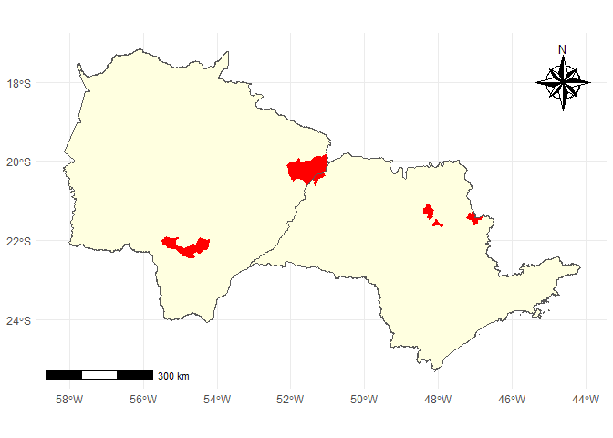
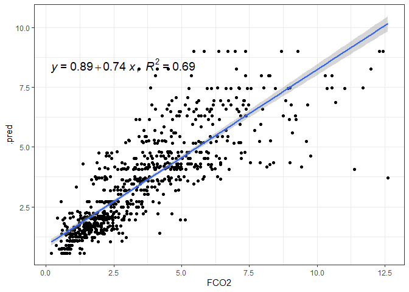
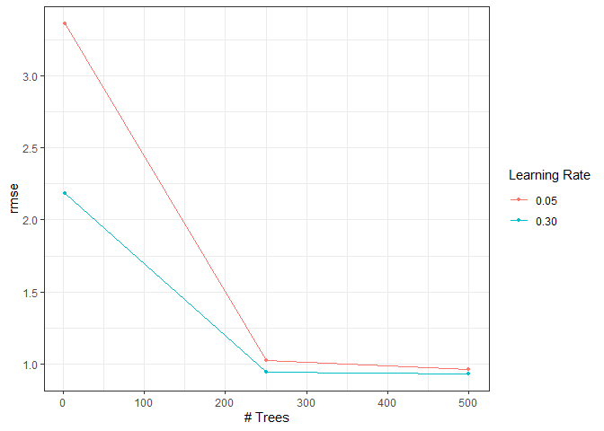

<!-- README.md is generated from README.Rmd. Please edit that file -->

# EMISSÃO DE CO<sub>2</sub> DO SOLO EM ÁREAS AGRÍCOLAS: ABORDAGEM EM APRENDIZADO DE MÁQUINA ESTATÍSTICO

## Autor: Prof. Dr. [Alan Rodrigo Panosso](https://www.fcav.unesp.br/#!/alan)

##### E-mail: <alan.panosso@unesp.br>

##### Departamento de Engenharia e Ciências Exatas

##### UNESP - Câmpus de Jaboticabal

## Objetivo

O objetivo do repositório `tese-fco2-ml-2023` é promover a
transparência, a reprodutibilidade e a colaboração em pesquisa. Você é
incentivado a explorar o código-fonte, utilizar os dados e contribuir
com melhorias, se desejar. Sinta-se à vontade para entrar em contato
caso tenha alguma dúvida ou precise de mais informações sobre minha
pesquisa.

## Contribuições

Contribuições são bem-vindas! Se você deseja colaborar com melhorias nos
códigos, correções de erros ou qualquer outro aprimoramento, sinta-se à
vontade para abrir uma solicitação de `pull request`.

## Licença

Este projeto é licenciado sob `MIT License`. Consulte o arquivo
[LICENSE](https://github.com/arpanosso/tese-fco2-ml-2023/blob/master/LICENSE.md)
para obter mais detalhes.

## Base de dados

Apresentação do pacote `fco2r` construído para facilitar a divulgação e
análise dos resultados obtidos ao longo de mais de 20 anos de ensaios em
campo. Este pacote, permite a visualização dos dados, a execução de
análises estatísticas avançadas e a geração de gráficos interativos para
tornar os resultados mais acessíveis e compreensíveis para a comunidade
científica.

### Instalação

Você pode instalar uma versão de desenvolvimento do pacote `fco2r` a
partir do [GitHub](https://github.com/) com os seguintes comandos:

``` r
# install.packages("devtools")
# devtools::install_github("arpanosso/fco2r")
```

### Problemas na instalação:

Possíveis problemas na instalação do pacote podem ser sanados com os
seguintes comandos:

``` r
# Sys.getenv("GITHUB_PAT")
# Sys.unsetenv("GITHUB_PAT")
# Sys.getenv("GITHUB_PAT")
```

### Carregando os pacotes

``` r
library(fco2r)
library(tidyverse)
library(patchwork)
library(ggspatial)
library(readxl)
library(skimr)
library(tidymodels)
library(ISLR)
library(modeldata)
library(vip)
library(ggpubr)
```

### Conhecendo a base de dados de emissão de CO<sub>2</sub> do solo

Base proveniente de ensaios de campo.

``` r
help(data_fco2)
glimpse(data_fco2)
#> Rows: 15,397
#> Columns: 39
#> $ experimento       <chr> "Espacial", "Espacial", "Espacial", "Espacial", "Esp~
#> $ data              <date> 2001-07-10, 2001-07-10, 2001-07-10, 2001-07-10, 200~
#> $ manejo            <chr> "convencional", "convencional", "convencional", "con~
#> $ tratamento        <chr> "AD_GN", "AD_GN", "AD_GN", "AD_GN", "AD_GN", "AD_GN"~
#> $ revolvimento_solo <lgl> FALSE, FALSE, FALSE, FALSE, FALSE, FALSE, FALSE, FAL~
#> $ data_preparo      <date> 2001-07-01, 2001-07-01, 2001-07-01, 2001-07-01, 200~
#> $ conversao         <date> 1970-01-01, 1970-01-01, 1970-01-01, 1970-01-01, 197~
#> $ cobertura         <lgl> TRUE, TRUE, TRUE, TRUE, TRUE, TRUE, TRUE, TRUE, TRUE~
#> $ cultura           <chr> "milho_soja", "milho_soja", "milho_soja", "milho_soj~
#> $ x                 <dbl> 0, 40, 80, 10, 25, 40, 55, 70, 20, 40, 60, 10, 70, 3~
#> $ y                 <dbl> 0, 0, 0, 10, 10, 10, 10, 10, 20, 20, 20, 25, 25, 30,~
#> $ longitude_muni    <dbl> 782062.7, 782062.7, 782062.7, 782062.7, 782062.7, 78~
#> $ latitude_muni     <dbl> 7647674, 7647674, 7647674, 7647674, 7647674, 7647674~
#> $ estado            <chr> "SP", "SP", "SP", "SP", "SP", "SP", "SP", "SP", "SP"~
#> $ municipio         <chr> "Jaboticabal", "Jaboticabal", "Jaboticabal", "Jaboti~
#> $ ID                <int> 1, 2, 3, 4, 5, 6, 7, 8, 9, 10, 11, 12, 13, 14, 15, 1~
#> $ prof              <chr> "0-0.1", "0-0.1", "0-0.1", "0-0.1", "0-0.1", "0-0.1"~
#> $ FCO2              <dbl> 1.080, 0.825, 1.950, 0.534, 0.893, 0.840, 1.110, 1.8~
#> $ Ts                <dbl> 18.73, 18.40, 19.20, 18.28, 18.35, 18.47, 19.10, 18.~
#> $ Us                <dbl> NA, NA, NA, NA, NA, NA, NA, NA, NA, NA, NA, NA, NA, ~
#> $ pH                <dbl> 5.1, 5.1, 5.8, 5.3, 5.5, 5.7, 5.6, 6.4, 5.3, 5.8, 5.~
#> $ MO                <dbl> 20, 24, 25, 23, 23, 21, 26, 23, 25, 24, 26, 20, 25, ~
#> $ P                 <dbl> 46, 26, 46, 78, 60, 46, 55, 92, 55, 60, 48, 71, 125,~
#> $ K                 <dbl> 2.4, 2.2, 5.3, 3.6, 3.4, 2.9, 4.0, 2.3, 3.3, 3.6, 4.~
#> $ Ca                <dbl> 25, 30, 41, 27, 33, 38, 35, 94, 29, 36, 37, 29, 50, ~
#> $ Mg                <dbl> 11, 11, 25, 11, 15, 20, 16, 65, 11, 17, 15, 11, 30, ~
#> $ H_Al              <dbl> 31, 31, 22, 28, 27, 22, 22, 12, 31, 28, 28, 31, 18, ~
#> $ SB                <dbl> 38.4, 43.2, 71.3, 41.6, 50.6, 60.9, 55.0, 161.3, 43.~
#> $ CTC               <dbl> 69.4, 74.2, 93.3, 69.6, 77.9, 82.9, 77.0, 173.3, 74.~
#> $ V                 <dbl> 55, 58, 76, 60, 65, 73, 71, 93, 58, 67, 67, 58, 82, ~
#> $ Ds                <dbl> NA, NA, NA, NA, NA, NA, NA, NA, NA, NA, NA, NA, NA, ~
#> $ Macro             <dbl> NA, NA, NA, NA, NA, NA, NA, NA, NA, NA, NA, NA, NA, ~
#> $ Micro             <dbl> NA, NA, NA, NA, NA, NA, NA, NA, NA, NA, NA, NA, NA, ~
#> $ VTP               <dbl> NA, NA, NA, NA, NA, NA, NA, NA, NA, NA, NA, NA, NA, ~
#> $ PLA               <dbl> NA, NA, NA, NA, NA, NA, NA, NA, NA, NA, NA, NA, NA, ~
#> $ AT                <dbl> NA, NA, NA, NA, NA, NA, NA, NA, NA, NA, NA, NA, NA, ~
#> $ SILTE             <dbl> NA, NA, NA, NA, NA, NA, NA, NA, NA, NA, NA, NA, NA, ~
#> $ ARG               <dbl> NA, NA, NA, NA, NA, NA, NA, NA, NA, NA, NA, NA, NA, ~
#> $ HLIFS             <dbl> NA, NA, NA, NA, NA, NA, NA, NA, NA, NA, NA, NA, NA, ~
```

Vamos conhecer, um pouco mais a nossa base de dados.

``` r
skimr::skim(data_fco2)
```

|                                                  |           |
|:-------------------------------------------------|:----------|
| Name                                             | data_fco2 |
| Number of rows                                   | 15397     |
| Number of columns                                | 39        |
| \_\_\_\_\_\_\_\_\_\_\_\_\_\_\_\_\_\_\_\_\_\_\_   |           |
| Column type frequency:                           |           |
| character                                        | 7         |
| Date                                             | 3         |
| logical                                          | 2         |
| numeric                                          | 27        |
| \_\_\_\_\_\_\_\_\_\_\_\_\_\_\_\_\_\_\_\_\_\_\_\_ |           |
| Group variables                                  | None      |

Data summary

**Variable type: character**

| skim_variable | n_missing | complete_rate | min | max | empty | n_unique | whitespace |
|:--------------|----------:|--------------:|----:|----:|------:|---------:|-----------:|
| experimento   |         0 |             1 |   8 |   8 |     0 |        2 |          0 |
| manejo        |         0 |             1 |   6 |  15 |     0 |       10 |          0 |
| tratamento    |         0 |             1 |   2 |  10 |     0 |       21 |          0 |
| cultura       |         0 |             1 |   4 |  14 |     0 |       11 |          0 |
| estado        |         0 |             1 |   2 |   2 |     0 |        2 |          0 |
| municipio     |         0 |             1 |   7 |  20 |     0 |        6 |          0 |
| prof          |         0 |             1 |   5 |   7 |     0 |        2 |          0 |

**Variable type: Date**

| skim_variable | n_missing | complete_rate | min        | max        | median     | n_unique |
|:--------------|----------:|--------------:|:-----------|:-----------|:-----------|---------:|
| data          |         0 |             1 | 2001-07-10 | 2019-12-01 | 2014-07-12 |      205 |
| data_preparo  |         0 |             1 | 1986-03-01 | 2019-04-01 | 2002-01-01 |       14 |
| conversao     |         0 |             1 | 1970-01-01 | 2009-07-03 | 1986-03-01 |       11 |

**Variable type: logical**

| skim_variable     | n_missing | complete_rate | mean | count      |
|:------------------|----------:|--------------:|-----:|:-----------|
| revolvimento_solo |         0 |             1 |    0 | FAL: 15397 |
| cobertura         |         0 |             1 |    1 | TRU: 15397 |

**Variable type: numeric**

| skim_variable  | n_missing | complete_rate |       mean |         sd |        p0 |        p25 |        p50 |        p75 |       p100 | hist  |
|:---------------|----------:|--------------:|-----------:|-----------:|----------:|-----------:|-----------:|-----------:|-----------:|:------|
| x              |         0 |          1.00 | 1392083.56 | 2923710.70 |      0.00 |       0.00 |      30.00 |     100.00 | 7749472.16 | ▇▁▁▁▂ |
| y              |         0 |          1.00 |  495854.97 | 1722529.75 |      0.00 |       0.00 |      27.00 |      80.00 | 7630525.47 | ▇▁▁▁▁ |
| longitude_muni |         0 |          1.00 | 1067926.05 | 1796771.47 | 456798.63 |  458447.46 |  458447.46 |  792043.56 | 7638196.06 | ▇▁▁▁▁ |
| latitude_muni  |         0 |          1.00 | 7231328.21 | 1754220.76 | 795907.06 | 7635356.70 | 7749398.84 | 7749821.85 | 7758831.37 | ▁▁▁▁▇ |
| ID             |         0 |          1.00 |      40.52 |      31.52 |      1.00 |      13.00 |      35.00 |      60.00 |     141.00 | ▇▅▃▁▁ |
| FCO2           |       110 |          0.99 |       2.78 |       2.08 |     -3.42 |       1.30 |       2.16 |       3.75 |      46.93 | ▇▁▁▁▁ |
| Ts             |       317 |          0.98 |      21.84 |       6.76 |      1.00 |      19.33 |      22.50 |      26.15 |     195.63 | ▇▁▁▁▁ |
| Us             |      1754 |          0.89 |      16.31 |       8.93 |      0.00 |      10.00 |      14.06 |      22.00 |      89.00 | ▇▅▁▁▁ |
| pH             |      2802 |          0.82 |       4.64 |       1.13 |      3.50 |       4.00 |       4.50 |       5.15 |      52.00 | ▇▁▁▁▁ |
| MO             |      1355 |          0.91 |      21.59 |      12.60 |      1.35 |      12.00 |      23.00 |      29.00 |      61.26 | ▆▇▇▂▁ |
| P              |      1355 |          0.91 |      20.95 |      24.74 |      1.00 |       6.00 |      15.48 |      27.36 |     253.00 | ▇▁▁▁▁ |
| K              |      1348 |          0.91 |       2.40 |       2.21 |      0.03 |       0.90 |       1.70 |       3.40 |      34.00 | ▇▁▁▁▁ |
| Ca             |      1376 |          0.91 |      17.20 |      14.57 |      1.10 |       6.00 |      11.00 |      26.00 |      94.00 | ▇▃▁▁▁ |
| Mg             |      1376 |          0.91 |      10.13 |       5.65 |      0.32 |       7.00 |      10.00 |      13.00 |      65.00 | ▇▂▁▁▁ |
| H_Al           |      1362 |          0.91 |      46.89 |      29.38 |      0.00 |      26.00 |      42.29 |      72.00 |     121.00 | ▅▇▆▂▂ |
| SB             |      1376 |          0.91 |      29.69 |      20.10 |      1.54 |      15.60 |      23.80 |      42.00 |     161.30 | ▇▃▁▁▁ |
| CTC            |      1369 |          0.91 |      77.10 |      32.99 |      4.62 |      59.23 |      83.40 |     103.20 |     173.30 | ▂▃▇▃▁ |
| V              |      1383 |          0.91 |      41.68 |      20.05 |      4.96 |      22.00 |      43.00 |      58.00 |     100.00 | ▆▆▇▅▁ |
| Ds             |      3284 |          0.79 |       1.38 |       0.17 |      0.88 |       1.24 |       1.38 |       1.52 |       1.86 | ▁▆▇▇▁ |
| Macro          |      3277 |          0.79 |       8.55 |       7.85 |    -45.30 |       0.15 |       8.13 |      13.64 |      49.77 | ▁▁▇▃▁ |
| Micro          |      3298 |          0.79 |      25.30 |      17.13 |      0.07 |       0.37 |      33.86 |      38.30 |      52.42 | ▅▁▂▇▁ |
| VTP            |      3298 |          0.79 |      42.34 |      15.65 |     -4.68 |      40.81 |      46.25 |      51.32 |      87.80 | ▂▁▇▃▁ |
| PLA            |      3438 |          0.78 |      29.57 |      11.80 |    -47.30 |      21.27 |      32.41 |      38.15 |      79.80 | ▁▁▅▇▁ |
| AT             |      8083 |          0.48 |    1013.33 |    1358.81 |     11.72 |     236.00 |     593.62 |     816.00 |    4542.73 | ▇▁▁▁▂ |
| SILTE          |      8048 |          0.48 |     229.26 |     336.37 |      1.26 |      50.87 |      73.65 |     188.00 |    1395.00 | ▇▁▁▁▁ |
| ARG            |      8055 |          0.48 |     995.41 |    1560.32 |     27.19 |     173.27 |     403.69 |     609.50 |    5244.76 | ▇▁▁▁▂ |
| HLIFS          |     10872 |          0.29 |   14590.11 |   17253.55 |    158.39 |    1110.15 |    2409.80 |   29707.78 |   84692.90 | ▇▃▁▁▁ |

### Alguns gráficos a respeito de nossa variável alvo, emissão de CO<sub>2</sub> do solo (FCO<sub>2</sub>).

``` r
theme_set(theme_bw())
fco2_histograma <- data_fco2 %>% 
  drop_na() %>% 
  ggplot(aes(x=FCO2, y=..density..)) +
  geom_histogram(col="black",fill="gray") +
  geom_density(fill="blue",alpha=.08)

fco2_boxplot <- data_fco2 %>% 
  drop_na() %>% 
  ggplot(aes(x=FCO2)) +
  geom_boxplot(fill="lightgray") + 
  coord_cartesian(ylim=c(-.9,.9))

fco2_qqplot <- data_fco2 %>% 
  drop_na() %>% 
  ggplot(aes(sample=FCO2)) +
  stat_qq(shape=1,size=1,color="black")+
  stat_qq_line(col="red")

fco2_qqplot | (fco2_histograma)/(fco2_boxplot)
```

<!-- -->

### Aplicando a transformação logarítmica nos dados de FCO<sub>2</sub>

``` r
ggplot2::theme_set(theme_bw())

fco2_histograma <- data_fco2 %>% 
  drop_na() %>% 
  ggplot(aes(x=log(FCO2), y=..density..)) +
  geom_histogram(col="black",fill="gray") +
  geom_density(fill="red",alpha=.08)

fco2_boxplot <- data_fco2 %>% 
  drop_na() %>% 
  ggplot(aes(x=log(FCO2))) +
  geom_boxplot(fill="orange") + 
  coord_cartesian(ylim=c(-.9,.9))

fco2_qqplot <- data_fco2 %>% 
  drop_na() %>% 
  ggplot(aes(sample=log(FCO2))) +
  stat_qq(shape=1,size=1,color="black")+
  stat_qq_line(col="blue")

fco2_qqplot | (fco2_histograma)/(fco2_boxplot)
```

<!-- -->

``` r
# brasil_geobr <- geobr::read_country()
# estados <- read_state(code_state = "all")
# write_rds(estados,"data/estados.rds")
# write_rds(brasil_geobr,"data/brasil_geobr.rds")
estados <- read_rds("data/estados.rds")
```

``` r
# muni <- read_municipality()
# write_rds(muni,"data/municipios.rds")
muni <- read_rds("data/municipios.rds")

sp <- muni %>% 
  filter(abbrev_state == "SP")

ms <- muni %>% 
  filter(abbrev_state == "MS")

sp_ms <- muni %>% 
  filter(abbrev_state == "SP" | abbrev_state == "MS")

fsp<-if_else(sp$name_muni == "Jaboticabal" | 
             sp$name_muni == "Guariba" |
             sp$name_muni == "Padrópolis" |
             sp$name_muni == "Rincão"|
             sp$name_muni == "Mococa"|
             sp$name_muni == "Ilha Solteira"
             ,"red","lightyellow")

fms<-if_else(ms$name_muni == "Aparecida Do Taboado" | 
             ms$name_muni == "Selvíria"|
             ms$name_muni == "Dourados"   
             ,"red","lightyellow")

sp_ <- estados %>% 
      filter(abbrev_state == "SP")

ms_ <- estados %>% 
      filter(abbrev_state == "MS")

ggplot(sp_ms) + 
  geom_sf(fill="lightyellow")+
  theme_minimal() + 
  annotation_scale(location="bl")+
  annotation_north_arrow(location="tr",
                         style = north_arrow_nautical(),
                         width = unit(2,"cm"),
                         height = unit(2,"cm")) +
  geom_sf(data= sp, fill=fsp,col=fsp) +
  geom_sf(data=sp_,fill="transparent") +
  geom_sf(data= ms, fill=fms,col=fms) +
  geom_sf(data=ms_,fill="transparent")
```

<!-- -->

### Conhecendo a base de dados de concentração de CO<sub>2</sub> atmosférico, oriundo do sensor NASA-OCO2.

``` r
help(oco2_br)
glimpse(oco2_br)
#> Rows: 37,387
#> Columns: 18
#> $ longitude                                                     <dbl> -70.5, -~
#> $ longitude_bnds                                                <chr> "-71.0:-~
#> $ latitude                                                      <dbl> -5.5, -4~
#> $ latitude_bnds                                                 <chr> "-6.0:-5~
#> $ time_yyyymmddhhmmss                                           <dbl> 2.014091~
#> $ time_bnds_yyyymmddhhmmss                                      <chr> "2014090~
#> $ altitude_km                                                   <dbl> 3307.8, ~
#> $ alt_bnds_km                                                   <chr> "0.0:661~
#> $ fluorescence_radiance_757nm_uncert_idp_ph_sec_1_m_2_sr_1_um_1 <dbl> 7.272876~
#> $ fluorescence_radiance_757nm_idp_ph_sec_1_m_2_sr_1_um_1        <dbl> 2.537127~
#> $ xco2_moles_mole_1                                             <dbl> 0.000394~
#> $ aerosol_total_aod                                             <dbl> 0.148579~
#> $ fluorescence_offset_relative_771nm_idp                        <dbl> 0.016753~
#> $ fluorescence_at_reference_ph_sec_1_m_2_sr_1_um_1              <dbl> 2.615319~
#> $ fluorescence_radiance_771nm_idp_ph_sec_1_m_2_sr_1_um_1        <dbl> 3.088582~
#> $ fluorescence_offset_relative_757nm_idp                        <dbl> 0.013969~
#> $ fluorescence_radiance_771nm_uncert_idp_ph_sec_1_m_2_sr_1_um_1 <dbl> 5.577878~
#> $ XCO2                                                          <dbl> 387.2781~
```

### Breve resumo do banco de dados de X<sub>CO2</sub>

``` r
skimr::skim(oco2_br)
```

|                                                  |         |
|:-------------------------------------------------|:--------|
| Name                                             | oco2_br |
| Number of rows                                   | 37387   |
| Number of columns                                | 18      |
| \_\_\_\_\_\_\_\_\_\_\_\_\_\_\_\_\_\_\_\_\_\_\_   |         |
| Column type frequency:                           |         |
| character                                        | 4       |
| numeric                                          | 14      |
| \_\_\_\_\_\_\_\_\_\_\_\_\_\_\_\_\_\_\_\_\_\_\_\_ |         |
| Group variables                                  | None    |

Data summary

**Variable type: character**

| skim_variable            | n_missing | complete_rate | min | max | empty | n_unique | whitespace |
|:-------------------------|----------:|--------------:|----:|----:|------:|---------:|-----------:|
| longitude_bnds           |         0 |             1 |  11 |  11 |     0 |       39 |          0 |
| latitude_bnds            |         0 |             1 |   7 |  11 |     0 |       38 |          0 |
| time_bnds_yyyymmddhhmmss |         0 |             1 |  29 |  29 |     0 |     1765 |          0 |
| alt_bnds_km              |         0 |             1 |  11 |  20 |     0 |       64 |          0 |

**Variable type: numeric**

| skim_variable                                                 | n_missing | complete_rate |          mean |           sd |            p0 |           p25 |           p50 |           p75 |          p100 | hist  |
|:--------------------------------------------------------------|----------:|--------------:|--------------:|-------------:|--------------:|--------------:|--------------:|--------------:|--------------:|:------|
| longitude                                                     |         0 |             1 | -5.120000e+01 | 8.280000e+00 | -7.350000e+01 | -5.650000e+01 | -5.050000e+01 | -4.450000e+01 | -3.550000e+01 | ▂▃▇▇▅ |
| latitude                                                      |         0 |             1 | -1.179000e+01 | 7.850000e+00 | -3.250000e+01 | -1.750000e+01 | -1.050000e+01 | -5.500000e+00 |  4.500000e+00 | ▂▃▇▇▃ |
| time_yyyymmddhhmmss                                           |         0 |             1 |  2.016952e+13 | 1.564571e+10 |  2.014091e+13 |  2.016020e+13 |  2.017052e+13 |  2.018092e+13 |  2.020012e+13 | ▇▇▅▆▇ |
| altitude_km                                                   |         0 |             1 |  3.123200e+03 | 1.108800e+02 |  2.555700e+03 |  3.056350e+03 |  3.126310e+03 |  3.196250e+03 |  3.307800e+03 | ▁▁▂▇▇ |
| fluorescence_radiance_757nm_uncert_idp_ph_sec_1_m_2_sr_1_um_1 |         0 |             1 |  8.520719e+17 | 5.599367e+18 | -9.999990e+05 |  6.323256e+17 |  6.951592e+17 |  7.671609e+17 |  9.365539e+20 | ▇▁▁▁▁ |
| fluorescence_radiance_757nm_idp_ph_sec_1_m_2_sr_1_um_1        |         0 |             1 | -1.358150e+18 | 1.946775e+20 | -3.400736e+22 |  7.735159e+17 |  1.676353e+18 |  2.566089e+18 |  2.316112e+20 | ▁▁▁▁▇ |
| xco2_moles_mole_1                                             |         0 |             1 |  0.000000e+00 | 0.000000e+00 |  0.000000e+00 |  0.000000e+00 |  0.000000e+00 |  0.000000e+00 |  0.000000e+00 | ▁▁▇▁▁ |
| aerosol_total_aod                                             |         0 |             1 |  4.828100e+02 | 7.848572e+04 |  2.000000e-02 |  1.100000e-01 |  1.700000e-01 |  2.600000e-01 |  1.487623e+07 | ▇▁▁▁▁ |
| fluorescence_offset_relative_771nm_idp                        |         0 |             1 | -4.814400e+02 | 2.193698e+04 | -9.999990e+05 |  1.000000e-02 |  1.000000e-02 |  2.000000e-02 |  1.230000e+00 | ▁▁▁▁▇ |
| fluorescence_at_reference_ph_sec_1_m_2_sr_1_um_1              |         0 |             1 |  1.296932e+18 | 2.245185e+18 | -8.394901e+19 |  2.014560e+17 |  1.268715e+18 |  2.395217e+18 |  8.610756e+19 | ▁▁▇▁▁ |
| fluorescence_radiance_771nm_idp_ph_sec_1_m_2_sr_1_um_1        |         0 |             1 |  1.904438e+18 | 2.236381e+18 | -8.453983e+19 |  9.694709e+17 |  1.987682e+18 |  2.918792e+18 |  4.338306e+19 | ▁▁▁▇▁ |
| fluorescence_offset_relative_757nm_idp                        |         0 |             1 | -3.744400e+02 | 1.934763e+04 | -9.999990e+05 |  1.000000e-02 |  1.000000e-02 |  2.000000e-02 |  2.086000e+01 | ▁▁▁▁▇ |
| fluorescence_radiance_771nm_uncert_idp_ph_sec_1_m_2_sr_1_um_1 |         0 |             1 |  5.235574e+17 | 7.580471e+16 | -9.999990e+05 |  4.695467e+17 |  5.216793e+17 |  5.736367e+17 |  1.143215e+18 | ▁▂▇▁▁ |
| XCO2                                                          |         0 |             1 |  3.858900e+02 | 3.120000e+00 |  3.383400e+02 |  3.844100e+02 |  3.862900e+02 |  3.878000e+02 |  4.301400e+02 | ▁▁▇▁▁ |

### Manipulando a base `oco2_br` para criação das variáveis temporais e ajuste de unidade de xco2.

``` r
oco2_br <- oco2_br  %>% 
        mutate(
           xco2 = xco2_moles_mole_1*1e06,
           data = ymd_hms(time_yyyymmddhhmmss),
           ano = year(data),
           mes = month(data),
           dia = day(data),
           dia_semana = wday(data))
```

Mapa das leituras do satélite OCO2-NASA

``` r
source("R/graficos.R")
brasil_geobr <- read_rds("data/brasil_geobr.rds")
brasil_geobr %>% 
  ggplot() +
  geom_sf(fill="white", color="black",
          size=.15, show.legend = FALSE) +
  tema_mapa() +
  geom_point(data=oco2_br %>%  
                        sample_n(20000) ,
             aes(x=longitude,y=latitude),
             shape=1,
             col="red",
             alpha=01)+
  labs(x="Longitude",y="Latitude")
```

<!-- -->

``` r
xco2_histograma <- oco2_br %>% 
  drop_na() %>% 
  ggplot(aes(x=xco2, y=..density..)) +
  geom_histogram(col="black",fill="gray") +
  geom_density(fill="aquamarine2",alpha=.08)

xco2_boxplot <- oco2_br %>% 
  drop_na() %>% 
  ggplot(aes(x=xco2)) +
  geom_boxplot(fill="aquamarine4") + 
  coord_cartesian(ylim=c(-.9,.9))

xco2_qqplot <- oco2_br %>% 
  drop_na() %>% 
  ggplot(aes(sample=xco2)) +
  stat_qq(shape=1,size=1,color="black")+
  stat_qq_line(col="purple",lwd=2)

xco2_qqplot | (xco2_histograma)/(xco2_boxplot)
```

<!-- -->

``` r
# Definindo o plano de multisession
future::plan("multisession")
```

``` r
oco2_br  %>%  
  ggplot(aes(x=data,y=XCO2)) +
  geom_point(shape=21,color="black",fill="gray") +
  geom_smooth(method = "lm") +
  stat_regline_equation(ggplot2::aes(
  label =  paste(..eq.label.., ..rr.label.., sep = "*plain(\",\")~~")))
```

<!-- -->

``` r
visdat::vis_miss(data_fco2)
```

<!-- -->

## Listando as datas dos arquivos

``` r
lista_data_fco2 <- unique(data_fco2$data)
lista_data_oco2 <- unique(oco2_br$data)
datas_fco2 <- paste0(lubridate::year(lista_data_fco2),"-",lubridate::month(lista_data_fco2)) %>% unique()

datas_oco2 <- paste0(lubridate::year(lista_data_oco2),"-",lubridate::month(lista_data_oco2)) %>% unique()
datas <- datas_fco2[datas_fco2 %in% datas_oco2]
```

Chaves para mesclagem

``` r
fco2 <- data_fco2 %>% 
  mutate(ano_mes = paste0(lubridate::year(data),"-",lubridate::month(data))) %>% 
  dplyr::filter(ano_mes %in% datas)

xco2 <- oco2_br %>%   
  mutate(ano_mes=paste0(ano,"-",mes)) %>% 
  dplyr::filter(ano_mes %in% datas)
```

Coordenadas das cidades

``` r
unique(xco2$ano_mes)[unique(xco2$ano_mes) %>% order()] == 
unique(fco2$ano_mes)[unique(fco2$ano_mes) %>% order()]
#>  [1] TRUE TRUE TRUE TRUE TRUE TRUE TRUE TRUE TRUE TRUE TRUE TRUE TRUE TRUE TRUE
#> [16] TRUE TRUE TRUE TRUE TRUE TRUE TRUE TRUE TRUE TRUE TRUE TRUE TRUE TRUE
```

``` r
data_set <- left_join(fco2 %>% 
            mutate(ano = lubridate::year(data),
                   mes = lubridate::month(data)
                   ), 
          xco2 %>% 
            select(data,mes,dia,longitude,latitude,XCO2,fluorescence_radiance_757nm_idp_ph_sec_1_m_2_sr_1_um_1,fluorescence_radiance_771nm_idp_ph_sec_1_m_2_sr_1_um_1, ano_mes), by = "ano_mes") %>% 
  mutate(dist = sqrt((longitude-(-51.423519))^2+(latitude-(-20.362911))^2),
         SIF = (fluorescence_radiance_757nm_idp_ph_sec_1_m_2_sr_1_um_1*2.6250912*10^(-19)  + 1.5*fluorescence_radiance_771nm_idp_ph_sec_1_m_2_sr_1_um_1* 2.57743*10^(-19))/2)


data_set<-data_set %>%
  select(-fluorescence_radiance_757nm_idp_ph_sec_1_m_2_sr_1_um_1, -fluorescence_radiance_771nm_idp_ph_sec_1_m_2_sr_1_um_1 )  %>% 
  filter(dist <= .16, FCO2 <= 30 ) 
```

``` r
visdat::vis_miss(data_set)
```

<!-- -->

``` r
tab_medias <- data_set %>% 
  # mutate(SIF = ifelse(SIF <=0, mean(data_set$SIF, na.rm=TRUE),SIF)) %>% 
  group_by(ano_mes, cultura) %>% 
  summarise(FCO2 = mean(FCO2, na.rm=TRUE),
            XCO2 = mean(XCO2, na.rm=TRUE),
            SIF = mean(SIF, na.rm=TRUE))

tab_medias %>% 
  ggplot(aes(x=XCO2, y=SIF,color=cultura)) +
  geom_point()+
  geom_smooth(method = "lm")+
  theme_bw()
```

<!-- -->

``` r
tab_medias %>% 
  ggplot(aes(x=XCO2, y=FCO2,col=cultura)) +
  geom_point()+
  geom_smooth(method = "lm")+
  theme_bw()
```

<!-- -->

``` r
tab_medias %>% 
  ggplot(aes(y=FCO2, x=SIF, color=cultura)) +
  geom_point()+
  geom_smooth(method = "lm") +
  theme_bw()
```

<!-- -->

``` r
data_set_temporal <- data_set %>% 
  filter(experimento == "Temporal")

data_set_espacial <- data_set %>% 
  filter(experimento == "Espacial")
```

# Carregando dados Meteorológicos de Ilha Solteira

``` r
dados_estacao <- read_excel("data-raw/xlsx/estacao_meteorologia_ilha_solteira.xlsx", na = "NA") 
glimpse(dados_estacao)
#> Rows: 1,826
#> Columns: 16
#> $ data    <dttm> 2015-01-01, 2015-01-02, 2015-01-03, 2015-01-04, 2015-01-05, 2~
#> $ Tmed    <dbl> 30.5, 30.0, 26.8, 27.1, 27.0, 27.6, 30.2, 28.2, 28.5, 29.9, 30~
#> $ Tmax    <dbl> 36.5, 36.7, 35.7, 34.3, 33.2, 36.4, 37.2, 32.4, 37.1, 38.1, 38~
#> $ Tmin    <dbl> 24.6, 24.5, 22.9, 22.7, 22.3, 22.8, 22.7, 24.0, 23.0, 23.3, 24~
#> $ Umed    <dbl> 66.6, 70.4, 82.7, 76.8, 81.6, 75.5, 65.8, 70.0, 72.9, 67.6, 66~
#> $ Umax    <dbl> 89.6, 93.6, 99.7, 95.0, 98.3, 96.1, 99.2, 83.4, 90.7, 97.4, 90~
#> $ Umin    <dbl> 42.0, 44.2, 52.9, 43.8, 57.1, 47.5, 34.1, 57.4, 42.7, 38.3, 37~
#> $ PkPa    <dbl> 97.2, 97.3, 97.4, 97.5, 97.4, 97.5, 97.4, 97.4, 97.4, 97.4, 97~
#> $ Rad     <dbl> 23.6, 24.6, 20.2, 21.4, 17.8, 19.2, 27.0, 15.2, 21.6, 24.3, 24~
#> $ PAR     <dbl> 496.6, 513.3, 430.5, 454.0, 378.2, 405.4, 565.7, 317.2, 467.5,~
#> $ Eto     <dbl> 5.7, 5.8, 4.9, 5.1, 4.1, 4.8, 6.2, 4.1, 5.5, 5.7, 5.9, 6.1, 6.~
#> $ Velmax  <dbl> 6.1, 4.8, 12.1, 6.2, 5.1, 4.5, 4.6, 5.7, 5.8, 5.2, 5.2, 4.7, 6~
#> $ Velmin  <dbl> 1.0, 1.0, 1.2, 1.0, 0.8, 0.9, 0.9, 1.5, 1.2, 0.8, 0.8, 1.2, 1.~
#> $ Dir_vel <dbl> 17.4, 261.9, 222.0, 25.0, 56.9, 74.9, 53.4, 89.0, 144.8, 303.9~
#> $ chuva   <dbl> 0.0, 0.0, 3.3, 0.0, 0.0, 0.0, 0.0, 0.0, 0.0, 0.0, 0.0, 0.0, 0.~
#> $ inso    <dbl> 7.9, 8.7, 5.2, 6.2, 3.4, 4.5, 10.5, 1.3, 6.3, 8.4, 8.6, 7.9, 1~
dados_estacao <- dados_estacao %>% 
                   drop_na()
visdat::vis_miss(dados_estacao)
```

<!-- -->

``` r
data_set_est_isa <- left_join(data_set %>% 
                         rename(data=data.x), dados_estacao, by = "data") %>%                           mutate(range_T = Tmax-Tmin) 
```

``` r
data_set_temporal <- data_set_est_isa %>% 
  filter(experimento == "Temporal")

data_set_espacial <- data_set_est_isa %>% 
  filter(experimento == "Espacial")
```

# Quarta Aproximação

- Alvo: FCO2 - temporal
- restrição dados após 2014
- Features: Atributos do Solo + Xco2 e SIF + Dados da Estação de ISA
- Modelo mais simples e geral
- Testar 3 métodos baseados em árvores de decisão

### visualização do banco de dados

``` r
visdat::vis_miss(data_set_temporal)
```

<!-- -->

### Definindo a Base de treino e teste

``` r
data_set_ml <- data_set_temporal # <-------
fco2_initial_split <- initial_split(data_set_ml, prop = 0.75)
```

``` r
fco2_train <- training(fco2_initial_split)
# fco2_test <- testing(fco2_initial_split)
# visdat::vis_miss(fco2_test)
fco2_train  %>% 
  ggplot(aes(x=FCO2, y=..density..))+
  geom_histogram(bins = 30, color="black",  fill="lightgray")+
  geom_density(alpha=.05,fill="red")+
  theme_bw() +
  labs(x="FCO2 - treino", y = "Densidade")
```

<!-- -->

``` r
fco2_testing <- testing(fco2_initial_split)
fco2_testing  %>% 
  ggplot(aes(x=FCO2, y=..density..))+
  geom_histogram(bins = 30, color="black",  fill="lightgray")+
  geom_density(alpha=.05,fill="blue")+
  theme_bw() +
  labs(x="FCO2 - teste", y = "Densidade")
```

<!-- -->

``` r
fco2_train   %>%    select(FCO2:HLIFS,XCO2,SIF,Tmed:inso) %>% 
  mutate(range_T = Tmax-Tmin) %>% select(-c(Tmax,Tmin,Umax,Umin,Dir_vel)) %>%   select(where(is.numeric)) %>%
  drop_na() %>% 
  cor()  %>%  
  corrplot::corrplot()
```

<!-- --> \### data
prep

``` r
fco2_recipe <- recipe(FCO2 ~ ., 
                      data = fco2_train %>% 
                        select(cultura, manejo, cobertura, FCO2:HLIFS,XCO2,SIF,Tmed:inso) 
) %>%  
  step_normalize(all_numeric_predictors())  %>% 
  step_novel(all_nominal_predictors()) %>% 
  step_zv(all_predictors()) %>%
  #step_naomit(c(Ts, Us)) %>% 
  step_impute_median(where(is.numeric)) %>% # inputação da mediana nos numéricos
  #step_poly(c(Us,Ts), degree = 2)  %>%  
  step_dummy(all_nominal_predictors())
bake(prep(fco2_recipe), new_data = NULL)
#> # A tibble: 2,676 x 49
#>         Ts      Us      pH       MO      P       K      Ca      Mg   H_Al     SB
#>      <dbl>   <dbl>   <dbl>    <dbl>  <dbl>   <dbl>   <dbl>   <dbl>  <dbl>  <dbl>
#>  1  0.0801 -0.386  -0.671   0.751   -0.441 -0.539  -0.674  -1.26    1.25  -1.01 
#>  2 -0.0121 -0.834   0.619   0.109    0.560 -0.739  -0.198   0.239  -1.09  -0.155
#>  3  0.370  -0.116  -0.187   1.18    -0.942 -0.389   0.0873  0.613  -0.129  0.233
#>  4  0.449  -0.383  -0.0262  0.00189 -0.691 -0.739  -0.674  -0.696  -0.939 -0.835
#>  5 -1.96    1.75   -0.510  -0.640    1.48  -0.239  -0.198   0.0519  0.471 -0.155
#>  6  0.765   0.0189 -0.0262  1.18    -0.274 -0.189   0.468   1.36   -0.429  0.804
#>  7 -0.776   1.64   -0.832  -0.533    0.393 -0.689  -0.769  -1.63    1.25  -1.24 
#>  8 -0.0121 -1.24    0.619   0.109    0.560 -0.739  -0.198   0.239  -1.09  -0.155
#>  9  0.225  -0.826  -0.0262  0.00189 -0.691 -0.739  -0.674  -0.696  -0.939 -0.835
#> 10 -2.36    0.829  -0.0262 -0.533    1.73  -0.0389  1.42    0.0519 -0.129  1.03 
#> # ... with 2,666 more rows, and 39 more variables: CTC <dbl>, V <dbl>,
#> #   Ds <dbl>, Macro <dbl>, Micro <dbl>, VTP <dbl>, PLA <dbl>, AT <dbl>,
#> #   SILTE <dbl>, ARG <dbl>, HLIFS <dbl>, XCO2 <dbl>, SIF <dbl>, Tmed <dbl>,
#> #   Tmax <dbl>, Tmin <dbl>, Umed <dbl>, Umax <dbl>, Umin <dbl>, PkPa <dbl>,
#> #   Rad <dbl>, PAR <dbl>, Eto <dbl>, Velmax <dbl>, Velmin <dbl>, Dir_vel <dbl>,
#> #   chuva <dbl>, inso <dbl>, FCO2 <dbl>, cultura_eucalipto <dbl>,
#> #   cultura_mata.ciliar <dbl>, cultura_pasto <dbl>, cultura_pinus <dbl>, ...
```

``` r
visdat::vis_miss(bake(prep(fco2_recipe), new_data = NULL))
```

<!-- --> \###
Reamostragem definida e será padrão para todos os modelos

``` r
fco2_resamples <- vfold_cv(fco2_train, v = 5) # 10 fold
grid <- grid_regular(
  penalty(range = c(-8, 0)),
  levels = 20
)
```

## Árvore de Decisão

### Definição do modelo

``` r
fco2_dt_model <- decision_tree(
  cost_complexity = tune(),
  tree_depth = tune(),
  min_n = tune()
)  %>%  
  set_mode("regression")  %>%  
  set_engine("rpart")
```

### Workflow

``` r
fco2_dt_wf <- workflow()   %>%  
  add_model(fco2_dt_model) %>% 
  add_recipe(fco2_recipe)
```

### Criando a matriz (grid) com os valores de hiperparâmetros a serem testados

``` r
grid_dt <- grid_random(
  cost_complexity(c(-6, -4)),
  tree_depth(range = c(8, 18)),
  min_n(range = c(42, 52)),
  size = 10 # <-----------------------------
)
glimpse(grid_dt)
#> Rows: 10
#> Columns: 3
#> $ cost_complexity <dbl> 9.025760e-05, 4.913009e-05, 6.339129e-05, 6.345867e-06~
#> $ tree_depth      <int> 12, 8, 18, 16, 8, 18, 8, 10, 8, 16
#> $ min_n           <int> 47, 50, 44, 52, 46, 43, 46, 50, 48, 46
```

### Tuning de hiperparâmetros

``` r
fco2_dt_tune_grid <- tune_grid(
  fco2_dt_wf,
  resamples = fco2_resamples,
  grid = grid_dt,
  metrics = metric_set(rmse)
)
```

``` r
autoplot(fco2_dt_tune_grid)
```

<!-- -->

``` r
collect_metrics(fco2_dt_tune_grid)
#> # A tibble: 10 x 9
#>    cost_complexity tree_depth min_n .metric .estim~1  mean     n std_err .config
#>              <dbl>      <int> <int> <chr>   <chr>    <dbl> <int>   <dbl> <chr>  
#>  1      0.0000903          12    47 rmse    standard  1.31     5  0.0511 Prepro~
#>  2      0.0000491           8    50 rmse    standard  1.33     5  0.0528 Prepro~
#>  3      0.0000634          18    44 rmse    standard  1.29     5  0.0419 Prepro~
#>  4      0.00000635         16    52 rmse    standard  1.32     5  0.0459 Prepro~
#>  5      0.00000281          8    46 rmse    standard  1.33     5  0.0465 Prepro~
#>  6      0.00000169         18    43 rmse    standard  1.29     5  0.0452 Prepro~
#>  7      0.0000325           8    46 rmse    standard  1.33     5  0.0465 Prepro~
#>  8      0.0000209          10    50 rmse    standard  1.32     5  0.0457 Prepro~
#>  9      0.0000255           8    48 rmse    standard  1.32     5  0.0530 Prepro~
#> 10      0.00000112         16    46 rmse    standard  1.31     5  0.0471 Prepro~
#> # ... with abbreviated variable name 1: .estimator
```

### Desempenho dos modelos finais

``` r
fco2_dt_best_params <- select_best(fco2_dt_tune_grid, "rmse")
fco2_dt_wf <- fco2_dt_wf %>% finalize_workflow(fco2_dt_best_params)
fco2_dt_last_fit <- last_fit(fco2_dt_wf, fco2_initial_split)
```

### Criando os preditos

``` r
fco2_test_preds <- bind_rows(
  collect_predictions(fco2_dt_last_fit)  %>%   mutate(modelo = "dt")
)

fco2_test <- testing(fco2_initial_split)
visdat::vis_miss(fco2_test)
```

<!-- -->

``` r
fco2_test_preds %>% 
  ggplot(aes(x=.pred, y=FCO2)) +
  geom_point()+
  theme_bw() +
  geom_smooth(method = "lm") +
  stat_regline_equation(ggplot2::aes(
  label =  paste(..eq.label.., ..rr.label.., sep = "*plain(\",\")~~"))) 
```

<!-- -->

# Importância

``` r
fco2_dt_last_fit_model <-fco2_dt_last_fit$.workflow[[1]]$fit$fit
vip(fco2_dt_last_fit_model)
```

<!-- -->

## Métricas

``` r
da <- fco2_test_preds %>% 
  filter(FCO2 > 0, .pred>0 )

my_r <- cor(da$FCO2,da$.pred)
my_r2 <- my_r*my_r
my_mse <- Metrics::mse(da$FCO2,da$.pred)
my_rmse <- Metrics::rmse(da$FCO2,
                         da$.pred)
my_mae <- Metrics::mae(da$FCO2,da$.pred)
my_mape <- Metrics::mape(da$FCO2,da$.pred)*100


fco2_test_preds %>% 
  ggplot(aes(x=FCO2,y=.pred))+
  geom_point()+
  geom_smooth(method = "lm")+
  stat_regline_equation(ggplot2::aes(
    label =  paste(..eq.label.., ..rr.label.., sep = "*plain(\",\")~~")),size=5)
```

<!-- -->

``` r
  # ggplot2::annotate('text',x=10.4,y=16.7,label=paste0('RMSE = ',round(my_rmse,2),', MAPE = '
  #                                                     ,round(my_mape,2),'%'),size=5)+
  # theme_bw()
vector_of_metrics <- c(r=my_r, R2=my_r2, MSE=my_mse, RMSE=my_rmse, MAE=my_mae, MAPE=my_mape)
print(data.frame(vector_of_metrics))
#>      vector_of_metrics
#> r            0.8277487
#> R2           0.6851679
#> MSE          1.5935510
#> RMSE         1.2623593
#> MAE          0.8337241
#> MAPE        27.3322549
```

## Random Forest

### Definição do modelo

``` r
fco2_rf_model <- rand_forest(
  min_n = tune(),
  mtry = tune(),
  trees = tune()
)   %>%  
  set_mode("regression")  %>% 
  set_engine("randomForest")
```

### Workflow

``` r
fco2_rf_wf <- workflow()   %>%  
  add_model(fco2_rf_model) %>%  
  add_recipe(fco2_recipe)
```

### Tune

``` r
grid_rf <- grid_random(
  min_n(range = c(20, 30)),
  mtry(range = c(10,20)),
  trees(range = c(769,1500) ),
  size = 10 #<-----------------------
)
```

``` r
fco2_rf_tune_grid <- tune_grid(
 fco2_rf_wf,
  resamples = fco2_resamples,
  grid = grid_rf,
  metrics = metric_set(rmse)
) 
autoplot(fco2_rf_tune_grid)
```

<!-- -->

``` r
collect_metrics(fco2_rf_tune_grid)
#> # A tibble: 10 x 9
#>     mtry trees min_n .metric .estimator  mean     n std_err .config             
#>    <int> <int> <int> <chr>   <chr>      <dbl> <int>   <dbl> <chr>               
#>  1    17  1050    28 rmse    standard    1.06     5  0.0334 Preprocessor1_Model~
#>  2    17  1069    23 rmse    standard    1.05     5  0.0320 Preprocessor1_Model~
#>  3    16  1217    23 rmse    standard    1.05     5  0.0333 Preprocessor1_Model~
#>  4    11  1000    20 rmse    standard    1.05     5  0.0334 Preprocessor1_Model~
#>  5    12  1004    24 rmse    standard    1.06     5  0.0334 Preprocessor1_Model~
#>  6    12  1436    30 rmse    standard    1.08     5  0.0347 Preprocessor1_Model~
#>  7    12  1190    29 rmse    standard    1.07     5  0.0345 Preprocessor1_Model~
#>  8    20  1414    21 rmse    standard    1.04     5  0.0317 Preprocessor1_Model~
#>  9    20  1035    29 rmse    standard    1.06     5  0.0329 Preprocessor1_Model~
#> 10    14   951    28 rmse    standard    1.07     5  0.0324 Preprocessor1_Model~
```

### Desempenho modelo final

``` r
fco2_rf_best_params <- select_best(fco2_rf_tune_grid, "rmse")
fco2_rf_wf <- fco2_rf_wf %>% finalize_workflow(fco2_rf_best_params)
fco2_rf_last_fit <- last_fit(fco2_rf_wf, fco2_initial_split)
```

### Criando os preditos

``` r
fco2_test_preds <- bind_rows(
  collect_predictions(fco2_rf_last_fit)  %>%   mutate(modelo = "rf")
)

fco2_test <- testing(fco2_initial_split)
visdat::vis_miss(fco2_test)
```

<!-- -->

``` r
fco2_test_preds %>% 
  ggplot(aes(x=.pred, y=FCO2)) +
  geom_point()+
  theme_bw() +
  geom_smooth(method = "lm") +
  stat_regline_equation(ggplot2::aes(
  label =  paste(..eq.label.., ..rr.label.., sep = "*plain(\",\")~~"))) 
```

<!-- -->

# Importância

``` r
fco2_rf_last_fit_model <-fco2_rf_last_fit$.workflow[[1]]$fit$fit
vip(fco2_rf_last_fit_model)
```

<!-- --> \## Métricas

``` r
da <- fco2_test_preds %>% 
  filter(FCO2 > 0, .pred>0 )

my_r <- cor(da$FCO2,da$.pred)
my_r2 <- my_r*my_r
my_mse <- Metrics::mse(da$FCO2,da$.pred)
my_rmse <- Metrics::rmse(da$FCO2,
                         da$.pred)
my_mae <- Metrics::mae(da$FCO2,da$.pred)
my_mape <- Metrics::mape(da$FCO2,da$.pred)*100


fco2_test_preds %>% 
  ggplot(aes(x=FCO2,y=.pred))+
  geom_point()+
  geom_smooth(method = "lm")+
  stat_regline_equation(ggplot2::aes(
    label =  paste(..eq.label.., ..rr.label.., sep = "*plain(\",\")~~")),size=5)
```

<!-- -->

``` r
  # ggplot2::annotate('text',x=10.4,y=16.7,label=paste0('RMSE = ',round(my_rmse,2),', MAPE = '
  #                                                     ,round(my_mape,2),'%'),size=5)+
  # theme_bw()
vector_of_metrics <- c(r=my_r, R2=my_r2, MSE=my_mse, RMSE=my_rmse, MAE=my_mae, MAPE=my_mape)
print(data.frame(vector_of_metrics))
#>      vector_of_metrics
#> r            0.8955432
#> R2           0.8019976
#> MSE          1.0068983
#> RMSE         1.0034432
#> MAE          0.6387230
#> MAPE        21.3415904
```

## Boosting gradient tree (xgb)

``` r
cores = 4
fco2_xgb_model <- boost_tree(
  mtry = 0.8, 
  trees = tune(), # <---------------
  min_n = 5, 
  tree_depth = 4,
  loss_reduction = 0, # lambda
  learn_rate = tune(), # epsilon
  sample_size = 0.8
)  %>%   
  set_mode("regression")  %>% 
  set_engine("xgboost", nthread = cores, counts = FALSE)
```

``` r
fco2_xgb_wf <- workflow()  %>%  
  add_model(fco2_xgb_model) %>%  
  add_recipe(fco2_recipe)
```

``` r
grid_xgb <- expand.grid(
  learn_rate =  c(0.05, 0.3),
  trees = c(2, 250, 500)
)
```

#### Passo 1

``` r
fco2_xgb_tune_grid <- tune_grid(
 fco2_xgb_wf,
  resamples = fco2_resamples,
  grid = grid_xgb,
  metrics = metric_set(rmse)
)
autoplot(fco2_xgb_tune_grid)
```

<!-- -->

``` r
fco2_xgb_tune_grid   %>%   show_best(metric = "rmse", n = 6)
#> # A tibble: 6 x 8
#>   trees learn_rate .metric .estimator  mean     n std_err .config             
#>   <dbl>      <dbl> <chr>   <chr>      <dbl> <int>   <dbl> <chr>               
#> 1   500       0.3  rmse    standard   0.934     5  0.0358 Preprocessor1_Model6
#> 2   250       0.3  rmse    standard   0.942     5  0.0350 Preprocessor1_Model5
#> 3   500       0.05 rmse    standard   0.960     5  0.0336 Preprocessor1_Model3
#> 4   250       0.05 rmse    standard   1.02      5  0.0361 Preprocessor1_Model2
#> 5     2       0.3  rmse    standard   2.18      5  0.0642 Preprocessor1_Model4
#> 6     2       0.05 rmse    standard   3.36      5  0.0566 Preprocessor1_Model1
```

``` r
fco2_xgb_select_best_passo1 <- fco2_xgb_tune_grid %>% 
  select_best(metric = "rmse")
fco2_xgb_select_best_passo1
#> # A tibble: 1 x 3
#>   trees learn_rate .config             
#>   <dbl>      <dbl> <chr>               
#> 1   500        0.3 Preprocessor1_Model6
```

#### Passo 2

``` r
fco2_xgb_model <- boost_tree(
  mtry = 0.8,
  trees = fco2_xgb_select_best_passo1$trees,
  min_n = tune(),
  tree_depth = tune(), 
  loss_reduction = 0, 
  learn_rate = fco2_xgb_select_best_passo1$learn_rate, 
  sample_size = 0.8
) %>% 
  set_mode("regression")  %>% 
  set_engine("xgboost", nthread = cores, counts = FALSE)

#### Workflow
fco2_xgb_wf <- workflow() %>%  
    add_model(fco2_xgb_model)   %>%   
    add_recipe(fco2_recipe)

#### Grid
fco2_xgb_grid <- expand.grid(
  tree_depth = c(1, 3, 4), 
  min_n = c(5, 30, 60)
)

fco2_xgb_tune_grid <- fco2_xgb_wf   %>%   
  tune_grid(
    resamples =fco2_resamples,
    grid = fco2_xgb_grid,
    control = control_grid(save_pred = TRUE, verbose = FALSE, allow_par = TRUE),
    metrics = metric_set(rmse)
  )

#### Melhores hiperparâmetros
autoplot(fco2_xgb_tune_grid)
```

<!-- -->

``` r
fco2_xgb_tune_grid  %>%   show_best(metric = "rmse", n = 5)
#> # A tibble: 5 x 8
#>   min_n tree_depth .metric .estimator  mean     n std_err .config             
#>   <dbl>      <dbl> <chr>   <chr>      <dbl> <int>   <dbl> <chr>               
#> 1     5          4 rmse    standard   0.944     5  0.0290 Preprocessor1_Model3
#> 2     5          3 rmse    standard   0.952     5  0.0325 Preprocessor1_Model2
#> 3    30          4 rmse    standard   0.957     5  0.0328 Preprocessor1_Model6
#> 4    60          4 rmse    standard   0.975     5  0.0293 Preprocessor1_Model9
#> 5    30          3 rmse    standard   0.988     5  0.0285 Preprocessor1_Model5
fco2_xgb_select_best_passo2 <- fco2_xgb_tune_grid  %>%   select_best(metric = "rmse")
fco2_xgb_select_best_passo2
#> # A tibble: 1 x 3
#>   min_n tree_depth .config             
#>   <dbl>      <dbl> <chr>               
#> 1     5          4 Preprocessor1_Model3
```

## Passo 3

``` r
fco2_xgb_model <- boost_tree(
  mtry = 0.8,
  trees = fco2_xgb_select_best_passo1$trees,
  min_n = fco2_xgb_select_best_passo2$min_n,
  tree_depth = fco2_xgb_select_best_passo2$tree_depth, 
  loss_reduction =tune(), 
  learn_rate = fco2_xgb_select_best_passo1$learn_rate, 
  sample_size = 0.8
)  %>%  
  set_mode("regression")  %>%  
  set_engine("xgboost", nthread = cores, counts = FALSE)

#### Workflow
fco2_xgb_wf <- workflow()  %>%   
    add_model(fco2_xgb_model)  %>%   
    add_recipe(fco2_recipe)

#### Grid
fco2_xgb_grid <- expand.grid(
  loss_reduction = c(0.01, 0.05, 1, 2, 4, 8)
)

fco2_xgb_tune_grid <- fco2_xgb_wf   %>%   
  tune_grid(
    resamples = fco2_resamples,
    grid = fco2_xgb_grid,
    control = control_grid(save_pred = TRUE, verbose = FALSE, allow_par = TRUE),
    metrics = metric_set(rmse)
  )

#### Melhores hiperparâmetros
autoplot(fco2_xgb_tune_grid)
```

<!-- -->

``` r
fco2_xgb_tune_grid   %>%   show_best(metric = "rmse", n = 5)
#> # A tibble: 5 x 7
#>   loss_reduction .metric .estimator  mean     n std_err .config             
#>            <dbl> <chr>   <chr>      <dbl> <int>   <dbl> <chr>               
#> 1           1    rmse    standard   0.933     5  0.0317 Preprocessor1_Model3
#> 2           0.01 rmse    standard   0.939     5  0.0322 Preprocessor1_Model1
#> 3           0.05 rmse    standard   0.940     5  0.0312 Preprocessor1_Model2
#> 4           2    rmse    standard   0.980     5  0.0311 Preprocessor1_Model4
#> 5           4    rmse    standard   0.993     5  0.0330 Preprocessor1_Model5
fco2_xgb_select_best_passo3 <- fco2_xgb_tune_grid %>% select_best(metric = "rmse")
fco2_xgb_select_best_passo3
#> # A tibble: 1 x 2
#>   loss_reduction .config             
#>            <dbl> <chr>               
#> 1              1 Preprocessor1_Model3
```

### Passo 4

``` r
fco2_xgb_model <- boost_tree(
  mtry = tune(),
  trees = fco2_xgb_select_best_passo1$trees,
  min_n = fco2_xgb_select_best_passo2$min_n,
  tree_depth = fco2_xgb_select_best_passo2$tree_depth, 
  loss_reduction = fco2_xgb_select_best_passo3$loss_reduction, 
  learn_rate = fco2_xgb_select_best_passo1$learn_rate, 
  sample_size = tune()
)%>%  
  set_mode("regression")  |> 
  set_engine("xgboost", nthread = cores, counts = FALSE)

#### Workflow
fco2_xgb_wf <- workflow()  %>%   
    add_model(fco2_xgb_model)  %>%   
    add_recipe(fco2_recipe)

#### Grid
fco2_xgb_grid <- expand.grid(
    sample_size = seq(0.5, 1.0, length.out = 2), ## <---
    mtry = seq(0.1, 1.0, length.out = 2) ## <---
)

fco2_xgb_tune_grid <- fco2_xgb_wf   %>%   
  tune_grid(
    resamples = fco2_resamples,
    grid = fco2_xgb_grid,
    control = control_grid(save_pred = TRUE, verbose = FALSE, allow_par = TRUE),
    metrics = metric_set(rmse)
  )

autoplot(fco2_xgb_tune_grid)
```

<!-- -->

``` r
fco2_xgb_tune_grid  |>  show_best(metric = "rmse", n = 5)
#> # A tibble: 4 x 8
#>    mtry sample_size .metric .estimator  mean     n std_err .config             
#>   <dbl>       <dbl> <chr>   <chr>      <dbl> <int>   <dbl> <chr>               
#> 1   0.1         1   rmse    standard   0.962     5  0.0316 Preprocessor1_Model2
#> 2   1           0.5 rmse    standard   0.974     5  0.0364 Preprocessor1_Model3
#> 3   1           1   rmse    standard   0.991     5  0.0403 Preprocessor1_Model4
#> 4   0.1         0.5 rmse    standard   1.00      5  0.0282 Preprocessor1_Model1
fco2_xgb_select_best_passo4 <- fco2_xgb_tune_grid   %>%   select_best(metric = "rmse")
fco2_xgb_select_best_passo4
#> # A tibble: 1 x 3
#>    mtry sample_size .config             
#>   <dbl>       <dbl> <chr>               
#> 1   0.1           1 Preprocessor1_Model2
```

### Passo 5

``` r
fco2_xgb_model <- boost_tree(
  mtry = fco2_xgb_select_best_passo4$mtry,
  trees = tune(),
  min_n = fco2_xgb_select_best_passo2$min_n,
  tree_depth = fco2_xgb_select_best_passo2$tree_depth, 
  loss_reduction = fco2_xgb_select_best_passo3$loss_reduction, 
  learn_rate = tune(), 
  sample_size = fco2_xgb_select_best_passo4$sample_size
) |> 
  set_mode("regression")  %>%  
  set_engine("xgboost", nthread = cores, counts = FALSE)

#### Workflow
fco2_xgb_wf <- workflow() %>%   
    add_model(fco2_xgb_model)  %>%   
    add_recipe(fco2_recipe)

#### Grid
fco2_xgb_grid <- expand.grid(
    learn_rate = c(0.05, 0.10, 0.15, 0.25),
    trees = c(100, 250, 500)
)

fco2_xgb_tune_grid <- fco2_xgb_wf   %>%   
  tune_grid(
    resamples = fco2_resamples,
    grid = fco2_xgb_grid,
    control = control_grid(save_pred = TRUE, verbose = FALSE, allow_par = TRUE),
    metrics = metric_set(rmse)
  )

#### Melhores hiperparâmetros
autoplot(fco2_xgb_tune_grid)
```

<!-- -->

``` r
fco2_xgb_tune_grid  %>%   show_best(metric = "rmse", n = 5)
#> # A tibble: 5 x 8
#>   trees learn_rate .metric .estimator  mean     n std_err .config              
#>   <dbl>      <dbl> <chr>   <chr>      <dbl> <int>   <dbl> <chr>                
#> 1   500       0.25 rmse    standard   0.962     5  0.0343 Preprocessor1_Model12
#> 2   500       0.15 rmse    standard   0.964     5  0.0282 Preprocessor1_Model09
#> 3   500       0.1  rmse    standard   0.981     5  0.0282 Preprocessor1_Model06
#> 4   250       0.25 rmse    standard   0.983     5  0.0332 Preprocessor1_Model11
#> 5   250       0.15 rmse    standard   1.00      5  0.0302 Preprocessor1_Model08
fco2_xgb_select_best_passo5 <- fco2_xgb_tune_grid   %>%   select_best(metric = "rmse")
fco2_xgb_select_best_passo5
#> # A tibble: 1 x 3
#>   trees learn_rate .config              
#>   <dbl>      <dbl> <chr>                
#> 1   500       0.25 Preprocessor1_Model12
```

## Desempenho dos modelos finais

``` r
fco2_xgb_model <- boost_tree(
  mtry = fco2_xgb_select_best_passo4$mtry,
  trees = fco2_xgb_select_best_passo5$trees,
  min_n = fco2_xgb_select_best_passo2$min_n,
  tree_depth = fco2_xgb_select_best_passo2$tree_depth, 
  loss_reduction = fco2_xgb_select_best_passo3$loss_reduction, 
  learn_rate = fco2_xgb_select_best_passo5$learn_rate, 
  sample_size = fco2_xgb_select_best_passo4$sample_size
) %>%  
  set_mode("regression")  %>%  
  set_engine("xgboost", nthread = cores, counts = FALSE)
```

``` r
df <- data.frame(
  mtry = fco2_xgb_select_best_passo4$mtry,
  trees = fco2_xgb_select_best_passo5$trees,
  min_n = fco2_xgb_select_best_passo2$min_n,
  tree_depth = fco2_xgb_select_best_passo2$tree_depth, 
  loss_reduction = fco2_xgb_select_best_passo3$loss_reduction, 
  learn_rate = fco2_xgb_select_best_passo5$learn_rate, 
  sample_size = fco2_xgb_select_best_passo4$sample_size
)
fco2_xgb_wf <- fco2_xgb_wf %>% finalize_workflow(df) # <------
fco2_xgb_last_fit <- last_fit(fco2_xgb_wf, fco2_initial_split) # <--------
```

\## Criar Preditos

``` r
fco2_test_preds <- bind_rows(
  collect_predictions(fco2_xgb_last_fit)  %>%   mutate(modelo = "xgb")
)
```

``` r
fco2_test_preds %>% 
  ggplot(aes(x=.pred, y=FCO2)) +
  geom_point()+
  theme_bw() +
  geom_smooth(method = "lm") +
  stat_regline_equation(ggplot2::aes(
  label =  paste(..eq.label.., ..rr.label.., sep = "*plain(\",\")~~")))
```

<!-- -->

``` r
fco2_xgb_last_fit_model <-fco2_xgb_last_fit$.workflow[[1]]$fit$fit
vip(fco2_xgb_last_fit_model)
```

<!-- -->

## Métricas

``` r
da <- fco2_test_preds %>% 
  filter(FCO2 > 0, .pred>0 )

my_r <- cor(da$FCO2,da$.pred)
my_r2 <- my_r*my_r
my_mse <- Metrics::mse(da$FCO2,da$.pred)
my_rmse <- Metrics::rmse(da$FCO2,
                         da$.pred)
my_mae <- Metrics::mae(da$FCO2,da$.pred)
my_mape <- Metrics::mape(da$FCO2,da$.pred)*100


fco2_test_preds %>% 
  ggplot(aes(x=FCO2,y=.pred))+
  geom_point()+
  geom_smooth(method = "lm")+
  stat_regline_equation(ggplot2::aes(
    label =  paste(..eq.label.., ..rr.label.., sep = "*plain(\",\")~~")),size=5)
```

<!-- -->

``` r
  # ggplot2::annotate('text',x=10.4,y=16.7,label=paste0('RMSE = ',round(my_rmse,2),', MAPE = '
  #                                                     ,round(my_mape,2),'%'),size=5)+
  # theme_bw()
vector_of_metrics <- c(r=my_r, R2=my_r2, MSE=my_mse, RMSE=my_rmse, MAE=my_mae, MAPE=my_mape)
print(data.frame(vector_of_metrics))
#>      vector_of_metrics
#> r            0.9091056
#> R2           0.8264731
#> MSE          0.8718466
#> RMSE         0.9337272
#> MAE          0.5919247
#> MAPE        19.7835459
```
